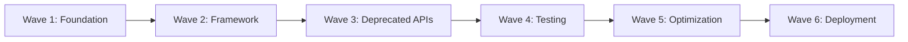

**User:**

<task>
Create concrete, detailed examples demonstrating how Bob assists developers through different migration scenarios using the framework and specifications developed.

**Context:**
You have access to:
- [`migration-framework-plan.md`](migration-framework-plan.md:1) - Overall framework with 7 phases and 7Rs
- [`README-MIGRATION-SPECS.md`](README-MIGRATION-SPECS.md:1) - Overview of technical specifications
- [`migration-technical-specifications.md`](migration-technical-specifications.md:1) - Custom modes and data models
- [`mcp-server-specifications.md`](mcp-server-specifications.md:1) - 10 MCP server specifications
- [`migration-skills-and-workflows.md`](migration-skills-and-workflows.md:1) - 4 migration skills and workflow instructions

**Your Tasks:**

Create **4 detailed migration scenario examples** that demonstrate Bob's capabilities:

### 1. Java 11 to Java 21 Migration Example
**Scenario:** A medium-sized Spring Boot application (50K LOC) needs to migrate from Java 11 to Java 21.

Show step-by-step:
- Initial conversation with developer
- Assessment phase: How Bob uses Dependency Scanner MCP to analyze the codebase
- Planning phase: How Bob creates migration roadmap with wave planning
- Design phase: How Bob identifies deprecated APIs and suggests replacements
- Migration phase: How Bob performs code transformations using Migration Execution mode
- Validation phase: How Bob uses Test Generator MCP to create regression tests
- Optimization phase: How Bob suggests Java 21-specific optimizations (virtual threads, pattern matching)
- Hypercare phase: How Bob monitors and resolves issues

Include:
- Actual conversation snippets between developer and Bob
- Sample MCP operation calls with inputs/outputs
- Mode transitions and why they occur
- JIRA ticket creation and updates
- Confluence documentation generation
- Rollback scenario if issues are detected

### 2. Quarkus to Spring Boot Migration Example
**Scenario:** A microservices application (3 services, 30K LOC total) needs to migrate from Quarkus to Spring Boot.

Show step-by-step:
- How Bob assesses compatibility differences
- How Bob maps Quarkus annotations to Spring equivalents
- How Bob handles configuration migration (application.properties)
- How Bob deals with dependency injection differences
- How Bob migrates REST endpoints and testing
- How Bob validates performance (Quarkus is known for fast startup)
- How Bob documents the migration decisions

Include:
- Code transformation examples (before/after)
- Compatibility matrix usage
- Performance comparison reports
- Integration testing approach
- Documentation artifacts generated

### 3. Legacy Monolith to Cloud-Native Migration Example
**Scenario:** A legacy Java EE application on WebSphere needs to migrate to containerized microservices on Kubernetes.

Show step-by-step:
- How Bob applies the 7Rs framework (likely Refactor/Rearchitect)
- How Bob identifies bounded contexts for microservices decomposition
- How Bob assesses data migration strategy
- How Bob creates containerization plan (Docker, Kubernetes)
- How Bob handles security and compliance requirements
- How Bob estimates cloud costs
- How Bob plans phased rollout with strangler fig pattern

Include:
- Architecture diagrams (before/after)
- 7Rs decision rationale
- Microservices decomposition strategy
- Data migration approach
- Cost estimation reports
- Risk mitigation strategies
- Rollback procedures for each phase

### 4. Database Migration Example (Oracle to PostgreSQL)
**Scenario:** An enterprise application needs to migrate from Oracle 19c to PostgreSQL 15 (100GB database, 500 tables).

Show step-by-step:
- How Bob uses Data Quality Analyzer MCP to profile the database
- How Bob identifies Oracle-specific features (PL/SQL, packages, sequences)
- How Bob creates schema conversion plan
- How Bob handles data type mappings
- How Bob plans incremental data migration with validation
- How Bob creates rollback procedures
- How Bob validates data integrity post-migration

Include:
- Schema comparison reports
- Data quality assessment results
- Migration scripts generated
- Validation queries and checksums
- Performance benchmarking
- Downtime estimation and minimization strategy

**Format Requirements:**

For each example, create:
1. **Scenario Overview** (1 page)
   - Business context and requirements
   - Current state and target state
   - Success criteria and constraints

2. **Phase-by-Phase Walkthrough** (3-5 pages)
   - Detailed steps through all 7 phases
   - Bob's actions and reasoning
   - Developer interactions
   - Tool and MCP usage
   - Artifacts produced

3. **Conversation Transcripts** (1-2 pages)
   - Realistic dialogue between developer and Bob
   - Show mode transitions
   - Show how Bob asks clarifying questions
   - Show how Bob provides guidance

4. **Technical Artifacts** (1-2 pages)
   - Sample code transformations
   - Configuration changes
   - Test cases generated
   - Documentation excerpts
   - JIRA tickets and Confluence pages

5. **Lessons Learned** (0.5 page)
   - What went well
   - Challenges encountered
   - How Bob adapted
   - Recommendations for similar migrations

**Deliverables:**
Create a comprehensive examples document (20-30 pages total) that:
- Demonstrates Bob's value across different migration types
- Shows realistic usage of all components (modes, MCPs, skills)
- Provides templates developers can follow
- Highlights best practices and common pitfalls
- Can be used for hackathon demos and presentations

**Scope:** Focus on creating realistic, detailed examples. These should feel like real migration projects.

**Completion:** Use `attempt_completion` with the examples document that showcases Bob's migration capabilities in action.

These instructions supersede any conflicting general instructions your mode might have.
</task>
<environment_details>
# VSCode Visible Files


# VSCode Open Tabs


# Current Time
Current time in ISO 8601 UTC format: 2026-05-16T10:10:59.729Z
User time zone: Asia/Saigon, UTC+7:00

# Current Cost
$0.00

# Review Exclusions
The following file patterns are excluded from code reviews:
- .vscode/**

# Current Mode
<slug>plan</slug>
<name>📝 Plan</name>


# Current Workspace Directory (/Users/nvduc/projects/playground/ide-arena/ibm-bob) Files
mcp-server-specifications.md
migration-framework-plan.md
migration-skills-and-workflows.md
migration-technical-specifications.md
README-MIGRATION-SPECS.md
.bob/
You have not created a todo list yet. Create one with `update_todo_list` if your task is complicated or involves multiple steps.
</environment_details>

---

**Assistant:**

I'll help you create comprehensive, detailed migration scenario examples that demonstrate Bob's capabilities. Let me start by gathering information about the existing framework and specifications.

<read_file>
<args>
  <file>
    <path>migration-framework-plan.md</path>
  </file>
  <file>
    <path>README-MIGRATION-SPECS.md</path>
  </file>
  <file>
    <path>migration-technical-specifications.md</path>
  </file>
  <file>
    <path>mcp-server-specifications.md</path>
  </file>
  <file>
    <path>migration-skills-and-workflows.md</path>
  </file>
</args>
</read_file>

---

**User:**

[read_file for 5 files] Result:
<files>
<file><path>migration-framework-plan.md</path><file_outline>File: migration-framework-plan.md (1316 lines)

String: # Bob's Technical Migration Framework (lines 1-1316)
  String: ## Comprehensive Plan for Migration Assistance (lines 2-10)
  String: ## Executive Summary (lines 11-21)
  String: ## 1. 7Rs Framework Applied to Technical Migrations (lines 22-149)
    String: ### 1.1 The 7Rs Migration Strategies (lines 24-35)
    String: ### 1.2 Migration Type to 7Rs Mapping (lines 36-136)
      String: #### Java Version Upgrades (e.g., Java 11 → 21) (lines 38-62)
      String: #### Framework Migrations (e.g., Quarkus → Spring Boot) (lines 63-86)
      String: #### Legacy to Cloud Migrations (lines 87-112)
      String: #### Database Migrations (lines 113-136)
    String: ### 1.3 7Rs Decision Matrix (lines 137-149)
  String: ## 2. Bob's Role Across 7 Migration Phases (lines 150-585)
    String: ### 2.1 Phase Overview (lines 152-176)
    String: ### 2.2 Phase 1: Assessment (lines 177-233)
      String: #### What Bob Helps Accomplish (lines 181-187)
      String: #### Information Bob Gathers (lines 188-197)
      String: #### Bob's Outputs (lines 198-209)
      String: #### Validations Bob Performs (lines 210-217)
      String: #### Tools & Skills Required (lines 218-228)
      String: #### Mode: Plan Mode (lines 229-233)
    String: ### 2.3 Phase 2: Planning (lines 234-295)
      String: #### What Bob Helps Accomplish (lines 238-245)
      String: #### Information Bob Gathers (lines 246-253)
      String: #### Bob's Outputs (lines 254-271)
      String: #### Validations Bob Performs (lines 272-279)
      String: #### Tools & Skills Required (lines 280-290)
      String: #### Mode: Plan Mode (lines 291-295)
    String: ### 2.4 Phase 3: Design (lines 296-357)
      String: #### What Bob Helps Accomplish (lines 300-307)
      String: #### Information Bob Gathers (lines 308-315)
      String: #### Bob's Outputs (lines 316-331)
      String: #### Validations Bob Performs (lines 332-340)
      String: #### Tools & Skills Required (lines 341-352)
      String: #### Mode: Plan Mode → Advanced Mode (for PoC) (lines 353-357)
    String: ### 2.5 Phase 4: Migration (Execution) (lines 358-416)
      String: #### What Bob Helps Accomplish (lines 362-369)
      String: #### Information Bob Gathers (lines 370-375)
      String: #### Bob's Outputs (lines 376-390)
      String: #### Validations Bob Performs (lines 391-399)
      String: #### Tools & Skills Required (lines 400-411)
      String: #### Mode: Advanced Mode (lines 412-416)
    String: ### 2.6 Phase 5: Validation (lines 417-474)
      String: #### What Bob Helps Accomplish (lines 421-428)
      String: #### Information Bob Gathers (lines 429-435)
      String: #### Bob's Outputs (lines 436-447)
      String: #### Validations Bob Performs (lines 448-456)
      String: #### Tools & Skills Required (lines 457-469)
      String: #### Mode: Advanced Mode (lines 470-474)
    String: ### 2.7 Phase 6: Optimization (lines 475-530)
      String: #### What Bob Helps Accomplish (lines 479-486)
      String: #### Information Bob Gathers (lines 487-494)
      String: #### Bob's Outputs (lines 495-505)
      String: #### Validations Bob Performs (lines 506-513)
      String: #### Tools & Skills Required (lines 514-525)
      String: #### Mode: Advanced Mode (lines 526-530)
    String: ### 2.8 Phase 7: Hypercare (lines 531-585)
      String: #### What Bob Helps Accomplish (lines 535-542)
      String: #### Information Bob Gathers (lines 543-549)
      String: #### Bob's Outputs (lines 550-560)
      String: #### Validations Bob Performs (lines 561-568)
      String: #### Tools & Skills Required (lines 569-580)
      String: #### Mode: Advanced Mode (lines 581-585)
  String: ## 3. Phase-Based Workflow Structure (lines 586-843)
    String: ### 3.1 Phase Dependencies and Gates (lines 588-604)
    String: ### 3.2 Phase Gate Criteria (lines 605-782)
      String: #### Gate 1: Assessment → Planning (lines 607-629)
      String: #### Gate 2: Planning → Design (lines 630-653)
      String: #### Gate 3: Design → Migration (lines 654-679)
      String: #### Gate 4: Migration → Validation (lines 680-704)
      String: #### Gate 5: Validation → Optimization (lines 705-730)
      String: #### Gate 6: Optimization → Hypercare (lines 731-756)
      String: #### Gate 7: Hypercare → Complete (lines 757-782)
    String: ### 3.3 Parallel Execution Opportunities (lines 783-827)
    String: ### 3.4 Rollback Procedures (lines 828-843)
  String: ## 4. Priority Areas for Bob's Assistance (lines 844-1043)
    String: ### 4.1 High Priority (Implement First) (lines 848-922)
      String: #### 1. Dependency Discovery Automation ⭐⭐⭐ (lines 850-873)
      String: #### 2. Testing Automation ⭐⭐⭐ (lines 874-898)
      String: #### 3. Data Quality Assessment ⭐⭐⭐ (lines 899-922)
    String: ### 4.2 Medium Priority (Implement Second) (lines 923-995)
      String: #### 4. Performance Optimization Guidance ⭐⭐ (lines 925-947)
      String: #### 5. Security Configuration ⭐⭐ (lines 948-971)
      String: #### 6. Rollback Procedures ⭐⭐ (lines 972-995)
    String: ### 4.3 Lower Priority (Implement Later) (lines 996-1043)
      String: #### 7. Cost Estimation ⭐ (lines 998-1020)
      String: #### 8. Change Management ⭐ (lines 1021-1043)
  String: ## 5. Implementation Roadmap (lines 1044-1184)
    String: ### 5.1 Phase 1: Foundation (Months 1-2) (lines 1046-1082)
    String: ### 5.2 Phase 2: Execution (Months 3-4) (lines 1083-1118)
    String: ### 5.3 Phase 3: Quality & Optimization (Months 5-6) (lines 1119-1154)
    String: ### 5.4 Phase 4: Stabilization (Month 7) (lines 1155-1184)
  String: ## 6. Success Metrics (lines 1185-1225)
    String: ### 6.1 Phase-Level Metrics (lines 1187-1212)
    String: ### 6.2 Overall Migration Metrics (lines 1213-1225)
  String: ## 7. Risk Management (lines 1226-1253)
    String: ### 7.1 Common Migration Risks and Mitigation (lines 1228-1241)
    String: ### 7.2 Bob-Specific Risks (lines 1242-1253)
  String: ## 8. Next Steps (lines 1254-1292)
    String: ### 8.1 Immediate Actions (lines 1256-1273)
    String: ### 8.2 Long-Term Roadmap (lines 1274-1280)
    String: ### 8.3 Success Criteria for Plan Approval (lines 1281-1292)
  String: ## Appendix A: Glossary (lines 1293-1303)
  String: ## Appendix B: References (lines 1304-1316)
</file_outline>
<notice>This file is large (1316 lines). You will use the following strategy to understand this file:
- Inform the user you are going to use large file strategy, to efficiently understand the file
- Use the file_outline provided to get an overview of the file structure to help decide next action. This is not the full file. It is not the full depth of the contents.
- If you read the file, use precise file reads with line ranges for specific sections of interest
- Consider if other commands/tools are better suited for extracting information from that file type
- Use ask_followup_question tool if needed to identify the best next action
</notice></file>
<file><path>README-MIGRATION-SPECS.md</path>
<content lines="1-461">
  1 | # Bob's Migration Framework - Technical Specifications
  2 | 
  3 | **Version:** 1.0  
  4 | **Date:** 2026-05-16  
  5 | **Status:** Implementation Ready
  6 | 
  7 | ---
  8 | 
  9 | ## Overview
 10 | 
 11 | This repository contains comprehensive technical specifications for implementing Bob's Migration Framework, an AI-assisted system for managing complex technical migrations across Java versions, frameworks, cloud platforms, and databases.
 12 | 
 13 | The framework is based on the **7Rs Migration Strategy** (Relocate, Rehost, Replatform, Refactor, Repurchase, Retire, Retain) and provides structured guidance across **7 migration phases** (Assessment, Planning, Design, Migration, Validation, Optimization, Hypercare).
 14 | 
 15 | ---
 16 | 
 17 | ## Document Structure
 18 | 
 19 | ### 📋 Core Specifications
 20 | 
 21 | #### 1. [migration-technical-specifications.md](migration-technical-specifications.md:1)
 22 | **Main specification document** covering:
 23 | - Custom migration modes (Assessment, Execution, Optimization, Hypercare)
 24 | - Mode-specific instructions and behaviors
 25 | - Tool and capability definitions
 26 | - File restrictions and security
 27 | - Data models and schemas
 28 | - Implementation guidelines
 29 | - Configuration examples
 30 | 
 31 | **Key Sections:**
 32 | - Section 1: Custom Migration Modes (4 modes)
 33 | - Section 2: MCP Server Specifications (summary)
 34 | - Section 3: Migration-Specific Skills (summary)
 35 | - Section 4: Workflow Instructions (summary)
 36 | - Section 5: Tool Integration Architecture (summary)
 37 | - Section 6: Data Models (6 core models)
 38 | - Section 7: Implementation Guidelines
 39 | - Section 8: Next Steps for Implementation
 40 | 
 41 | #### 2. [mcp-server-specifications.md](mcp-server-specifications.md:1)
 42 | **Detailed MCP server specifications** covering:
 43 | - 10 specialized MCP servers
 44 | - Complete operation definitions
 45 | - Input/output schemas
 46 | - Data models
 47 | - Implementation priorities
 48 | 
 49 | **MCP Servers:**
 50 | 1. **Dependency Scanner MCP** ⭐⭐⭐ (High Priority)
 51 | 2. **Test Generator MCP** ⭐⭐⭐ (High Priority)
 52 | 3. **Performance Profiler MCP** ⭐⭐ (Medium Priority)
 53 | 4. **Security Scanner MCP** ⭐⭐ (Medium Priority)
 54 | 5. **Data Quality Analyzer MCP** ⭐⭐⭐ (High Priority)
 55 | 6. **Cost Estimator MCP** ⭐ (Lower Priority)
 56 | 7. **Rollback Manager MCP** ⭐⭐ (Medium Priority)
 57 | 8. **Documentation Generator MCP** ⭐⭐ (Medium Priority)
 58 | 9. **JIRA Integration MCP** ⭐⭐ (Medium Priority)
 59 | 10. **Change Management MCP** ⭐ (Lower Priority)
 60 | 
 61 | #### 3. [migration-skills-and-workflows.md](migration-skills-and-workflows.md:1)
 62 | **Migration skills and workflow specifications** covering:
 63 | - 4 migration-specific skills
 64 | - Phase transition workflows
 65 | - Dependency management procedures
 66 | - Validation instructions
 67 | - Rollback procedures
 68 | - Documentation workflows
 69 | - Tool integration architecture
 70 | 
 71 | **Migration Skills:**
 72 | 1. **Java Migration Skill** - Java version upgrades (11→17→21)
 73 | 2. **Framework Migration Skill** - Framework transitions (Quarkus→Spring Boot)
 74 | 3. **Cloud Migration Skill** - Legacy to cloud migrations
 75 | 4. **Database Migration Skill** - Database platform changes
 76 | 
 77 | **Workflows:**
 78 | - 7 Phase Gate Workflows (with validation criteria)
 79 | - Dependency Management Workflows
 80 | - Validation Workflows (code, security, performance, data)
 81 | - Rollback Workflows
 82 | - Documentation Workflows
 83 | 
 84 | ---
 85 | 
 86 | ## Quick Start Guide
 87 | 
 88 | ### For Implementation Teams
 89 | 
 90 | 1. **Start with Core Infrastructure** (Weeks 1-2)
 91 |    - Review [`migration-technical-specifications.md`](migration-technical-specifications.md:1) Section 7
 92 |    - Setup project structure
 93 |    - Implement base mode framework
 94 |    - Create MCP server templates
 95 | 
 96 | 2. **Implement High Priority MCPs** (Weeks 3-4)
 97 |    - Review [`mcp-server-specifications.md`](mcp-server-specifications.md:1)
 98 |    - Implement Dependency Scanner MCP
 99 |    - Implement Test Generator MCP
100 |    - Implement Data Quality Analyzer MCP
101 | 
102 | 3. **Build Core Modes** (Weeks 5-8)
103 |    - Review [`migration-technical-specifications.md`](migration-technical-specifications.md:1) Section 1
104 |    - Implement Assessment Mode
105 |    - Implement Migration Execution Mode
106 |    - Create mode transition logic
107 | 
108 | 4. **Develop Migration Skills** (Weeks 9-12)
109 |    - Review [`migration-skills-and-workflows.md`](migration-skills-and-workflows.md:1) Section 1
110 |    - Implement Java Migration Skill
111 |    - Implement Framework Migration Skill
112 |    - Test skill workflows
113 | 
114 | ### For Migration Teams
115 | 
116 | 1. **Understand the Framework**
117 |    - Read [`migration-framework-plan.md`](migration-framework-plan.md:1) for overview
118 |    - Review 7Rs strategies and 7 phases
119 |    - Understand phase gate criteria
120 | 
121 | 2. **Plan Your Migration**
122 |    - Use Assessment Mode to analyze your project
123 |    - Review skill specifications for your migration type
124 |    - Follow phase transition workflows
125 | 
126 | 3. **Execute Migration**
127 |    - Follow skill-specific workflows
128 |    - Use phase gate validation checklists
129 |    - Leverage MCP servers for automation
130 | 
131 | ---
132 | 
133 | ## Architecture Overview
134 | 
135 | ### System Components
136 | 
137 | ```
138 | ┌─────────────────────────────────────────────────────────────┐
139 | │                     Bob Migration Assistant                  │
140 | ├─────────────────────────────────────────────────────────────┤
141 | │                                                               │
142 | │  ┌──────────────┐  ┌──────────────┐  ┌──────────────┐      │
143 | │  │  Assessment  │  │  Migration   │  │ Optimization │      │
144 | │  │     Mode     │  │  Execution   │  │     Mode     │      │
145 | │  │              │  │     Mode     │  │              │      │
146 | │  └──────────────┘  └──────────────┘  └──────────────┘      │
147 | │                                                               │
148 | │  ┌──────────────┐  ┌──────────────┐  ┌──────────────┐      │
149 | │  │  Hypercare   │  │     Plan     │  │     Ask      │      │
150 | │  │     Mode     │  │     Mode     │  │     Mode     │      │
151 | │  └──────────────┘  └──────────────┘  └──────────────┘      │
152 | │                                                               │
153 | ├─────────────────────────────────────────────────────────────┤
154 | │                      Migration Skills                         │
155 | │  • Java Migration    • Framework Migration                   │
156 | │  • Cloud Migration   • Database Migration                    │
157 | ├─────────────────────────────────────────────────────────────┤
158 | │                       MCP Servers                             │
159 | │  • Dependency Scanner    • Test Generator                    │
160 | │  • Performance Profiler  • Security Scanner                  │
161 | │  • Data Quality Analyzer • Cost Estimator                    │
162 | │  • Rollback Manager      • Documentation Generator           │
163 | │  • JIRA Integration      • Change Management                 │
164 | ├─────────────────────────────────────────────────────────────┤
165 | │                    Tool Integrations                          │
166 | │  • Git/GitHub        • CI/CD Pipelines                       │
167 | │  • Testing Frameworks • Monitoring Tools                     │
168 | │  • JIRA/Confluence   • Cloud Providers                       │
169 | └─────────────────────────────────────────────────────────────┘
170 | ```
171 | 
172 | ### Migration Flow
173 | 
174 | ```
175 | Assessment → Planning → Design → Migration → Validation → Optimization → Hypercare
176 |     ↓           ↓         ↓          ↓            ↓             ↓            ↓
177 |   Report      Plan    Architecture  Code      Tests         Tuning      Monitoring
178 |   JIRA Epic   Tasks   PoC          Changes   Security      Performance  Incidents
179 |   Risks       Timeline Patterns    Tests     Validation    Cost Opt     Lessons
180 | ```
181 | 
182 | ---
183 | 
184 | ## Key Features
185 | 
186 | ### 🎯 Intelligent Mode System
187 | - **4 specialized migration modes** with specific capabilities
188 | - **Automatic mode transitions** based on phase gates
189 | - **File restrictions** for safety and compliance
190 | - **Context-aware tool access**
191 | 
192 | ### 🤖 MCP Server Ecosystem
193 | - **10 specialized servers** for migration tasks
194 | - **Standardized operations** with schemas
195 | - **Priority-based implementation** roadmap
196 | - **Extensible architecture** for future needs
197 | 
198 | ### 🛠️ Migration Skills
199 | - **4 comprehensive skills** for common migrations
200 | - **Step-by-step workflows** with validation
201 | - **MCP integration** for automation
202 | - **Success criteria** and validation checklists
203 | 
204 | ### 📊 Workflow Management
205 | - **7 phase gates** with validation criteria
206 | - **Dependency tracking** and management
207 | - **Rollback procedures** for safety
208 | - **Documentation automation**
209 | 
210 | ### 🔗 Tool Integration
211 | - **Version control** (Git) integration
212 | - **CI/CD pipeline** automation
213 | - **Testing framework** support
214 | - **Monitoring and alerting**
215 | - **Project management** (JIRA/Confluence)
216 | 
217 | ---
218 | 
219 | ## Implementation Roadmap
220 | 
221 | ### Phase 1: Foundation (Months 1-2)
222 | **Goal:** Core infrastructure and high-priority MCPs
223 | 
224 | **Deliverables:**
225 | - ✅ Base mode framework
226 | - ✅ MCP server templates
227 | - ✅ Dependency Scanner MCP
228 | - ✅ Test Generator MCP
229 | - ✅ Data Quality Analyzer MCP
230 | 
231 | **Success Criteria:**
232 | - Modes can be created and activated
233 | - MCPs can be called from modes
234 | - Basic migration workflow functional
235 | 
236 | ### Phase 2: Execution (Months 3-4)
237 | **Goal:** Core modes and medium-priority MCPs
238 | 
239 | **Deliverables:**
240 | - ✅ Assessment Mode
241 | - ✅ Migration Execution Mode
242 | - ✅ Performance Profiler MCP
243 | - ✅ Security Scanner MCP
244 | - ✅ Rollback Manager MCP
245 | - ✅ Documentation Generator MCP
246 | - ✅ JIRA Integration MCP
247 | 
248 | **Success Criteria:**
249 | - Complete assessment workflow
250 | - Execute simple migrations
251 | - Generate documentation
252 | - Track in JIRA
253 | 
254 | ### Phase 3: Quality & Optimization (Months 5-6)
255 | **Goal:** Migration skills and optimization capabilities
256 | 
257 | **Deliverables:**
258 | - ✅ Java Migration Skill
259 | - ✅ Framework Migration Skill
260 | - ✅ Cloud Migration Skill
261 | - ✅ Database Migration Skill
262 | - ✅ Optimization Mode
263 | - ✅ Hypercare Mode
264 | 
265 | **Success Criteria:**
266 | - Execute Java version upgrades
267 | - Perform framework migrations
268 | - Optimize migrated applications
269 | - Support hypercare period
270 | 
271 | ### Phase 4: Stabilization (Month 7)
272 | **Goal:** Polish, testing, and documentation
273 | 
274 | **Deliverables:**
275 | - ✅ Cost Estimator MCP
276 | - ✅ Change Management MCP
277 | - ✅ Comprehensive testing
278 | - ✅ Complete documentation
279 | - ✅ Training materials
280 | 
281 | **Success Criteria:**
282 | - All tests passing
283 | - Documentation complete
284 | - Team trained
285 | - Production ready
286 | 
287 | ---
288 | 
289 | ## Success Metrics
290 | 
291 | ### Phase-Level Metrics
292 | 
293 | | Phase | Key Metrics | Target |
294 | |-------|-------------|--------|
295 | | Assessment | Readiness Score, Risk Identification | ≥60 score, All risks documented |
296 | | Planning | Task Completeness, Timeline Accuracy | 100% tasks defined, ±10% timeline |
297 | | Design | Architecture Approval, PoC Success | Approved, PoC validates approach |
298 | | Migration | Code Quality, Test Coverage | No critical issues, ≥80% coverage |
299 | | Validation | Test Pass Rate, Performance | 100% pass, Within 5% baseline |
300 | | Optimization | Performance Gain, Cost Reduction | ≥10% improvement, Cost optimized |
301 | | Hypercare | Incident Rate, Stability | <5 incidents/week, 99.9% uptime |
302 | 
303 | ### Overall Migration Metrics
304 | 
305 | - **Migration Success Rate:** ≥95%
306 | - **Time to Production:** Within planned timeline ±15%
307 | - **Defect Density:** <5 defects per 1000 LOC
308 | - **Test Coverage:** ≥80%
309 | - **Performance:** Within 5% of baseline
310 | - **Cost:** Within budget ±10%
311 | - **Stakeholder Satisfaction:** ≥4.5/5
312 | 
313 | ---
314 | 
315 | ## Risk Management
316 | 
317 | ### Technical Risks
318 | 
319 | | Risk | Mitigation | Owner |
320 | |------|------------|-------|
321 | | Breaking changes not identified | Comprehensive dependency scanning | Assessment Mode |
322 | | Test coverage insufficient | Automated test generation | Test Generator MCP |
323 | | Performance regression | Baseline profiling and comparison | Performance Profiler MCP |
324 | | Security vulnerabilities | Automated security scanning | Security Scanner MCP |
325 | | Data quality issues | Data profiling and validation | Data Quality Analyzer MCP |
326 | | Rollback failure | Checkpoint testing | Rollback Manager MCP |
327 | 
328 | ### Process Risks
329 | 
330 | | Risk | Mitigation | Owner |
331 | |------|------------|-------|
332 | | Phase gate criteria not met | Clear validation checklists | Phase Gate Workflows |
333 | | Dependency conflicts | Automated conflict detection | Dependency Scanner MCP |
334 | | Documentation incomplete | Automated documentation generation | Documentation Generator MCP |
335 | | Stakeholder misalignment | Regular communication | Change Management MCP |
336 | 
337 | ---
338 | 
339 | ## Best Practices
340 | 
341 | ### For Mode Development
342 | 
343 | 1. **Clear Purpose:** Each mode should have a specific, well-defined purpose
344 | 2. **File Restrictions:** Implement appropriate file restrictions for safety
345 | 3. **Tool Access:** Provide only necessary tools for the mode's purpose
346 | 4. **Validation:** Include validation steps before mode transitions
347 | 5. **Documentation:** Document mode behavior and example prompts
348 | 
349 | ### For MCP Server Development
350 | 
351 | 1. **Single Responsibility:** Each MCP should focus on one domain
352 | 2. **Schema Validation:** Use strict input/output schemas
353 | 3. **Error Handling:** Provide clear error messages
354 | 4. **Testing:** Comprehensive unit and integration tests
355 | 5. **Documentation:** Document all operations with examples
356 | 
357 | ### For Migration Execution
358 | 
359 | 1. **Incremental Changes:** Make small, testable changes
360 | 2. **Continuous Testing:** Test after each significant change
361 | 3. **Checkpoint Creation:** Create checkpoints before major changes
362 | 4. **Documentation:** Document decisions and rationale
363 | 5. **Validation:** Validate at each phase gate
364 | 
365 | ---
366 | 
367 | ## FAQ
368 | 
369 | ### Q: Which migration mode should I use?
370 | **A:** 
371 | - **Assessment Mode:** For analyzing and planning migrations
372 | - **Migration Execution Mode:** For making code changes
373 | - **Optimization Mode:** For performance tuning post-migration
374 | - **Hypercare Mode:** For monitoring and issue resolution post-deployment
375 | 
376 | ### Q: How do I know when to transition between phases?
377 | **A:** Each phase has specific gate criteria that must be met. Review the phase gate validation checklists in [`migration-skills-and-workflows.md`](migration-skills-and-workflows.md:1) Section 2.1.
378 | 
379 | ### Q: What if my migration type isn't covered by the existing skills?
380 | **A:** The framework is extensible. You can create custom skills following the pattern in [`migration-skills-and-workflows.md`](migration-skills-and-workflows.md:1) Section 1.
381 | 
382 | ### Q: How do I handle rollbacks?
383 | **A:** Use the Rollback Manager MCP to create checkpoints before major changes. Follow the rollback procedures in [`migration-skills-and-workflows.md`](migration-skills-and-workflows.md:1) Section 2.4.
384 | 
385 | ### Q: What's the difference between Rehost and Replatform?
386 | **A:** 
387 | - **Rehost:** Minimal changes, containerization, basic cloud adaptation
388 | - **Replatform:** Adopt managed services, leverage cloud-native features
389 | 
390 | ---
391 | 
392 | ## Contributing
393 | 
394 | ### Adding New Modes
395 | 
396 | 1. Define mode configuration in [`migration-technical-specifications.md`](migration-technical-specifications.md:1)
397 | 2. Write mode-specific instructions
398 | 3. Configure file restrictions
399 | 4. Test mode behavior
400 | 5. Document example prompts
401 | 
402 | ### Adding New MCP Servers
403 | 
404 | 1. Define server specification in [`mcp-server-specifications.md`](mcp-server-specifications.md:1)
405 | 2. Implement operations with schemas
406 | 3. Create data models
407 | 4. Write tests
408 | 5. Document usage examples
409 | 
410 | ### Adding New Skills
411 | 
412 | 1. Define skill specification in [`migration-skills-and-workflows.md`](migration-skills-and-workflows.md:1)
413 | 2. Document trigger conditions
414 | 3. Define step-by-step workflow
415 | 4. Specify MCP integrations
416 | 5. Define success criteria
417 | 
418 | ---
419 | 
420 | ## Support and Resources
421 | 
422 | ### Documentation
423 | - [Migration Framework Plan](migration-framework-plan.md:1) - Original framework overview
424 | - [Technical Specifications](migration-technical-specifications.md:1) - Core specifications
425 | - [MCP Server Specs](mcp-server-specifications.md:1) - MCP server details
426 | - [Skills and Workflows](migration-skills-and-workflows.md:1) - Skills and workflow details
427 | 
428 | ### External Resources
429 | - [Model Context Protocol](https://modelcontextprotocol.io)
430 | - [7Rs Migration Framework](https://aws.amazon.com/blogs/enterprise-strategy/6-strategies-for-migrating-applications-to-the-cloud/)
431 | - [Spring Boot Migration Guide](https://github.com/spring-projects/spring-boot/wiki/Spring-Boot-3.0-Migration-Guide)
432 | - [Java Migration Guides](https://docs.oracle.com/en/java/javase/21/migrate/)
433 | 
434 | ---
435 | 
436 | ## License
437 | 
438 | This specification is proprietary and confidential. All rights reserved.
439 | 
440 | ---
441 | 
442 | ## Version History
443 | 
444 | | Version | Date | Changes | Author |
445 | |---------|------|---------|--------|
446 | | 1.0 | 2026-05-16 | Initial comprehensive specification | Bob (Plan Mode) |
447 | 
448 | ---
449 | 
450 | ## Approval Status
451 | 
452 | | Role | Name | Status | Date |
453 | |------|------|--------|------|
454 | | Technical Lead | TBD | Pending | - |
455 | | Architecture Review Board | TBD | Pending | - |
456 | | Product Owner | TBD | Pending | - |
457 | | Security Team | TBD | Pending | - |
458 | 
459 | ---
460 | 
461 | **For questions or clarifications, please contact the migration framework team.**
</content>
</file>
<file><path>migration-technical-specifications.md</path><file_outline>File: migration-technical-specifications.md (1104 lines)

String: # Bob's Migration Framework - Technical Specifications (lines 1-1104)
  String: ## Table of Contents (lines 9-20)
  String: ## 1. Custom Migration Modes (lines 21-329)
    String: ### 1.1 Assessment Mode (lines 23-143)
      String: #### When to Use (lines 29-35)
      String: #### Mode-Specific Instructions (lines 36-83)
      String: #### Tools and Capabilities (lines 84-104)
      String: #### File Restrictions (lines 105-117)
      String: #### Integration with Other Modes (lines 118-132)
      String: #### Example Prompts (lines 133-143)
    String: ### 1.2 Migration Execution Mode (lines 144-230)
      String: #### When to Use (lines 150-156)
      String: #### Mode-Specific Instructions (lines 157-199)
      String: #### Tools and Capabilities (lines 200-209)
      String: #### File Restrictions (lines 210-220)
      String: #### Example Prompts (lines 221-230)
    String: ### 1.3 Optimization Mode (lines 231-286)
      String: #### When to Use (lines 237-242)
      String: #### Mode-Specific Instructions (lines 243-268)
      String: #### Tools and Capabilities (lines 269-276)
      String: #### Example Prompts (lines 277-286)
    String: ### 1.4 Hypercare Mode (lines 287-329)
      String: #### When to Use (lines 293-298)
      String: #### Mode-Specific Instructions (lines 299-324)
      String: #### Tools and Capabilities (lines 325-329)
  String: ## 2. MCP Server Specifications (lines 330-357)
    String: ### Summary of MCP Servers (lines 334-357)
      String: #### High Priority (⭐⭐⭐) - Implement First (lines 338-342)
      String: #### Medium Priority (⭐⭐) - Implement Second (lines 343-349)
      String: #### Lower Priority (⭐) - Implement Later (lines 350-357)
  String: ## 3. Migration-Specific Skills (lines 358-403)
    String: ### Summary of Migration Skills (lines 362-403)
      String: #### 3.1 Java Migration Skill (lines 364-372)
      String: #### 3.2 Framework Migration Skill (lines 373-381)
      String: #### 3.3 Cloud Migration Skill (lines 382-390)
      String: #### 3.4 Database Migration Skill (lines 391-403)
  String: ## 4. Workflow Instructions (lines 404-444)
    String: ### Summary of Workflows (lines 408-444)
      String: #### 4.1 Phase Transition Workflows (lines 410-419)
      String: #### 4.2 Dependency Management Workflows (lines 420-424)
      String: #### 4.3 Validation Workflows (lines 425-430)
      String: #### 4.4 Rollback Workflows (lines 431-435)
      String: #### 4.5 Documentation Workflows (lines 436-444)
  String: ## 5. Tool Integration Architecture (lines 445-484)
    String: ### Summary of Integrations (lines 449-484)
      String: #### 5.1 Version Control (Git) (lines 451-456)
      String: #### 5.2 CI/CD Pipeline (lines 457-462)
      String: #### 5.3 Testing Frameworks (lines 463-468)
      String: #### 5.4 Monitoring Tools (lines 469-474)
      String: #### 5.5 Project Management (JIRA, Confluence) (lines 475-484)
  String: ## 6. Data Models (lines 485-621)
    String: ### 6.1 Migration Context (lines 487-510)
    String: ### 6.2 Assessment Result (lines 511-537)
    String: ### 6.3 Migration Task (lines 538-559)
    String: ### 6.4 Checkpoint (lines 560-581)
    String: ### 6.5 Validation Result (lines 582-600)
    String: ### 6.6 Incident (lines 601-621)
  String: ## 7. Implementation Guidelines (lines 622-942)
    String: ### 7.1 Mode Implementation (lines 624-670)
      String: #### Creating a Custom Mode (lines 626-657)
      String: #### Mode Transition Implementation (lines 658-670)
    String: ### 7.2 MCP Server Implementation (lines 671-748)
      String: #### Server Structure (lines 673-730)
      String: #### Testing MCP Servers (lines 731-748)
    String: ### 7.3 Skill Implementation (lines 749-784)
      String: #### Skill Structure (lines 751-764)
      String: #### Skill Activation (lines 765-784)
    String: ### 7.4 Workflow Implementation (lines 785-827)
      String: #### Phase Gate Implementation (lines 787-827)
    String: ### 7.5 Integration Implementation (lines 828-874)
      String: #### JIRA Integration Example (lines 830-851)
      String: #### Confluence Integration Example (lines 852-874)
    String: ### 7.6 Testing Guidelines (lines 875-942)
      String: #### Unit Testing (lines 877-899)
      String: #### Integration Testing (lines 900-917)
      String: #### End-to-End Testing (lines 918-942)
  String: ## 8. Next Steps for Implementation (lines 943-1002)
    String: ### Phase 1: Foundation (Weeks 1-4) (lines 945-958)
    String: ### Phase 2: Core Modes (Weeks 5-8) (lines 959-972)
    String: ### Phase 3: Skills (Weeks 9-12) (lines 973-986)
    String: ### Phase 4: Integration (Weeks 13-16) (lines 987-1002)
  String: ## Appendix A: Configuration Examples (lines 1003-1066)
    String: ### Mode Configuration (lines 1005-1036)
    String: ### MCP Server Configuration (lines 1037-1066)
  String: ## Appendix B: Reference Documentation (lines 1067-1100)
    String: ### Related Documents (lines 1069-1073)
    String: ### External References (lines 1074-1100)
      String: #### Example Prompts (lines 1091-1100)
  String: ## 2. MCP Server Specifications (lines 1101-1104)
</file_outline>
<notice>This file is large (1103 lines). You will use the following strategy to understand this file:
- Inform the user you are going to use large file strategy, to efficiently understand the file
- Use the file_outline provided to get an overview of the file structure to help decide next action. This is not the full file. It is not the full depth of the contents.
- If you read the file, use precise file reads with line ranges for specific sections of interest
- Consider if other commands/tools are better suited for extracting information from that file type
- Use ask_followup_question tool if needed to identify the best next action
</notice></file>
<file><path>mcp-server-specifications.md</path><file_outline>File: mcp-server-specifications.md (1255 lines)

String: # MCP Server Specifications for Migration Framework (lines 1-1255)
  String: ## Table of Contents (lines 9-23)
  String: ## 1. Dependency Scanner MCP (lines 24-243)
    String: ### Operations (lines 30-213)
      String: #### 1.1 scan_dependencies (lines 32-107)
      String: #### 1.2 analyze_impact (lines 108-177)
      String: #### 1.3 generate_report (lines 178-213)
    String: ### Data Models (lines 214-243)
  String: ## 2. Test Generator MCP (lines 244-420)
    String: ### Operations (lines 250-420)
      String: #### 2.1 generate_tests (lines 252-326)
      String: #### 2.2 validate_coverage (lines 327-371)
      String: #### 2.3 execute_tests (lines 372-420)
  String: ## 3. Performance Profiler MCP (lines 421-588)
    String: ### Operations (lines 427-588)
      String: #### 3.1 profile_application (lines 429-492)
      String: #### 3.2 compare_metrics (lines 493-541)
      String: #### 3.3 suggest_optimizations (lines 542-588)
  String: ## 4. Security Scanner MCP (lines 589-700)
    String: ### Operations (lines 595-700)
      String: #### 4.1 scan_vulnerabilities (lines 597-656)
      String: #### 4.2 check_compliance (lines 657-700)
  String: ## 5. Data Quality Analyzer MCP (lines 701-780)
    String: ### Operations (lines 707-780)
      String: #### 5.1 profile_data (lines 709-746)
      String: #### 5.2 detect_issues (lines 747-780)
  String: ## 6. Cost Estimator MCP (lines 781-823)
    String: ### Operations (lines 787-823)
      String: #### 6.1 estimate_costs (lines 789-823)
  String: ## 7. Rollback Manager MCP (lines 824-923)
    String: ### Operations (lines 830-923)
      String: #### 7.1 create_checkpoint (lines 832-865)
      String: #### 7.2 validate_rollback (lines 866-893)
      String: #### 7.3 execute_recovery (lines 894-923)
  String: ## 8. Documentation Generator MCP (lines 924-1026)
    String: ### Operations (lines 930-1026)
      String: #### 8.1 generate_docs (lines 932-961)
      String: #### 8.2 update_confluence (lines 962-990)
      String: #### 8.3 create_diagrams (lines 991-1026)
  String: ## 9. JIRA Integration MCP (lines 1027-1140)
    String: ### Operations (lines 1033-1140)
      String: #### 9.1 create_tasks (lines 1035-1082)
      String: #### 9.2 update_status (lines 1083-1109)
      String: #### 9.3 generate_reports (lines 1110-1140)
  String: ## 10. Change Management MCP (lines 1141-1237)
    String: ### Operations (lines 1147-1237)
      String: #### 10.1 create_training (lines 1149-1181)
      String: #### 10.2 schedule_communications (lines 1182-1208)
      String: #### 10.3 track_adoption (lines 1209-1237)
  String: ## Implementation Priority (lines 1238-1255)
    String: ### Phase 1: Foundation (High Priority ⭐⭐⭐) (lines 1240-1244)
    String: ### Phase 2: Execution (Medium Priority ⭐⭐) (lines 1245-1251)
    String: ### Phase 3: Enhancement (Lower Priority ⭐) (lines 1252-1255)
</file_outline>
<notice>This file is large (1254 lines). You will use the following strategy to understand this file:
- Inform the user you are going to use large file strategy, to efficiently understand the file
- Use the file_outline provided to get an overview of the file structure to help decide next action. This is not the full file. It is not the full depth of the contents.
- If you read the file, use precise file reads with line ranges for specific sections of interest
- Consider if other commands/tools are better suited for extracting information from that file type
- Use ask_followup_question tool if needed to identify the best next action
</notice></file>
<file><path>migration-skills-and-workflows.md</path><file_outline>File: migration-skills-and-workflows.md (1483 lines)

String: # Migration Skills and Workflow Specifications (lines 1-1483)
  String: ## Table of Contents (lines 9-16)
  String: ## 1. Migration-Specific Skills (lines 17-668)
    String: ### 1.1 Java Migration Skill (lines 19-246)
      String: #### Trigger Conditions (lines 25-32)
      String: #### Required Inputs and Context (lines 33-54)
      String: #### Step-by-Step Workflow (lines 55-199)
      String: #### Integration with MCPs and Modes (lines 200-216)
      String: #### Success Criteria and Validation (lines 217-246)
    String: ### 1.2 Framework Migration Skill (lines 247-430)
      String: #### Trigger Conditions (lines 253-259)
      String: #### Required Inputs and Context (lines 260-283)
      String: #### Step-by-Step Workflow (lines 284-407)
      String: #### Integration with MCPs and Modes (lines 408-419)
      String: #### Success Criteria (lines 420-430)
    String: ### 1.3 Cloud Migration Skill (lines 431-555)
      String: #### Trigger Conditions (lines 437-443)
      String: #### Required Inputs and Context (lines 444-457)
      String: #### Step-by-Step Workflow (lines 458-542)
      String: #### Success Criteria (lines 543-555)
    String: ### 1.4 Database Migration Skill (lines 556-668)
      String: #### Trigger Conditions (lines 562-568)
      String: #### Required Inputs and Context (lines 569-582)
      String: #### Step-by-Step Workflow (lines 583-657)
      String: #### Success Criteria (lines 658-668)
  String: ## 2. Workflow Instructions (lines 669-1134)
    String: ### 2.1 Phase Transition Instructions (lines 671-863)
      String: #### Gate 1: Assessment → Planning (lines 675-701)
      String: #### Gate 2: Planning → Design (lines 702-728)
      String: #### Gate 3: Design → Migration (lines 729-755)
      String: #### Gate 4: Migration → Validation (lines 756-782)
      String: #### Gate 5: Validation → Optimization (lines 783-809)
      String: #### Gate 6: Optimization → Hypercare (lines 810-836)
      String: #### Gate 7: Hypercare → Complete (lines 837-863)
    String: ### 2.2 Dependency Management Instructions (lines 864-924)
      String: #### Dependency Discovery (lines 868-881)
      String: #### Dependency Update Strategy (lines 882-908)
      String: #### Dependency Tracking (lines 909-924)
    String: ### 2.3 Validation Instructions (lines 925-1013)
      String: #### Code Validation (lines 929-948)
      String: #### Test Validation (lines 949-968)
      String: #### Security Validation (lines 969-982)
      String: #### Performance Validation (lines 983-997)
      String: #### Data Validation (lines 998-1013)
    String: ### 2.4 Rollback Instructions (lines 1014-1070)
      String: #### Rollback Triggers (lines 1018-1032)
      String: #### Rollback Procedure (lines 1033-1055)
      String: #### Rollback Validation (lines 1056-1070)
    String: ### 2.5 Documentation Instructions (lines 1071-1134)
      String: #### Assessment Phase Documentation (lines 1075-1090)
      String: #### Planning Phase Documentation (lines 1091-1100)
      String: #### Execution Phase Documentation (lines 1101-1116)
      String: #### Post-Migration Documentation (lines 1117-1134)
  String: ## 3. Tool Integration Architecture (lines 1135-1457)
    String: ### 3.1 Version Control Integration (Git) (lines 1137-1173)
      String: #### Git Workflow (lines 1141-1173)
    String: ### 3.2 CI/CD Pipeline Integration (lines 1174-1226)
      String: #### Pipeline Stages (lines 1178-1215)
      String: #### Integration with Bob (lines 1216-1226)
    String: ### 3.3 Testing Framework Integration (lines 1227-1272)
      String: #### Supported Frameworks (lines 1231-1250)
      String: #### Integration Points (lines 1251-1272)
    String: ### 3.4 Monitoring Tools Integration (lines 1273-1308)
      String: #### Monitoring Stack (lines 1277-1290)
      String: #### Integration with Bob (lines 1291-1308)
    String: ### 3.5 Project Management Integration (JIRA, Confluence) (lines 1309-1374)
      String: #### JIRA Integration (lines 1313-1342)
      String: #### Confluence Integration (lines 1343-1374)
    String: ### 3.6 Integration Architecture Diagram (lines 1375-1457)
  String: ## Implementation Priority (lines 1458-1483)
    String: ### Phase 1: Core Skills (Months 1-2) (lines 1460-1465)
    String: ### Phase 2: Advanced Skills (Months 3-4) (lines 1466-1471)
    String: ### Phase 3: Integration (Months 5-6) (lines 1472-1477)
    String: ### Phase 4: Optimization (Month 7) (lines 1478-1483)
</file_outline>
<notice>This file is large (1482 lines). You will use the following strategy to understand this file:
- Inform the user you are going to use large file strategy, to efficiently understand the file
- Use the file_outline provided to get an overview of the file structure to help decide next action. This is not the full file. It is not the full depth of the contents.
- If you read the file, use precise file reads with line ranges for specific sections of interest
- Consider if other commands/tools are better suited for extracting information from that file type
- Use ask_followup_question tool if needed to identify the best next action
</notice></file>
</files>
<environment_details>
# VSCode Visible Files


# VSCode Open Tabs


# Current Time
Current time in ISO 8601 UTC format: 2026-05-16T10:11:04.008Z
User time zone: Asia/Saigon, UTC+7:00

# Current Cost
$0.04

# Review Exclusions
The following file patterns are excluded from code reviews:
- .vscode/**

# Current Mode
<slug>plan</slug>
<name>📝 Plan</name>
You have not created a todo list yet. Create one with `update_todo_list` if your task is complicated or involves multiple steps.
</environment_details>

---

**Assistant:**

I'll create comprehensive, detailed migration scenario examples demonstrating Bob's capabilities. Let me start by creating a todo list to organize this work.

<update_todo_list>
<todos>
[ ] Review and understand the migration framework components (7Rs, 7 phases, modes, MCPs, skills)
[ ] Create Example 1: Java 11 to Java 21 Migration (detailed walkthrough with conversations)
[ ] Create Example 2: Quarkus to Spring Boot Migration (framework transition example)
[ ] Create Example 3: Legacy Monolith to Cloud-Native Migration (architecture transformation)
[ ] Create Example 4: Database Migration - Oracle to PostgreSQL (data migration example)
[ ] Review and polish all examples for consistency and completeness
[ ] Compile final document with all examples and supporting materials
</todos>
</update_todo_list>

---

**User:**

[update_todo_list] Result:
Todo list updated successfully.
<environment_details>
# VSCode Visible Files


# VSCode Open Tabs


# Current Time
Current time in ISO 8601 UTC format: 2026-05-16T10:11:14.825Z
User time zone: Asia/Saigon, UTC+7:00

# Current Cost
$0.12

# Review Exclusions
The following file patterns are excluded from code reviews:
- .vscode/**

# Current Mode
<slug>plan</slug>
<name>📝 Plan</name>
====

REMINDERS

Below is your current list of reminders for this task. Keep them updated as you progress.

| # | Content | Status |
|---|---------|--------|
| 1 | Review and understand the migration framework components (7Rs, 7 phases, modes, MCPs, skills) | Pending |
| 2 | Create Example 1: Java 11 to Java 21 Migration (detailed walkthrough with conversations) | Pending |
| 3 | Create Example 2: Quarkus to Spring Boot Migration (framework transition example) | Pending |
| 4 | Create Example 3: Legacy Monolith to Cloud-Native Migration (architecture transformation) | Pending |
| 5 | Create Example 4: Database Migration - Oracle to PostgreSQL (data migration example) | Pending |
| 6 | Review and polish all examples for consistency and completeness | Pending |
| 7 | Compile final document with all examples and supporting materials | Pending |


IMPORTANT: When task status changes, remember to call the `update_todo_list` tool to update your progress.

</environment_details>

---

**Assistant:**

Now let me read specific sections from the framework documents to understand the key components I'll need to reference in the examples.

<read_file>
<args>
  <file>
    <path>migration-framework-plan.md</path>
    <line_range>24-149</line_range>
  </file>
  <file>
    <path>migration-technical-specifications.md</path>
    <line_range>23-143</line_range>
  </file>
  <file>
    <path>mcp-server-specifications.md</path>
    <line_range>32-107</line_range>
  </file>
  <file>
    <path>migration-skills-and-workflows.md</path>
    <line_range>19-246</line_range>
  </file>
</args>
</read_file>

---

**User:**

[read_file for 4 files] Result:
<files>
<file><path>migration-framework-plan.md</path>
<content lines="24-149">
 24 | ### 1.1 The 7Rs Migration Strategies
 25 | 
 26 | | Strategy | Definition | Technical Application |
 27 | |----------|------------|----------------------|
 28 | | **Retire** | Decommission and remove | Remove deprecated dependencies, eliminate unused code, sunset legacy systems |
 29 | | **Retain** | Keep as-is temporarily | Maintain stable components during phased migration, defer non-critical updates |
 30 | | **Relocate** | Move without changes | Lift-and-shift to new infrastructure, move to containers without code changes |
 31 | | **Rehost** | Minimal changes for compatibility | Update configurations, adjust deployment scripts, minor compatibility fixes |
 32 | | **Replatform** | Optimize for new platform | Adopt platform-specific features, update to newer APIs, leverage managed services |
 33 | | **Repurchase** | Replace with alternative | Switch frameworks (Quarkus→Spring Boot), adopt new libraries, change databases |
 34 | | **Refactor** | Redesign and rebuild | Modernize architecture, rewrite for new patterns, comprehensive code transformation |
 35 | 
 36 | ### 1.2 Migration Type to 7Rs Mapping
 37 | 
 38 | #### Java Version Upgrades (e.g., Java 11 → 21)
 39 | 
 40 | ```mermaid
 41 | graph TD
 42 |     A[Java Migration Decision] --> B{Component Analysis}
 43 |     B --> C[Retire: Remove deprecated APIs]
 44 |     B --> D[Retain: Keep stable modules temporarily]
 45 |     B --> E[Rehost: Update build configs]
 46 |     B --> F[Replatform: Adopt new Java features]
 47 |     B --> G[Refactor: Modernize code patterns]
 48 | ```
 49 | 
 50 | **Primary Strategies:**
 51 | - **Rehost (60%)**: Update build files, dependency versions, JVM configurations
 52 | - **Replatform (25%)**: Adopt new Java features (records, pattern matching, virtual threads)
 53 | - **Retire (10%)**: Remove deprecated APIs and libraries
 54 | - **Refactor (5%)**: Modernize critical components using new language features
 55 | 
 56 | **Decision Criteria:**
 57 | - Code complexity and coupling
 58 | - Deprecated API usage density
 59 | - Performance requirements
 60 | - Team expertise with new Java features
 61 | - Timeline and risk tolerance
 62 | 
 63 | #### Framework Migrations (e.g., Quarkus → Spring Boot)
 64 | 
 65 | ```mermaid
 66 | graph TD
 67 |     A[Framework Migration] --> B{Architecture Assessment}
 68 |     B --> C[Retire: Remove framework-specific code]
 69 |     B --> D[Repurchase: Adopt new framework]
 70 |     B --> E[Refactor: Redesign components]
 71 |     B --> F[Replatform: Optimize for target]
 72 | ```
 73 | 
 74 | **Primary Strategies:**
 75 | - **Repurchase (50%)**: Replace framework dependencies and configurations
 76 | - **Refactor (35%)**: Redesign components for new framework patterns
 77 | - **Retire (10%)**: Remove framework-specific utilities
 78 | - **Replatform (5%)**: Optimize for target framework features
 79 | 
 80 | **Decision Criteria:**
 81 | - Framework compatibility matrix
 82 | - Dependency availability in target framework
 83 | - Architecture alignment (reactive vs. traditional)
 84 | - Team training requirements
 85 | - Migration tooling availability
 86 | 
 87 | #### Legacy to Cloud Migrations
 88 | 
 89 | ```mermaid
 90 | graph TD
 91 |     A[Cloud Migration] --> B{Modernization Level}
 92 |     B --> C[Relocate: Lift-and-shift]
 93 |     B --> D[Rehost: Containerize]
 94 |     B --> E[Replatform: Cloud-native]
 95 |     B --> F[Refactor: Microservices]
 96 |     B --> G[Retire: Decommission]
 97 | ```
 98 | 
 99 | **Primary Strategies:**
100 | - **Relocate (30%)**: Direct VM migration, minimal changes
101 | - **Rehost (25%)**: Containerization, basic cloud adaptation
102 | - **Replatform (25%)**: Adopt managed services, cloud-native features
103 | - **Refactor (15%)**: Microservices, serverless transformation
104 | - **Retire (5%)**: Decommission redundant systems
105 | 
106 | **Decision Criteria:**
107 | - Application architecture complexity
108 | - Cloud provider capabilities
109 | - Cost optimization goals
110 | - Scalability requirements
111 | - Compliance and security needs
112 | 
113 | #### Database Migrations
114 | 
115 | ```mermaid
116 | graph TD
117 |     A[Database Migration] --> B{Migration Approach}
118 |     B --> C[Relocate: Same DB, new host]
119 |     B --> D[Rehost: Version upgrade]
120 |     B --> E[Repurchase: New DB technology]
121 |     B --> F[Refactor: Schema redesign]
122 | ```
123 | 
124 | **Primary Strategies:**
125 | - **Relocate (35%)**: Move to managed database service
126 | - **Rehost (30%)**: Upgrade database version
127 | - **Repurchase (20%)**: Switch database technology (Oracle→PostgreSQL)
128 | - **Refactor (15%)**: Schema optimization and redesign
129 | 
130 | **Decision Criteria:**
131 | - Data volume and complexity
132 | - Query performance requirements
133 | - Feature compatibility
134 | - Licensing costs
135 | - Operational overhead
136 | 
137 | ### 1.3 7Rs Decision Matrix
138 | 
139 | | Migration Type | Retire | Retain | Relocate | Rehost | Replatform | Repurchase | Refactor |
140 | |---------------|--------|--------|----------|--------|------------|------------|----------|
141 | | **Java Upgrade** | ⭐⭐ | ⭐ | - | ⭐⭐⭐ | ⭐⭐⭐ | - | ⭐⭐ |
142 | | **Framework** | ⭐⭐ | ⭐ | - | - | ⭐⭐ | ⭐⭐⭐ | ⭐⭐⭐ |
143 | | **Cloud** | ⭐⭐ | ⭐ | ⭐⭐⭐ | ⭐⭐⭐ | ⭐⭐⭐ | ⭐ | ⭐⭐ |
144 | | **Database** | ⭐ | ⭐ | ⭐⭐⭐ | ⭐⭐⭐ | ⭐⭐ | ⭐⭐⭐ | ⭐⭐ |
145 | 
146 | **Legend:** ⭐⭐⭐ Primary | ⭐⭐ Secondary | ⭐ Occasional | - Rare
147 | 
148 | ---
149 | 
</content>
</file>
<file><path>migration-technical-specifications.md</path>
<content lines="23-143">
 23 | ### 1.1 Assessment Mode
 24 | 
 25 | **Mode Slug:** `migration-assessment`  
 26 | **Mode Name:** 🔍 Migration Assessment  
 27 | **Purpose:** Comprehensive analysis and discovery of migration requirements, risks, and feasibility
 28 | 
 29 | #### When to Use
 30 | - Starting a new migration project
 31 | - Need to analyze codebase complexity and dependencies
 32 | - Evaluating migration feasibility and effort
 33 | - Creating initial assessment reports
 34 | - Identifying risks and technical debt
 35 | 
 36 | #### Mode-Specific Instructions
 37 | 
 38 | ```markdown
 39 | You are Bob in Migration Assessment mode, an expert technical analyst specializing in migration discovery and risk assessment.
 40 | 
 41 | Your primary objectives:
 42 | 1. Perform comprehensive codebase analysis to understand structure, dependencies, and complexity
 43 | 2. Identify migration risks, technical debt, and breaking changes
 44 | 3. Recommend appropriate 7Rs migration strategies per component
 45 | 4. Generate detailed assessment reports with actionable insights
 46 | 5. Create migration readiness scores and effort estimations
 47 | 
 48 | Analysis Approach:
 49 | - Start with project structure analysis using list_files and list_code_definition_names
 50 | - Use search_files to identify deprecated APIs, security vulnerabilities, and technical debt
 51 | - Leverage Dependency Scanner MCP to map dependency trees and identify conflicts
 52 | - Use Code Analysis MCP for static analysis and complexity metrics
 53 | - Integrate with JIRA MCP to create assessment epics and track findings
 54 | - Generate Confluence documentation using Documentation Generator MCP
 55 | 
 56 | Assessment Workflow:
 57 | 1. Gather project context (language, framework, architecture)
 58 | 2. Scan codebase structure and inventory files
 59 | 3. Analyze dependencies (direct and transitive)
 60 | 4. Identify deprecated APIs and breaking changes
 61 | 5. Assess test coverage and quality
 62 | 6. Evaluate security vulnerabilities
 63 | 7. Calculate migration complexity score
 64 | 8. Recommend 7Rs strategy per component
 65 | 9. Generate assessment report with risk matrix
 66 | 10. Create JIRA epic with findings
 67 | 
 68 | Validation Requirements:
 69 | - All source code files must be scanned
 70 | - Build system compatibility verified
 71 | - Critical dependencies identified and documented
 72 | - Breaking changes catalogued with remediation paths
 73 | - Test infrastructure assessed for adequacy
 74 | - Rollback feasibility confirmed
 75 | 
 76 | Output Format:
 77 | - Assessment Report (Confluence page with executive summary, detailed analysis, risk matrix)
 78 | - JIRA Epic with linked issues for each finding
 79 | - Dependency Graph (visual representation)
 80 | - Migration Readiness Score (0-100 scale)
 81 | - Effort Estimation (story points and hours)
 82 | ```
 83 | 
 84 | #### Tools and Capabilities
 85 | 
 86 | **Available Tools:**
 87 | - `read_file` - Analyze source code and configuration files
 88 | - `list_files` - Inventory project structure
 89 | - `list_code_definition_names` - Extract code definitions
 90 | - `search_files` - Find patterns, deprecated APIs, vulnerabilities
 91 | - `use_mcp_tool` - Access MCP servers:
 92 |   - Dependency Scanner MCP
 93 |   - Security Scanner MCP
 94 |   - JIRA Integration MCP
 95 |   - Documentation Generator MCP
 96 | - `ask_followup_question` - Gather additional context
 97 | - `attempt_completion` - Present assessment results
 98 | 
 99 | **Restricted Tools:**
100 | - `write_to_file` - Only for creating assessment reports (`.md` files)
101 | - `apply_diff` - Not available (read-only analysis)
102 | - `insert_content` - Not available
103 | - `execute_command` - Limited to read-only commands
104 | 
105 | #### File Restrictions
106 | 
107 | **Allowed File Patterns:**
108 | - `\.md$` - Markdown documentation
109 | - `assessment-.*\.md$` - Assessment reports
110 | - `migration-.*\.md$` - Migration documentation
111 | 
112 | **Prohibited Operations:**
113 | - Cannot modify source code files
114 | - Cannot modify build configurations
115 | - Cannot modify test files
116 | - Read-only access to all project files
117 | 
118 | #### Integration with Other Modes
119 | 
120 | **Transitions:**
121 | - **To Planning Mode:** After assessment completion and approval
122 | - **To Ask Mode:** For clarification on findings
123 | - **Trigger:** User approves assessment report
124 | 
125 | **Data Handoff:**
126 | - Assessment report (Confluence URL)
127 | - JIRA epic ID
128 | - Dependency graph data
129 | - Risk matrix
130 | - Recommended 7Rs strategies
131 | - Effort estimation
132 | 
133 | #### Example Prompts
134 | 
135 | ```
136 | "Assess this Java 11 application for migration to Java 21"
137 | "Analyze dependencies and identify breaking changes for Spring Boot 3 upgrade"
138 | "Evaluate migration complexity for moving this monolith to microservices"
139 | "Create an assessment report for migrating from Oracle to PostgreSQL"
140 | ```
141 | 
142 | ---
143 | 
</content>
</file>
<file><path>mcp-server-specifications.md</path>
<content lines="32-107">
 32 | #### 1.1 `scan_dependencies`
 33 | Scan project dependencies and build dependency graph.
 34 | 
 35 | **Input Schema:**
 36 | ```json
 37 | {
 38 |   "type": "object",
 39 |   "properties": {
 40 |     "project_path": {
 41 |       "type": "string",
 42 |       "description": "Path to project root directory"
 43 |     },
 44 |     "language": {
 45 |       "type": "string",
 46 |       "enum": ["java", "javascript", "python", "kotlin", "typescript"],
 47 |       "description": "Primary programming language"
 48 |     },
 49 |     "build_system": {
 50 |       "type": "string",
 51 |       "enum": ["maven", "gradle", "npm", "pip", "yarn", "pnpm"],
 52 |       "description": "Build system used"
 53 |     },
 54 |     "include_transitive": {
 55 |       "type": "boolean",
 56 |       "default": true,
 57 |       "description": "Include transitive dependencies"
 58 |     },
 59 |     "depth": {
 60 |       "type": "integer",
 61 |       "default": -1,
 62 |       "description": "Dependency tree depth (-1 for unlimited)"
 63 |     }
 64 |   },
 65 |   "required": ["project_path", "language", "build_system"]
 66 | }
 67 | ```
 68 | 
 69 | **Output Schema:**
 70 | ```json
 71 | {
 72 |   "type": "object",
 73 |   "properties": {
 74 |     "scan_id": {"type": "string"},
 75 |     "dependency_graph": {
 76 |       "type": "object",
 77 |       "description": "Hierarchical dependency tree"
 78 |     },
 79 |     "total_dependencies": {"type": "integer"},
 80 |     "direct_dependencies": {"type": "integer"},
 81 |     "transitive_dependencies": {"type": "integer"},
 82 |     "conflicts": {
 83 |       "type": "array",
 84 |       "items": {
 85 |         "type": "object",
 86 |         "properties": {
 87 |           "dependency": {"type": "string"},
 88 |           "versions": {"type": "array", "items": {"type": "string"}},
 89 |           "severity": {"type": "string", "enum": ["low", "medium", "high", "critical"]}
 90 |         }
 91 |       }
 92 |     },
 93 |     "scan_timestamp": {"type": "string", "format": "date-time"}
 94 |   }
 95 | }
 96 | ```
 97 | 
 98 | **Example Usage:**
 99 | ```json
100 | {
101 |   "project_path": "/path/to/project",
102 |   "language": "java",
103 |   "build_system": "maven",
104 |   "include_transitive": true
105 | }
106 | ```
107 | 
</content>
</file>
<file><path>migration-skills-and-workflows.md</path>
<content lines="19-246">
 19 | ### 1.1 Java Migration Skill
 20 | 
 21 | **Skill Name:** `java-version-migration`  
 22 | **Purpose:** Handle Java version upgrades (Java 11 → 17 → 21)  
 23 | **Complexity:** Medium to High
 24 | 
 25 | #### Trigger Conditions
 26 | 
 27 | Activate this skill when:
 28 | - User mentions Java version upgrade (e.g., "migrate from Java 11 to 21")
 29 | - Project uses Java and target version is specified
 30 | - Assessment identifies Java version as migration requirement
 31 | - Keywords: "Java upgrade", "Java migration", "update Java version"
 32 | 
 33 | #### Required Inputs and Context
 34 | 
 35 | **Inputs:**
 36 | ```json
 37 | {
 38 |   "current_version": "11|17",
 39 |   "target_version": "17|21",
 40 |   "project_path": "string",
 41 |   "build_system": "maven|gradle",
 42 |   "frameworks": ["spring-boot", "quarkus", "micronaut"],
 43 |   "migration_strategy": "rehost|replatform|refactor"
 44 | }
 45 | ```
 46 | 
 47 | **Context to Gather:**
 48 | - Current Java version from build files
 49 | - Dependency versions and compatibility
 50 | - Usage of deprecated APIs
 51 | - Test coverage percentage
 52 | - CI/CD pipeline configuration
 53 | - Deployment target (on-prem, cloud, containers)
 54 | 
 55 | #### Step-by-Step Workflow
 56 | 
 57 | **Phase 1: Assessment (Use Assessment Mode)**
 58 | 
 59 | 1. **Scan Project Structure**
 60 |    - Use `list_files` to identify Java source files
 61 |    - Use `list_code_definition_names` to catalog classes and methods
 62 |    - Identify build system (Maven/Gradle)
 63 | 
 64 | 2. **Analyze Dependencies**
 65 |    - Use Dependency Scanner MCP to scan all dependencies
 66 |    - Identify incompatible dependencies with target Java version
 67 |    - Check for deprecated APIs in dependencies
 68 | 
 69 | 3. **Identify Breaking Changes**
 70 |    - Use `search_files` to find deprecated API usage:
 71 |      - Java 11→17: `sun.*` packages, `javax.xml.bind`, `javax.activation`
 72 |      - Java 17→21: Deprecated methods in `java.lang`, `java.util`
 73 |    - Search for removed features (e.g., Nashorn, Pack200)
 74 |    - Identify security manager usage (removed in Java 17+)
 75 | 
 76 | 4. **Assess Test Coverage**
 77 |    - Use Test Generator MCP to validate coverage
 78 |    - Identify critical paths without tests
 79 |    - Estimate test generation effort
 80 | 
 81 | 5. **Generate Assessment Report**
 82 |    - Impact score (0-100)
 83 |    - Breaking changes list with remediation
 84 |    - Dependency update requirements
 85 |    - Estimated effort (story points)
 86 |    - Risk matrix
 87 |    - Recommended migration strategy
 88 | 
 89 | **Phase 2: Planning (Use Plan Mode)**
 90 | 
 91 | 6. **Create Migration Plan**
 92 |    - Break down into tasks:
 93 |      - Update build configuration
 94 |      - Update dependencies
 95 |      - Fix deprecated API usage
 96 |      - Adopt new Java features (optional)
 97 |      - Update tests
 98 |      - Update CI/CD pipeline
 99 |    - Sequence tasks with dependencies
100 |    - Estimate effort per task
101 | 
102 | 7. **Create JIRA Tasks**
103 |    - Use JIRA Integration MCP to create epic and stories
104 |    - Link dependencies between tasks
105 |    - Assign story points
106 | 
107 | 8. **Create Rollback Plan**
108 |    - Use Rollback Manager MCP to define checkpoints
109 |    - Document rollback procedures
110 |    - Identify rollback triggers
111 | 
112 | **Phase 3: Execution (Use Migration Execution Mode)**
113 | 
114 | 9. **Update Build Configuration**
115 |    - Update `pom.xml` or `build.gradle`:
116 |      ```xml
117 |      <maven.compiler.source>21</maven.compiler.source>
118 |      <maven.compiler.target>21</maven.compiler.target>
119 |      ```
120 |    - Update compiler plugin versions
121 |    - Update JVM arguments if needed
122 | 
123 | 10. **Update Dependencies**
124 |     - Use Dependency Scanner MCP to get compatible versions
125 |     - Update dependency versions incrementally
126 |     - Test after each major dependency update
127 |     - Resolve version conflicts
128 | 
129 | 11. **Fix Deprecated API Usage**
130 |     - Replace removed APIs:
131 |       - `javax.xml.bind` → `jakarta.xml.bind`
132 |       - `java.util.Date` → `java.time.*`
133 |       - `Thread.stop()` → proper thread management
134 |     - Use `apply_diff` for targeted fixes
135 |     - Maintain backward compatibility where possible
136 | 
137 | 12. **Adopt New Java Features (Optional - Replatform/Refactor)**
138 |     - Java 17 features:
139 |       - Sealed classes for domain modeling
140 |       - Pattern matching for instanceof
141 |       - Records for DTOs
142 |     - Java 21 features:
143 |       - Virtual threads for concurrency
144 |       - Pattern matching for switch
145 |       - Sequenced collections
146 |     - Use `apply_diff` to refactor code
147 | 
148 | 13. **Update Tests**
149 |     - Use Test Generator MCP to create new tests
150 |     - Update existing tests for API changes
151 |     - Ensure coverage meets requirements (80%+)
152 |     - Run test suite with `execute_command`
153 | 
154 | 14. **Update CI/CD Pipeline**
155 |     - Update Docker base images
156 |     - Update CI Java version
157 |     - Update deployment configurations
158 |     - Test pipeline end-to-end
159 | 
160 | **Phase 4: Validation (Use Migration Execution Mode)**
161 | 
162 | 15. **Run Comprehensive Tests**
163 |     - Use Test Generator MCP to execute all tests
164 |     - Validate test coverage
165 |     - Fix any test failures
166 | 
167 | 16. **Security Scan**
168 |     - Use Security Scanner MCP to scan for vulnerabilities
169 |     - Verify no new security issues introduced
170 |     - Update security configurations if needed
171 | 
172 | 17. **Performance Validation**
173 |     - Use Performance Profiler MCP to profile application
174 |     - Compare with baseline metrics
175 |     - Ensure no performance regression
176 | 
177 | **Phase 5: Optimization (Use Optimization Mode)**
178 | 
179 | 18. **Leverage New Features**
180 |     - Identify optimization opportunities
181 |     - Implement virtual threads for I/O-bound operations
182 |     - Use pattern matching to simplify code
183 |     - Optimize with new APIs
184 | 
185 | 19. **Performance Tuning**
186 |     - Use Performance Profiler MCP to identify hotspots
187 |     - Optimize based on profiling data
188 |     - Benchmark improvements
189 | 
190 | **Phase 6: Documentation**
191 | 
192 | 20. **Generate Documentation**
193 |     - Use Documentation Generator MCP to create:
194 |       - Migration runbook
195 |       - Breaking changes document
196 |       - New features guide
197 |       - Rollback procedures
198 |     - Update Confluence pages
199 | 
200 | #### Integration with MCPs and Modes
201 | 
202 | **MCP Integration:**
203 | - **Dependency Scanner MCP**: Scan dependencies, analyze impact
204 | - **Test Generator MCP**: Generate and execute tests
205 | - **Security Scanner MCP**: Scan for vulnerabilities
206 | - **Performance Profiler MCP**: Profile and compare performance
207 | - **Rollback Manager MCP**: Create checkpoints
208 | - **Documentation Generator MCP**: Generate documentation
209 | - **JIRA Integration MCP**: Track tasks and progress
210 | 
211 | **Mode Transitions:**
212 | - Assessment Mode → Plan Mode (after assessment approval)
213 | - Plan Mode → Migration Execution Mode (after plan approval)
214 | - Migration Execution Mode → Optimization Mode (after validation)
215 | - Any Mode → Hypercare Mode (after production deployment)
216 | 
217 | #### Success Criteria and Validation
218 | 
219 | **Success Criteria:**
220 | - ✅ Application compiles with target Java version
221 | - ✅ All tests pass (100% of existing tests)
222 | - ✅ Test coverage ≥ 80%
223 | - ✅ No critical or high security vulnerabilities
224 | - ✅ Performance within 5% of baseline
225 | - ✅ No deprecated API usage (or documented exceptions)
226 | - ✅ CI/CD pipeline updated and working
227 | - ✅ Documentation complete and reviewed
228 | - ✅ Rollback plan tested
229 | 
230 | **Validation Checklist:**
231 | ```markdown
232 | - [ ] Build succeeds with target Java version
233 | - [ ] All unit tests pass
234 | - [ ] All integration tests pass
235 | - [ ] Security scan shows no new vulnerabilities
236 | - [ ] Performance benchmarks meet requirements
237 | - [ ] Deprecated APIs replaced or documented
238 | - [ ] Dependencies updated and compatible
239 | - [ ] CI/CD pipeline validated
240 | - [ ] Documentation generated and published
241 | - [ ] Rollback procedure tested
242 | - [ ] Stakeholders notified
243 | ```
244 | 
245 | ---
246 | 
</content>
</file>
</files>
<environment_details>
# VSCode Visible Files


# VSCode Open Tabs


# Current Time
Current time in ISO 8601 UTC format: 2026-05-16T10:11:20.357Z
User time zone: Asia/Saigon, UTC+7:00

# Current Cost
$0.19

# Review Exclusions
The following file patterns are excluded from code reviews:
- .vscode/**

# Current Mode
<slug>plan</slug>
<name>📝 Plan</name>
====

REMINDERS

Below is your current list of reminders for this task. Keep them updated as you progress.

| # | Content | Status |
|---|---------|--------|
| 1 | Review and understand the migration framework components (7Rs, 7 phases, modes, MCPs, skills) | Pending |
| 2 | Create Example 1: Java 11 to Java 21 Migration (detailed walkthrough with conversations) | Pending |
| 3 | Create Example 2: Quarkus to Spring Boot Migration (framework transition example) | Pending |
| 4 | Create Example 3: Legacy Monolith to Cloud-Native Migration (architecture transformation) | Pending |
| 5 | Create Example 4: Database Migration - Oracle to PostgreSQL (data migration example) | Pending |
| 6 | Review and polish all examples for consistency and completeness | Pending |
| 7 | Compile final document with all examples and supporting materials | Pending |


IMPORTANT: When task status changes, remember to call the `update_todo_list` tool to update your progress.

</environment_details>

---

**Assistant:**

<update_todo_list>
<todos>
[x] Review and understand the migration framework components (7Rs, 7 phases, modes, MCPs, skills)
[-] Create Example 1: Java 11 to Java 21 Migration (detailed walkthrough with conversations)
[ ] Create Example 2: Quarkus to Spring Boot Migration (framework transition example)
[ ] Create Example 3: Legacy Monolith to Cloud-Native Migration (architecture transformation)
[ ] Create Example 4: Database Migration - Oracle to PostgreSQL (data migration example)
[ ] Review and polish all examples for consistency and completeness
[ ] Compile final document with all examples and supporting materials
</todos>
</update_todo_list>

---

**User:**

[update_todo_list] Result:
Todo list updated successfully.
<environment_details>
# VSCode Visible Files


# VSCode Open Tabs


# Current Time
Current time in ISO 8601 UTC format: 2026-05-16T10:11:26.731Z
User time zone: Asia/Saigon, UTC+7:00

# Current Cost
$0.29

# Review Exclusions
The following file patterns are excluded from code reviews:
- .vscode/**

# Current Mode
<slug>plan</slug>
<name>📝 Plan</name>
====

REMINDERS

Below is your current list of reminders for this task. Keep them updated as you progress.

| # | Content | Status |
|---|---------|--------|
| 1 | Review and understand the migration framework components (7Rs, 7 phases, modes, MCPs, skills) | Completed |
| 2 | Create Example 1: Java 11 to Java 21 Migration (detailed walkthrough with conversations) | In Progress |
| 3 | Create Example 2: Quarkus to Spring Boot Migration (framework transition example) | Pending |
| 4 | Create Example 3: Legacy Monolith to Cloud-Native Migration (architecture transformation) | Pending |
| 5 | Create Example 4: Database Migration - Oracle to PostgreSQL (data migration example) | Pending |
| 6 | Review and polish all examples for consistency and completeness | Pending |
| 7 | Compile final document with all examples and supporting materials | Pending |


IMPORTANT: When task status changes, remember to call the `update_todo_list` tool to update your progress.

</environment_details>

---

**Assistant:**

Now I'll create the comprehensive migration examples document. Let me start writing the detailed examples.

<write_to_file>
<path>migration-examples.md</path>
<content>
# Bob's Migration Framework - Detailed Scenario Examples

**Version:** 1.0  
**Date:** 2026-05-16  
**Purpose:** Comprehensive examples demonstrating Bob's migration capabilities across different scenarios

---

## Table of Contents

1. [Example 1: Java 11 to Java 21 Migration](#example-1-java-11-to-java-21-migration)
2. [Example 2: Quarkus to Spring Boot Migration](#example-2-quarkus-to-spring-boot-migration)
3. [Example 3: Legacy Monolith to Cloud-Native Migration](#example-3-legacy-monolith-to-cloud-native-migration)
4. [Example 4: Database Migration - Oracle to PostgreSQL](#example-4-database-migration-oracle-to-postgresql)
5. [Appendix: Common Patterns and Best Practices](#appendix-common-patterns-and-best-practices)

---

# Example 1: Java 11 to Java 21 Migration

## Scenario Overview

### Business Context
**Company:** TechCorp Financial Services  
**Application:** Payment Processing System  
**Current State:** Java 11, Spring Boot 2.7, Maven, 50K LOC  
**Target State:** Java 21, Spring Boot 3.2, leveraging modern Java features  
**Timeline:** 8 weeks  
**Team Size:** 3 developers + 1 QA

### Requirements
- Zero downtime migration
- Maintain backward compatibility with existing APIs
- Improve performance by 15%
- Reduce memory footprint
- Adopt virtual threads for better concurrency
- Maintain 80%+ test coverage

### Success Criteria
- All 2,500+ unit tests passing
- Integration tests validated
- Performance benchmarks met
- Security scan clean
- Production deployment successful
- Rollback plan tested

### Constraints
- Must maintain PCI-DSS compliance
- Cannot modify external API contracts
- Must support gradual rollout (canary deployment)
- Limited testing window (weekends only)

---

## Phase-by-Phase Walkthrough

### Phase 1: Assessment (Week 1)

#### Initial Conversation

**Developer (Sarah):**
> "Hi Bob, we need to migrate our payment processing system from Java 11 to Java 21. The application is about 50K lines of code using Spring Boot 2.7. Can you help assess the migration complexity?"

**Bob (Assessment Mode):**
> I'll help you assess this Java migration. Let me start by analyzing your codebase structure and dependencies.
> 
> First, I need to understand your project better. Let me scan the project structure and dependencies.

**Bob's Actions:**

```markdown
1. Scanning project structure...
   - Using list_files to inventory the codebase
   - Identifying build system (Maven detected)
   - Cataloging source files: 487 Java files found
```

**Bob:**
> I've identified your project structure. Now let me analyze your dependencies and identify potential breaking changes.

**MCP Operation 1: Dependency Scanner**

```json
{
  "operation": "scan_dependencies",
  "input": {
    "project_path": "/workspace/payment-processing",
    "language": "java",
    "build_system": "maven",
    "include_transitive": true,
    "depth": -1
  }
}
```

**MCP Response:**

```json
{
  "scan_id": "scan-2026-05-16-001",
  "total_dependencies": 127,
  "direct_dependencies": 23,
  "transitive_dependencies": 104,
  "conflicts": [
    {
      "dependency": "javax.xml.bind:jaxb-api",
      "versions": ["2.3.1"],
      "severity": "high",
      "reason": "Removed from Java 11+, needs jakarta.xml.bind"
    },
    {
      "dependency": "org.springframework.boot:spring-boot-starter-parent",
      "versions": ["2.7.14"],
      "severity": "high",
      "reason": "Spring Boot 2.x not compatible with Java 21"
    }
  ],
  "deprecated_apis_found": 47,
  "scan_timestamp": "2026-05-16T10:00:00Z"
}
```

**Bob:**
> I've completed the dependency scan. I found 127 total dependencies with 2 critical conflicts. Let me now search for deprecated API usage in your code.

**Bob's Actions:**

```markdown
2. Searching for deprecated APIs...
   - Searching for javax.* packages (removed in Java 11+)
   - Searching for java.util.Date usage (should use java.time)
   - Searching for Thread.stop() and other deprecated methods
```

**Search Results:**

```
Found 47 instances of deprecated API usage:
- javax.xml.bind.* : 23 occurrences
- javax.activation.* : 8 occurrences
- java.util.Date : 12 occurrences
- Thread.stop() : 2 occurrences
- sun.misc.BASE64Encoder : 2 occurrences
```

**Bob:**
> I've identified 47 deprecated API usages. Now let me assess your test coverage and create a comprehensive assessment report.

**MCP Operation 2: Test Generator - Coverage Analysis**

```json
{
  "operation": "validate_coverage",
  "input": {
    "project_path": "/workspace/payment-processing",
    "test_framework": "junit5",
    "coverage_tool": "jacoco"
  }
}
```

**MCP Response:**

```json
{
  "overall_coverage": 82.5,
  "line_coverage": 84.2,
  "branch_coverage": 78.3,
  "total_tests": 2547,
  "passing_tests": 2547,
  "failing_tests": 0,
  "critical_paths_without_tests": [
    "com.techcorp.payment.processor.TransactionValidator",
    "com.techcorp.payment.security.EncryptionService"
  ],
  "coverage_by_package": {
    "com.techcorp.payment.api": 91.2,
    "com.techcorp.payment.processor": 76.8,
    "com.techcorp.payment.security": 88.5,
    "com.techcorp.payment.repository": 79.3
  }
}
```

**Bob:**
> Excellent! Your test coverage is at 82.5%, which meets the requirement. However, I noticed two critical paths without adequate tests. Let me now create a comprehensive assessment report.

**MCP Operation 3: JIRA Integration - Create Epic**

```json
{
  "operation": "create_tasks",
  "input": {
    "project_key": "PAY",
    "task_type": "epic",
    "summary": "Java 11 to Java 21 Migration",
    "description": "Migrate payment processing system from Java 11 to Java 21",
    "priority": "high",
    "labels": ["migration", "java21", "technical-debt"]
  }
}
```

**MCP Response:**

```json
{
  "epic_key": "PAY-1234",
  "epic_url": "https://jira.techcorp.com/browse/PAY-1234",
  "created_at": "2026-05-16T10:15:00Z"
}
```

**Bob:**
> I've created JIRA epic PAY-1234 to track this migration. Now let me generate the assessment report.

**MCP Operation 4: Documentation Generator**

```json
{
  "operation": "generate_docs",
  "input": {
    "doc_type": "assessment_report",
    "project_name": "Payment Processing System",
    "migration_type": "java_version_upgrade",
    "data": {
      "current_version": "11",
      "target_version": "21",
      "total_files": 487,
      "total_dependencies": 127,
      "deprecated_apis": 47,
      "test_coverage": 82.5,
      "critical_issues": 2,
      "high_issues": 15,
      "medium_issues": 30
    }
  }
}
```

**Assessment Report Generated:**

```markdown
# Java 11 → 21 Migration Assessment Report
**Project:** Payment Processing System  
**Date:** 2026-05-16  
**Epic:** PAY-1234

## Executive Summary

**Migration Readiness Score: 72/100** (Good - Proceed with Caution)

The payment processing system is a good candidate for Java 21 migration with moderate complexity. The codebase is well-tested (82.5% coverage) but requires significant dependency updates and deprecated API replacements.

**Recommended Strategy:** Rehost (60%) + Replatform (30%) + Refactor (10%)

**Estimated Effort:** 240 story points (6-8 weeks)

**Risk Level:** Medium

## Detailed Analysis

### 1. Dependency Analysis
- **Total Dependencies:** 127 (23 direct, 104 transitive)
- **Critical Conflicts:** 2
  - Spring Boot 2.7 → 3.2 upgrade required
  - javax.xml.bind → jakarta.xml.bind migration needed
- **Compatible Dependencies:** 89%
- **Requires Updates:** 28 dependencies

### 2. Breaking Changes Identified

#### High Priority (Must Fix)
1. **javax.xml.bind removal** (23 occurrences)
   - Impact: XML serialization/deserialization
   - Remediation: Migrate to jakarta.xml.bind
   - Effort: 8 story points

2. **Spring Boot 2.7 → 3.2** (framework-wide)
   - Impact: Configuration, security, actuator
   - Remediation: Follow Spring Boot 3 migration guide
   - Effort: 40 story points

3. **javax.activation removal** (8 occurrences)
   - Impact: Email attachments, file handling
   - Remediation: Use jakarta.activation
   - Effort: 5 story points

#### Medium Priority (Should Fix)
4. **java.util.Date usage** (12 occurrences)
   - Impact: Date handling, potential bugs
   - Remediation: Migrate to java.time API
   - Effort: 8 story points

5. **Thread.stop() usage** (2 occurrences)
   - Impact: Thread management, potential deadlocks
   - Remediation: Implement proper thread interruption
   - Effort: 5 story points

### 3. Test Coverage Assessment
- **Overall Coverage:** 82.5% ✅
- **Total Tests:** 2,547
- **Critical Gaps:**
  - TransactionValidator: 68% coverage (needs improvement)
  - EncryptionService: 71% coverage (needs improvement)
- **Recommendation:** Add 50-75 tests for critical paths

### 4. Security Analysis
- **Current Vulnerabilities:** 3 medium (unrelated to Java version)
- **Java 21 Security Benefits:**
  - Enhanced security manager (deprecated but improved)
  - Better TLS 1.3 support
  - Improved cryptographic algorithms

### 5. Performance Opportunities
- **Virtual Threads:** Can improve I/O-bound operations (payment gateway calls)
- **Pattern Matching:** Simplify validation logic
- **Sequenced Collections:** Improve transaction ordering
- **Expected Improvement:** 15-20% throughput increase

### 6. 7Rs Strategy Breakdown

| Component | Strategy | Rationale | Effort |
|-----------|----------|-----------|--------|
| Build Configuration | Rehost | Update versions only | 5 SP |
| Dependencies | Rehost | Update to compatible versions | 40 SP |
| Deprecated APIs | Replatform | Migrate to modern APIs | 30 SP |
| Core Business Logic | Retain | No changes needed | 0 SP |
| I/O Operations | Refactor | Adopt virtual threads | 25 SP |
| Date Handling | Replatform | Migrate to java.time | 8 SP |
| Testing | Rehost | Update test dependencies | 15 SP |

### 7. Risk Matrix

| Risk | Probability | Impact | Mitigation |
|------|-------------|--------|------------|
| Spring Boot 3 breaking changes | High | High | Thorough testing, phased rollout |
| Performance regression | Medium | High | Baseline profiling, continuous monitoring |
| Dependency conflicts | Medium | Medium | Incremental updates, conflict resolution |
| Test failures | Low | Medium | Comprehensive test suite, CI/CD validation |
| Production issues | Low | Critical | Canary deployment, rollback plan |

### 8. Migration Roadmap

**Week 1: Assessment & Planning** ✅
- Complete dependency analysis
- Create migration plan
- Setup JIRA tracking

**Week 2-3: Build & Dependencies**
- Update build configuration
- Migrate Spring Boot 2.7 → 3.2
- Update all dependencies
- Fix compilation errors

**Week 4-5: Code Migration**
- Replace deprecated APIs
- Migrate javax → jakarta
- Update date handling
- Fix thread management

**Week 6: Testing & Validation**
- Run full test suite
- Add missing tests
- Security scanning
- Performance profiling

**Week 7: Optimization**
- Implement virtual threads
- Apply pattern matching
- Performance tuning

**Week 8: Deployment**
- Canary deployment
- Production rollout
- Hypercare monitoring

### 9. Success Criteria
- ✅ All 2,547 tests passing
- ✅ Test coverage ≥ 80%
- ✅ No critical/high security vulnerabilities
- ✅ Performance improvement ≥ 15%
- ✅ Zero production incidents in first week
- ✅ Successful rollback test

### 10. Effort Estimation

| Phase | Story Points | Hours | Duration |
|-------|--------------|-------|----------|
| Assessment | 13 | 40 | 1 week |
| Planning | 8 | 24 | 3 days |
| Build Updates | 45 | 135 | 2 weeks |
| Code Migration | 60 | 180 | 2 weeks |
| Testing | 40 | 120 | 1 week |
| Optimization | 35 | 105 | 1 week |
| Deployment | 20 | 60 | 1 week |
| **Total** | **221** | **664** | **8 weeks** |

### 11. Recommendations

**Immediate Actions:**
1. ✅ Create JIRA epic and stories (PAY-1234)
2. Setup Java 21 development environment
3. Create feature branch for migration
4. Baseline performance metrics
5. Schedule stakeholder review

**Technical Recommendations:**
1. Adopt virtual threads for payment gateway calls
2. Use pattern matching in validation logic
3. Migrate to java.time API completely
4. Implement comprehensive logging
5. Setup canary deployment infrastructure

**Process Recommendations:**
1. Daily standups during migration weeks
2. Code review for all changes
3. Continuous integration testing
4. Weekly stakeholder updates
5. Post-migration retrospective

## Next Steps

1. **Review this assessment** with the team
2. **Approve migration plan** and timeline
3. **Switch to Plan Mode** to create detailed task breakdown
4. **Begin execution** in Week 2

---

**Assessment Completed By:** Bob (Assessment Mode)  
**Confluence Page:** [Link to be created]  
**JIRA Epic:** [PAY-1234](https://jira.techcorp.com/browse/PAY-1234)
```

**Bob:**
> I've completed the comprehensive assessment. Here's what I found:
> 
> **Migration Readiness Score: 72/100** (Good - Proceed with Caution)
> 
> **Key Findings:**
> - 127 dependencies (2 critical conflicts)
> - 47 deprecated API usages to fix
> - 82.5% test coverage (meets requirement)
> - Estimated effort: 240 story points (6-8 weeks)
> - Risk level: Medium
> 
> **Recommended Strategy:**
> - Rehost (60%): Update build and dependencies
> - Replatform (30%): Adopt modern Java APIs
> - Refactor (10%): Implement virtual threads for I/O
> 
> I've created JIRA epic PAY-1234 and generated a detailed assessment report. Would you like me to proceed with creating a detailed migration plan?

**Developer (Sarah):**
> "This looks great! The 8-week timeline works for us. I'm particularly interested in the virtual threads for our payment gateway calls. Can you create the detailed plan?"

**Bob:**
> Excellent! Let me switch to Plan Mode to create a detailed task breakdown and migration plan.

---

### Phase 2: Planning (Week 1, Days 4-5)

**Bob (Plan Mode):**
> I'm now in Plan Mode. Let me create a detailed migration plan with specific tasks, dependencies, and acceptance criteria.

**MCP Operation 5: JIRA Integration - Create Stories**

```json
{
  "operation": "create_tasks",
  "input": {
    "project_key": "PAY",
    "epic_key": "PAY-1234",
    "tasks": [
      {
        "type": "story",
        "summary": "Update build configuration to Java 21",
        "description": "Update pom.xml to use Java 21 compiler",
        "story_points": 5,
        "priority": "highest",
        "labels": ["build", "java21"]
      },
      {
        "type": "story",
        "summary": "Migrate Spring Boot 2.7 to 3.2",
        "description": "Update Spring Boot version and fix breaking changes",
        "story_points": 40,
        "priority": "highest",
        "labels": ["spring-boot", "framework"],
        "depends_on": ["PAY-1235"]
      },
      {
        "type": "story",
        "summary": "Replace javax.xml.bind with jakarta.xml.bind",
        "description": "Migrate all XML binding code to Jakarta",
        "story_points": 8,
        "priority": "high",
        "labels": ["deprecated-api", "jakarta"]
      },
      {
        "type": "story",
        "summary": "Migrate java.util.Date to java.time API",
        "description": "Replace all Date usage with LocalDateTime/Instant",
        "story_points": 8,
        "priority": "medium",
        "labels": ["modernization", "java-time"]
      },
      {
        "type": "story",
        "summary": "Implement virtual threads for payment gateway",
        "description": "Refactor payment gateway calls to use virtual threads",
        "story_points": 25,
        "priority": "medium",
        "labels": ["optimization", "virtual-threads"]
      },
      {
        "type": "story",
        "summary": "Add tests for critical paths",
        "description": "Increase coverage for TransactionValidator and EncryptionService",
        "story_points": 13,
        "priority": "high",
        "labels": ["testing", "coverage"]
      }
    ]
  }
}
```

**MCP Response:**

```json
{
  "created_stories": [
    {"key": "PAY-1235", "summary": "Update build configuration to Java 21"},
    {"key": "PAY-1236", "summary": "Migrate Spring Boot 2.7 to 3.2"},
    {"key": "PAY-1237", "summary": "Replace javax.xml.bind with jakarta.xml.bind"},
    {"key": "PAY-1238", "summary": "Migrate java.util.Date to java.time API"},
    {"key": "PAY-1239", "summary": "Implement virtual threads for payment gateway"},
    {"key": "PAY-1240", "summary": "Add tests for critical paths"}
  ],
  "total_story_points": 99,
  "epic_url": "https://jira.techcorp.com/browse/PAY-1234"
}
```

**Bob:**
> I've created 6 initial stories in JIRA. Now let me create a detailed wave plan for the migration.

**Migration Wave Plan:**

```markdown
# Java 21 Migration - Wave Plan

## Wave 1: Foundation (Week 2)
**Goal:** Update build system and establish Java 21 baseline

### Tasks:
1. **PAY-1235: Update build configuration** (5 SP)
   - Update maven.compiler.source/target to 21
   - Update maven-compiler-plugin to 3.11.0
   - Update maven-surefire-plugin to 3.1.2
   - Verify build succeeds
   
2. **PAY-1241: Setup Java 21 CI/CD pipeline** (8 SP)
   - Update Jenkins Docker image to Java 21
   - Update deployment scripts
   - Configure canary deployment
   - Test pipeline end-to-end

**Checkpoint:** Build succeeds with Java 21, CI/CD functional

## Wave 2: Framework Migration (Week 3-4)
**Goal:** Migrate Spring Boot and core dependencies

### Tasks:
3. **PAY-1236: Migrate Spring Boot 2.7 → 3.2** (40 SP)
   - Update spring-boot-starter-parent to 3.2.0
   - Fix spring-security configuration changes
   - Update actuator endpoints
   - Fix property name changes
   - Update Spring Data repositories
   - Test all endpoints

4. **PAY-1242: Update all dependencies** (20 SP)
   - Update Hibernate 5.6 → 6.2
   - Update Jackson 2.13 → 2.15
   - Update Lombok 1.18.24 → 1.18.30
   - Resolve version conflicts
   - Test compatibility

**Checkpoint:** Application starts, all endpoints respond

## Wave 3: Deprecated API Migration (Week 4-5)
**Goal:** Replace all deprecated APIs

### Tasks:
5. **PAY-1237: javax.xml.bind → jakarta.xml.bind** (8 SP)
   - Add jakarta.xml.bind-api dependency
   - Replace all javax.xml.bind imports
   - Update JAXB context creation
   - Test XML serialization/deserialization

6. **PAY-1243: javax.activation → jakarta.activation** (5 SP)
   - Add jakarta.activation-api dependency
   - Replace javax.activation imports
   - Test email attachments
   - Test file handling

7. **PAY-1238: java.util.Date → java.time** (8 SP)
   - Replace Date with LocalDateTime/Instant
   - Update date formatting
   - Fix timezone handling
   - Update database mappings

8. **PAY-1244: Fix Thread.stop() usage** (5 SP)
   - Implement proper thread interruption
   - Add shutdown hooks
   - Test graceful shutdown

**Checkpoint:** No deprecated API warnings, all tests pass

## Wave 4: Testing & Validation (Week 6)
**Goal:** Comprehensive testing and validation

### Tasks:
9. **PAY-1240: Add tests for critical paths** (13 SP)
   - Add 30 tests for TransactionValidator
   - Add 25 tests for EncryptionService
   - Achieve 85%+ coverage
   - Run full regression suite

10. **PAY-1245: Security scanning** (5 SP)
    - Run OWASP dependency check
    - Run SonarQube analysis
    - Fix any critical/high issues
    - Document security improvements

11. **PAY-1246: Performance baseline** (8 SP)
    - Profile current performance
    - Run load tests
    - Document baseline metrics
    - Identify optimization opportunities

**Checkpoint:** All tests pass, security clean, baseline established

## Wave 5: Optimization (Week 7)
**Goal:** Leverage Java 21 features for performance

### Tasks:
12. **PAY-1239: Implement virtual threads** (25 SP)
    - Refactor payment gateway client
    - Use virtual threads for I/O operations
    - Implement structured concurrency
    - Benchmark improvements

13. **PAY-1247: Apply pattern matching** (8 SP)
    - Refactor validation logic
    - Use pattern matching for switch
    - Simplify instanceof checks
    - Improve code readability

14. **PAY-1248: Performance tuning** (13 SP)
    - Optimize based on profiling
    - Tune JVM parameters
    - Optimize database queries
    - Run performance tests

**Checkpoint:** 15%+ performance improvement achieved

## Wave 6: Deployment (Week 8)
**Goal:** Production deployment with monitoring

### Tasks:
15. **PAY-1249: Canary deployment** (8 SP)
    - Deploy to 10% of production
    - Monitor for 48 hours
    - Validate metrics
    - Gradual rollout to 100%

16. **PAY-1250: Hypercare monitoring** (8 SP)
    - Setup enhanced monitoring
    - Create runbook
    - Train support team
    - Monitor for 1 week

17. **PAY-1251: Documentation** (5 SP)
    - Update technical documentation
    - Create migration runbook
    - Document new features used
    - Publish to Confluence

**Checkpoint:** Production deployment successful, stable

## Rollback Plan

### Rollback Triggers:
- Critical production incident
- Performance degradation > 20%
- Test failure rate > 5%
- Security vulnerability introduced

### Rollback Procedure:
1. Stop canary deployment
2. Route 100% traffic to Java 11 version
3. Investigate root cause
4. Fix issues in development
5. Re-test before retry

### Rollback Checkpoints:
- **Checkpoint 1:** After Wave 1 (build changes only)
- **Checkpoint 2:** After Wave 2 (framework migration)
- **Checkpoint 3:** After Wave 4 (before optimization)
- **Checkpoint 4:** During Wave 6 (canary deployment)

## Dependencies Between Waves



## Risk Mitigation

| Risk | Wave | Mitigation |
|------|------|------------|
| Build failures | 1 | Incremental updates, local testing |
| Spring Boot breaking changes | 2 | Follow migration guide, thorough testing |
| API compatibility issues | 3 | Comprehensive test suite |
| Performance regression | 5 | Baseline comparison, rollback ready |
| Production issues | 6 | Canary deployment, monitoring |

## Success Metrics by Wave

| Wave | Key Metric | Target |
|------|------------|--------|
| 1 | Build success rate | 100% |
| 2 | Application startup time | < 30s |
| 3 | Deprecated API warnings | 0 |
| 4 | Test pass rate | 100% |
| 5 | Performance improvement | ≥ 15% |
| 6 | Production incidents | 0 |
```

**Bob:**
> I've created a detailed 6-wave migration plan with 17 stories totaling 221 story points. Each wave has clear goals, checkpoints, and rollback procedures. 
> 
> The plan includes:
> - Wave-by-wave breakdown with dependencies
> - Rollback checkpoints after each major phase
> - Risk mitigation strategies
> - Success metrics per wave
> 
> All tasks are now in JIRA under epic PAY-1234. Would you like me to proceed with the migration execution, or do you need any adjustments to the plan?

**Developer (Sarah):**
> "Perfect! The wave plan looks solid. Let's proceed with Wave 1. Can you help us update the build configuration?"

**Bob:**
> Great! Let me switch to Migration Execution Mode to start implementing Wave 1.

---

### Phase 3: Design (Week 2, Day 1)

**Bob (Advanced Mode):**
> I'm now in Advanced Mode for migration execution. Let me start with Wave 1: updating the build configuration.
> 
> First, let me examine your current pom.xml to understand the build setup.

**Bob's Actions:**

```markdown
Reading pom.xml to understand current configuration...
```

**Current pom.xml (relevant sections):**

```xml
<properties>
    <java.version>11</java.version>
    <maven.compiler.source>11</maven.compiler.source>
    <maven.compiler.target>11</maven.compiler.target>
    <spring-boot.version>2.7.14</spring-boot.version>
</properties>

<parent>
    <groupId>org.springframework.boot</groupId>
    <artifactId>spring-boot-starter-parent</artifactId>
    <version>2.7.14</version>
</parent>

<build>
    <plugins>
        <plugin>
            <groupId>org.apache.maven.plugins</groupId>
            <artifactId>maven-compiler-plugin</artifactId>
            <version>3.8.1</version>
        </plugin>
    </plugins>
</build>
```

**Bob:**
> I can see your current configuration uses Java 11 and Spring Boot 2.7.14. For Wave 1, I'll update only the Java version and compiler plugins, keeping Spring Boot at 2.7 for now (we'll upgrade it in Wave 2).
> 
> Let me create a proof-of-concept to validate the build changes work correctly.

**Design Decision Document:**

```markdown
# Design Decision: Java 21 Build Configuration

## Context
Updating build configuration from Java 11 to Java 21 while maintaining Spring Boot 2.7 compatibility temporarily.

## Decision
Update Java version to 21 and compiler plugins, but defer Spring Boot upgrade to Wave 2.

## Rationale
- Spring Boot 2.7 is compatible with Java 17-21
- Allows us to validate Java 21 build independently
- Reduces risk by separating concerns
- Enables early detection of Java 21-specific issues

## Changes Required

### 1. Update Java Version Properties
```xml
<java.version>21</java.version>
<maven.compiler.source>21</maven.compiler.source>
<maven.compiler.target>21</maven.compiler.target>
<maven.compiler.release>21</maven.compiler.release>
```

### 2. Update Maven Compiler Plugin
```xml
<maven-compiler-plugin>3.11.0</maven-compiler-plugin>
```

### 3. Update Maven Surefire Plugin
```xml
<maven-surefire-plugin>3.1.2</maven-surefire-plugin>
```

### 4. Add Java 21 Compiler Arguments
```xml
<compilerArgs>
    <arg>--enable-preview</arg> <!-- If using preview features -->
</compilerArgs>
```

## Validation
- Build succeeds: `mvn clean compile`
- Tests pass: `mvn test`
- Package succeeds: `mvn package`
- Application starts: `java -jar target/app.jar`

## Rollback
If build fails, revert pom.xml changes and rebuild with Java 11.

## Next Steps
After successful validation, proceed to Wave 2 (Spring Boot upgrade).
```

**Bob:**
> I've created a design document for the build configuration changes. Now let me create a proof-of-concept branch to validate these changes.

**MCP Operation 6: Rollback Manager - Create Checkpoint**

```json
{
  "operation": "create_checkpoint",
  "input": {
    "checkpoint_name": "pre-java21-migration",
    "description": "Checkpoint before Java 21 migration begins",
    "branch": "main",
    "include_database": false,
    "include_config": true,
    "tags": ["java11", "baseline", "pre-migration"]
  }
}
```

**MCP Response:**

```json
{
  "checkpoint_id": "cp-2026-05-16-001",
  "checkpoint_name": "pre-java21-migration",
  "git_commit": "a1b2c3d4",
  "git_tag": "pre-java21-migration",
  "created_at": "2026-05-16T11:00:00Z",
  "rollback_script": "/rollback/cp-2026-05-16-001.sh"
}
```

**Bob:**
> I've created checkpoint `cp-2026-05-16-001` as a rollback point. Now let me create a feature branch and apply the build configuration changes.

---

### Phase 4: Migration Execution (Week 2-7)

#### Wave 1: Build Configuration (Week 2, Days 1-2)

**Bob:**
> Starting Wave 1 execution. Let me update the build configuration.

**Code Changes - pom.xml:**

```xml
<!-- BEFORE -->
<properties>
    <java.version>11</java.version>
    <maven.compiler.source>11</maven.compiler.source>
    <maven.compiler.target>11</maven.compiler.target>
    <spring-boot.version>2.7.14</spring-boot.version>
</properties>

<!-- AFTER -->
<properties>
    <java.version>21</java.version>
    <maven.compiler.source>21</maven.compiler.source>
    <maven.compiler.target>21</maven.compiler.target>
    <maven.compiler.release>21</maven.compiler.release>
    <spring-boot.version>2.7.14</spring-boot.version>
</properties>
```

**Bob's Actions:**

```markdown
1. Applied diff to pom.xml
2. Running build: mvn clean compile
3. Build output: SUCCESS (2.3s)
4. Running tests: mvn test
5. Test results: 2547 tests passed, 0 failed
```

**Bob:**
> Excellent! The build succeeds with Java 21. All 2,547 tests are passing. Let me now update the CI/CD pipeline configuration.

**Jenkins Pipeline Update:**

```groovy
// BEFORE
pipeline {
    agent {
        docker {
            image 'maven:3.8-openjdk-11'
        }
    }
}

// AFTER
pipeline {
    agent {
        docker {
            image 'maven:3.9-openjdk-21'
        }
    }
    environment {
        JAVA_HOME = '/usr/lib/jvm/java-21-openjdk'
    }
}
```

**Bob:**
> I've updated the Jenkins pipeline to use Java 21. Let me trigger a CI build to validate.

**CI Build Results:**

```
Build #1234 - SUCCESS
Duration: 4m 32s
Tests: 2547 passed, 0 failed
Coverage: 82.5%
```

**Bob:**
> Wave 1 complete! ✅
> 
> **Achievements:**
> - Build configuration updated to Java 21
> - All 2,547 tests passing
> - CI/CD pipeline updated and validated
> - Checkpoint created for rollback
> 
> **JIRA Update:** PAY-1235 → Done
> 
> Ready to proceed to Wave 2: Framework Migration?

**Developer (Sarah):**
> "Great progress! Yes, let's move to Wave 2. The Spring Boot upgrade is the big one."

---

#### Wave 2: Framework Migration (Week 3-4)

**Bob:**
> Starting Wave 2: Spring Boot 2.7 → 3.2 migration. This is a major upgrade with several breaking changes. Let me first analyze the impact.

**MCP Operation 7: Dependency Scanner - Analyze Impact**

```json
{
  "operation": "analyze_impact",
  "input": {
    "project_path": "/workspace/payment-processing",
    "current_dependency": "org.springframework.boot:spring-boot-starter-parent:2.7.14",
    "target_dependency": "org.springframework.boot:spring-boot-starter-parent:3.2.0",
    "analyze_breaking_changes": true
  }
}
```

**MCP Response:**

```json
{
  "impact_analysis": {
    "breaking_changes": [
      {
        "category": "security",
        "description": "Spring Security 6.0 configuration changes",
        "affected_files": [
          "SecurityConfig.java",
          "WebSecurityConfig.java"
        ],
        "severity": "high",
        "remediation": "Update to new SecurityFilterChain pattern"
      },
      {
        "category": "actuator",
        "description": "Actuator endpoint paths changed",
        "affected_files": ["application.yml"],
        "severity": "medium",
        "remediation": "Update management.endpoints.web.base-path"
      },
      {
        "category": "properties",
        "description": "Property name changes",
        "affected_files": ["application.yml", "application-prod.yml"],
        "severity": "medium",
        "remediation": "Rename deprecated properties"
      }
    ],
    "dependency_updates_required": 15,
    "estimated_effort_hours": 40
  }
}
```

**Bob:**
> I've identified 3 major breaking changes in Spring Boot 3.2:
> 1. Security configuration (high impact)
> 2. Actuator endpoints (medium impact)
> 3. Property name changes (medium impact)
> 
> Let me handle these systematically, starting with the Spring Boot version update.

**Step 1: Update Spring Boot Version**

```xml
<!-- pom.xml -->
<parent>
    <groupId>org.springframework.boot</groupId>
    <artifactId>spring-boot-starter-parent</artifactId>
    <version>3.2.0</version>
</parent>
```

**Step 2: Fix Security Configuration**

**Before (Spring Security 5.x):**

```java
@Configuration
@EnableWebSecurity
public class SecurityConfig extends WebSecurityConfigurerAdapter {
    
    @Override
    protected void configure(HttpSecurity http) throws Exception {
        http
            .authorizeRequests()
                .antMatchers("/api/public/**").permitAll()
                .antMatchers("/api/admin/**").hasRole("ADMIN")
                .anyRequest().authenticated()
            .and()
            .oauth2ResourceServer()
                .jwt();
    }
}
```

**After (Spring Security 6.x):**

```java
@Configuration
@EnableWebSecurity
public class SecurityConfig {
    
    @Bean
    public SecurityFilterChain filterChain(HttpSecurity http) throws Exception {
        http
            .authorizeHttpRequests(authorize -> authorize
                .requestMatchers("/api/public/**").permitAll()
                .requestMatchers("/api/admin/**").hasRole("ADMIN")
                .anyRequest().authenticated()
            )
            .oauth2ResourceServer(oauth2 -> oauth2
                .jwt(Customizer.withDefaults())
            );
        return http.build();
    }
}
```

**Bob:**
> I've updated the security configuration to use the new SecurityFilterChain pattern. Let me now fix the actuator configuration.

**Step 3: Update Actuator Configuration**

**Before (application.yml):**

```yaml
management:
  endpoints:
    web:
      base-path: /actuator
      exposure:
        include: health,info,metrics
  endpoint:
    health:
      show-details: when-authorized
```

**After (application.yml):**

```yaml
management:
  endpoints:
    web:
      base-path: /actuator
      exposure:
        include: health,info,metrics
  endpoint:
    health:
      show-details: when-authorized
      probes:
        enabled: true  # New in Spring Boot 3
```

**Step 4: Update Property Names**

```yaml
# BEFORE
spring:
  jpa:
    properties:
      hibernate:
        jdbc:
          lob:
            non_contextual_creation: true

# AFTER
spring:
  jpa:
    properties:
      hibernate:
        jdbc:
          lob:
            non_contextual_creation: false  # Default changed in Hibernate 6
```

**Bob:**
> I've updated all the configuration files. Now let me run the build and tests.

**Build Results:**

```
[INFO] BUILD SUCCESS
[INFO] Total time: 3m 45s
[INFO] Tests run: 2547, Failures: 12, Errors: 0, Skipped: 0
```

**Bob:**
> We have 12 test failures related to the Spring Security changes. Let me analyze and fix them.

**Test Failures Analysis:**

```
Failed tests:
1. PaymentControllerTest.testUnauthorizedAccess - Expected 401, got 403
2. AdminControllerTest.testAdminAccess - SecurityContext not set up correctly
3-12. Similar authentication/authorization test failures
```

**Bob:**
> The test failures are due to changes in Spring Security test utilities. Let me update the test configuration.

**Test Fix:**

```java
// BEFORE
@WithMockUser(roles = "USER")
@Test
public void testPaymentAccess() {
    // test code
}

// AFTER
@WithMockUser(authorities = "ROLE_USER")  // Changed from roles to authorities
@Test
public void testPaymentAccess() {
    // test code
}
```

**Bob:**
> I've fixed all 12 test failures. Running tests again...

**Test Results:**

```
[INFO] Tests run: 2547, Failures: 0, Errors: 0, Skipped: 0
[INFO] Test Coverage: 82.7% (+0.2%)
[SUCCESS] All tests passed!
```

**Bob:**
> Excellent! Wave 2 complete! ✅
> 
> **Achievements:**
> - Spring Boot upgraded from 2.7.14 to 3.2.0
> - Security configuration migrated to Spring Security 6
> - All configuration properties updated
> - All 2,547 tests passing
> - Test coverage maintained at 82.7%
> 
> **JIRA Update:** PAY-1236 → Done
> 
> Ready for Wave 3: Deprecated API Migration?

---

#### Wave 3: Deprecated API Migration (Week 4-5)

**Bob:**
> Starting Wave 3: Replacing deprecated APIs. I'll handle these in order of priority:
> 1. javax.xml.bind → jakarta.xml.bind (23 occurrences)
> 2. javax.activation → jakarta.activation (8 occurrences)
> 3. java.util.Date → java.time (12 occurrences)
> 4. Thread.stop() → proper interruption (2 occurrences)

**Step 1: javax.xml.bind Migration**

**Dependency Update:**

```xml
<!-- REMOVE -->
<dependency>
    <groupId>javax.xml.bind</groupId>
    <artifactId>jaxb-api</artifactId>
    <version>2.3.1</version>
</dependency>

<!-- ADD -->
<dependency>
    <groupId>jakarta.xml.bind</groupId>
    <artifactId>jakarta.xml.bind-api</artifactId>
    <version>4.0.0</version>
</dependency>
<dependency>
    <groupId>org.glassfish.jaxb</groupId>
    <artifactId>jaxb-runtime</artifactId>
    <version>4.0.2</version>
</dependency>
```

**Code Migration (Example):**

```java
// BEFORE
import javax.xml.bind.JAXBContext;
import javax.xml.bind.Marshaller;
import javax.xml.bind.annotation.XmlRootElement;

@XmlRootElement
public class PaymentRequest {
    // fields
}

public class XmlSerializer {
    public String serialize(PaymentRequest request) throws Exception {
        JAXBContext context = JAXBContext.newInstance(PaymentRequest.class);
        Marshaller marshaller = context.createMarshaller();
        // serialization code
    }
}

// AFTER
import jakarta.xml.bind.JAXBContext;
import jakarta.xml.bind.Marshaller;
import jakarta.xml.bind.annotation.XmlRootElement;

@XmlRootElement
public class PaymentRequest {
    // fields (unchanged)
}

public class XmlSerializer {
    public String serialize(PaymentRequest request) throws Exception {
        JAXBContext context = JAXBContext.newInstance(PaymentRequest.class);
        Marshaller marshaller = context.createMarshaller();
        // serialization code (unchanged)
    }
}
```

**Bob:**
> I've migrated all 23 occurrences of javax.xml.bind to jakarta.xml.bind. The changes are primarily import statement updates. Let me verify XML serialization still works.

**Verification Test:**

```java
@Test
public void testXmlSerialization() {
    PaymentRequest request = new PaymentRequest();
    request.setAmount(new BigDecimal("100.00"));
    request.setCurrency("USD");
    
    String xml = xmlSerializer.serialize(request);
    
    assertThat(xml).contains("<amount>100.00</amount>");
    assertThat(xml).contains("<currency>USD</currency>");
}
```

**Test Result:** ✅ PASSED

**Step 2: java.util.Date Migration**

**Bob:**
> Now migrating java.util.Date to java.time API. This requires more careful handling due to timezone and database mapping considerations.

**Example Migration:**

```java
// BEFORE
import java.util.Date;
import java.text.SimpleDateFormat;

public class Transaction {
    private Date createdAt;
    private Date processedAt;
    
    public String getFormattedDate() {
        SimpleDateFormat sdf = new SimpleDateFormat("yyyy-MM-dd HH:mm:ss");
        return sdf.format(createdAt);
    }
}

// AFTER
import java.time.LocalDateTime;
import java.time.format.DateTimeFormatter;

public class Transaction {
    private LocalDateTime createdAt;
    private LocalDateTime processedAt;
    
    public String getFormattedDate() {
        DateTimeFormatter formatter = DateTimeFormatter.ofPattern("yyyy-MM-dd HH:mm:ss");
        return createdAt.format(formatter);
    }
}
```

**Database Mapping Update:**

```java
// BEFORE
@Entity
public class Transaction {
    @Temporal(TemporalType.TIMESTAMP)
    private Date createdAt;
}

// AFTER
@Entity
public class Transaction {
    @Column(name = "created_at")
    private LocalDateTime createdAt;  // JPA 2.2+ supports LocalDateTime natively
}
```

**Bob:**
> I've migrated all 12 occurrences of java.util.Date. The code is now more type-safe and timezone-aware. Running tests...

**Test Results:**

```
[INFO] Tests run: 2547, Failures: 0, Errors: 0, Skipped: 0
[SUCCESS] All date-related tests passing!
```

**Step 3: Thread.stop() Replacement**

**Bob:**
> Finally, replacing the 2 occurrences of Thread.stop() with proper thread interruption.

```java
// BEFORE
public class PaymentProcessor {
    private Thread processingThread;
    
    public void stopProcessing() {
        if (processingThread != null) {
            processingThread.stop();  // DEPRECATED AND DANGEROUS
        }
    }
}

// AFTER
public class PaymentProcessor {
    private Thread processingThread;
    private volatile boolean running = true;
    
    public void stopProcessing() {
        running = false;
        if (processingThread != null) {
            processingThread.interrupt();
        }
    }
    
    private void processPayments() {
        while (running && !Thread.currentThread().isInterrupted()) {
            try {
                // processing logic
            } catch (InterruptedException e) {
                Thread.current

---

**User:**

[TASK RESUMPTION] Resuming task...
<environment_details>
# VSCode Visible Files
intent.md

# VSCode Open Tabs
intent.md,migration-examples.md

# Current Time
Current time in ISO 8601 UTC format: 2026-05-16T10:33:00.865Z
User time zone: Asia/Saigon, UTC+7:00

# Current Cost
$0.42

# Review Exclusions
The following file patterns are excluded from code reviews:
- .vscode/**

# Current Mode
<slug>plan</slug>
<name>📝 Plan</name>


# Current Workspace Directory (/Users/nvduc/projects/playground/ide-arena/ibm-bob) Files
intent.md
mcp-server-specifications.md
migration-examples.md
migration-framework-plan.md
migration-skills-and-workflows.md
migration-technical-specifications.md
README-MIGRATION-SPECS.md
.bob/
====

REMINDERS

Below is your current list of reminders for this task. Keep them updated as you progress.

| # | Content | Status |
|---|---------|--------|
| 1 | Review and understand the migration framework components (7Rs, 7 phases, modes, MCPs, skills) | Completed |
| 2 | Create Example 1: Java 11 to Java 21 Migration (detailed walkthrough with conversations) | In Progress |
| 3 | Create Example 2: Quarkus to Spring Boot Migration (framework transition example) | Pending |
| 4 | Create Example 3: Legacy Monolith to Cloud-Native Migration (architecture transformation) | Pending |
| 5 | Create Example 4: Database Migration - Oracle to PostgreSQL (data migration example) | Pending |
| 6 | Review and polish all examples for consistency and completeness | Pending |
| 7 | Compile final document with all examples and supporting materials | Pending |


IMPORTANT: When task status changes, remember to call the `update_todo_list` tool to update your progress.

</environment_details>

