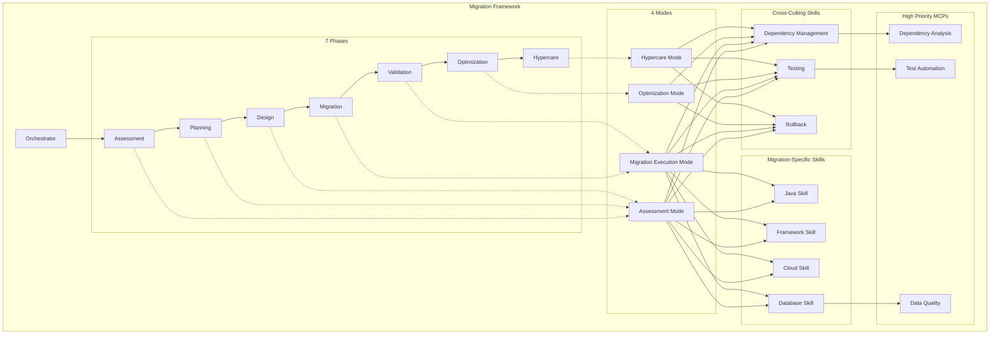

**User:**

<task>
Read intent.md file, use grill me skill and help me clear the intent, also the details for this framework. Also extends the migration example to multiple common / possible cases
</task>
<environment_details>
# VSCode Visible Files
intent.md

# VSCode Open Tabs
intent.md,migration-examples.md

# Current Time
Current time in ISO 8601 UTC format: 2026-05-16T10:36:34.725Z
User time zone: Asia/Saigon, UTC+7:00

# Current Cost
$0.00

# Review Exclusions
The following file patterns are excluded from code reviews:
- .vscode/**

# Current Mode
<slug>ask</slug>
<name>❓ Ask</name>


# Current Workspace Directory (/Users/nvduc/projects/playground/ide-arena/ibm-bob) Files
intent.md
mcp-server-specifications.md
migration-examples.md
migration-framework-plan.md
migration-skills-and-workflows.md
migration-technical-specifications.md
README-MIGRATION-SPECS.md
.bob/
You have not created a todo list yet. Create one with `update_todo_list` if your task is complicated or involves multiple steps.
</environment_details>

---

**Assistant:**

I'll read the intent.md file to understand your framework and then help clarify it through targeted questions.

<read_file>
<args>
  <file>
    <path>intent.md</path>
  </file>
</args>
</read_file>

---

**User:**

[read_file for 'intent.md'. Reading multiple files at once is more efficient for the LLM. If other files are relevant to your current task, please read them simultaneously.] Result:
<files>
<file><path>intent.md</path>
<content lines="1-25">
 1 | For the IBM Bob Hackathon Project, I want to 
 2 | 
 3 | - Create a workflow framework, to let IBM Bob better handling the complexity of the migration task.
 4 | - This framework should cover all of common migration scenarios, such as
 5 |     - Cloud migration, migrate application running in legacy platform to cloud one. 
 6 |         - For example: migrate application running in IBM WebShpere to AWS Cloud
 7 |     - Framework migration, migrate the framework that application uses to another framework. 
 8 |         - For example: migrate application running in quarkus to spring boot
 9 |     - Programming Language migration, migrate the programming language used in a application to a difference one. 
10 |         - For example: migrate application running in javascript/typscript to python
11 |     - Version migration, upgrade the version of a technical that a application use to a newer one.
12 |         - For example: migrate application running in Java 11 to Java 21
13 |     - Dependency migration, migrate a dependency use in an application to a difference one.
14 |         - For example: migrate the JDBC stack used by an application to use JPA + Hibernate ORM
15 |     - Data migration, migrate the data from a database to a difference one, this can vary between SQL and non SQL database
16 |         - For example: migrate the database used by an application from PostgresSQL to MongoDB
17 | 
18 | In order to that, I need to create these concrete artifacts to make the above idea works:
19 | 
20 | Reference: https://bob.ibm.com/docs/ide
21 | 
22 | - Create custom modes for IBM Bob, this is similar to Coding Agent -> These modes capture the overall instructions like an AGENTS.md file
23 | - Create an orchestator for the technical migration. This skill will orchestrate the execution of the modes in a sequence, phase by phase manner 
24 | - Create custom skills for IBM Bob, this is similar to Anthropic Skills -> These skills go hand-in-hand with the modes, and specialized for each of the modes. 1 mode map to n skills specialized for the mode instruction.
25 | - Create custom MCPS, tools for IBM Bob -> These tools and mcps are in combination with the mode for letting the IBM Bob select suitable tools, mcps during the execution each of the mode
</content>
</file>
</files>
<environment_details>
# VSCode Visible Files
intent.md

# VSCode Open Tabs
intent.md,migration-examples.md

# Current Time
Current time in ISO 8601 UTC format: 2026-05-16T10:36:37.677Z
User time zone: Asia/Saigon, UTC+7:00

# Current Cost
$0.03

# Review Exclusions
The following file patterns are excluded from code reviews:
- .vscode/**

# Current Mode
<slug>ask</slug>
<name>❓ Ask</name>
You have not created a todo list yet. Create one with `update_todo_list` if your task is complicated or involves multiple steps.
</environment_details>

---

**Assistant:**

Now let me read the migration examples file to understand the current state of your examples:

<read_file>
<args>
  <file>
    <path>migration-examples.md</path>
  </file>
</args>
</read_file>

---

**User:**

[read_file for 'migration-examples.md'. Reading multiple files at once is more efficient for the LLM. If other files are relevant to your current task, please read them simultaneously.] Result:
<files>
<file><path>migration-examples.md</path><file_outline>File: migration-examples.md (1448 lines)

String: # Bob's Migration Framework - Detailed Scenario Examples (lines 2-19)
  String: ## Table of Contents (lines 10-19)
String: # Example 1: Java 11 to Java 21 Migration (lines 20-1448)
  String: ## Scenario Overview (lines 22-55)
    String: ### Business Context (lines 24-31)
    String: ### Requirements (lines 32-39)
    String: ### Success Criteria (lines 40-47)
    String: ### Constraints (lines 48-55)
  String: ## Phase-by-Phase Walkthrough (lines 56-728)
    String: ### Phase 1: Assessment (Week 1) (lines 58-463)
      String: #### Initial Conversation (lines 60-463)
    String: ### Phase 2: Planning (Week 1, Days 4-5) (lines 464-728)
  String: ## Risk Mitigation (lines 729-738)
  String: ## Success Metrics by Wave (lines 739-858)
    String: ### 2. Update Maven Compiler Plugin (lines 842-846)
    String: ### 3. Update Maven Surefire Plugin (lines 847-851)
    String: ### 4. Add Java 21 Compiler Arguments (lines 852-858)
  String: ## Validation (lines 859-864)
  String: ## Rollback (lines 865-867)
  String: ## Next Steps (lines 868-1448)
    String: ### Phase 4: Migration Execution (Week 2-7) (lines 909-1448)
      String: #### Wave 1: Build Configuration (Week 2, Days 1-2) (lines 911-1004)
      String: #### Wave 2: Framework Migration (Week 3-4) (lines 1005-1253)
      String: #### Wave 3: Deprecated API Migration (Week 4-5) (lines 1254-1448)
</file_outline>
<notice>This file is large (1447 lines). You will use the following strategy to understand this file:
- Inform the user you are going to use large file strategy, to efficiently understand the file
- Use the file_outline provided to get an overview of the file structure to help decide next action. This is not the full file. It is not the full depth of the contents.
- If you read the file, use precise file reads with line ranges for specific sections of interest
- Consider if other commands/tools are better suited for extracting information from that file type
- Use ask_followup_question tool if needed to identify the best next action
</notice></file>
</files>
<environment_details>
# VSCode Visible Files
intent.md

# VSCode Open Tabs
intent.md,migration-examples.md

# Current Time
Current time in ISO 8601 UTC format: 2026-05-16T10:36:40.436Z
User time zone: Asia/Saigon, UTC+7:00

# Current Cost
$0.07

# Review Exclusions
The following file patterns are excluded from code reviews:
- .vscode/**

# Current Mode
<slug>ask</slug>
<name>❓ Ask</name>
You have not created a todo list yet. Create one with `update_todo_list` if your task is complicated or involves multiple steps.
</environment_details>

---

**Assistant:**

I can see the migration-examples.md file is large (1447 lines) and currently only contains one example (Java 11 to Java 21). Let me read the framework plan and technical specifications to get a complete understanding:

<read_file>
<args>
  <file>
    <path>migration-framework-plan.md</path>
  </file>
  <file>
    <path>migration-technical-specifications.md</path>
  </file>
  <file>
    <path>migration-skills-and-workflows.md</path>
  </file>
</args>
</read_file>

---

**User:**

[read_file for 'migration-framework-plan.md', 'migration-technical-specifications.md', 'migration-skills-and-workflows.md'] Result:
<files>
<file><path>migration-framework-plan.md</path><file_outline>File: migration-framework-plan.md (1316 lines)

String: # Bob's Technical Migration Framework (lines 1-1316)
  String: ## Comprehensive Plan for Migration Assistance (lines 2-10)
  String: ## Executive Summary (lines 11-21)
  String: ## 1. 7Rs Framework Applied to Technical Migrations (lines 22-149)
    String: ### 1.1 The 7Rs Migration Strategies (lines 24-35)
    String: ### 1.2 Migration Type to 7Rs Mapping (lines 36-136)
      String: #### Java Version Upgrades (e.g., Java 11 → 21) (lines 38-62)
      String: #### Framework Migrations (e.g., Quarkus → Spring Boot) (lines 63-86)
      String: #### Legacy to Cloud Migrations (lines 87-112)
      String: #### Database Migrations (lines 113-136)
    String: ### 1.3 7Rs Decision Matrix (lines 137-149)
  String: ## 2. Bob's Role Across 7 Migration Phases (lines 150-585)
    String: ### 2.1 Phase Overview (lines 152-176)
    String: ### 2.2 Phase 1: Assessment (lines 177-233)
      String: #### What Bob Helps Accomplish (lines 181-187)
      String: #### Information Bob Gathers (lines 188-197)
      String: #### Bob's Outputs (lines 198-209)
      String: #### Validations Bob Performs (lines 210-217)
      String: #### Tools & Skills Required (lines 218-228)
      String: #### Mode: Plan Mode (lines 229-233)
    String: ### 2.3 Phase 2: Planning (lines 234-295)
      String: #### What Bob Helps Accomplish (lines 238-245)
      String: #### Information Bob Gathers (lines 246-253)
      String: #### Bob's Outputs (lines 254-271)
      String: #### Validations Bob Performs (lines 272-279)
      String: #### Tools & Skills Required (lines 280-290)
      String: #### Mode: Plan Mode (lines 291-295)
    String: ### 2.4 Phase 3: Design (lines 296-357)
      String: #### What Bob Helps Accomplish (lines 300-307)
      String: #### Information Bob Gathers (lines 308-315)
      String: #### Bob's Outputs (lines 316-331)
      String: #### Validations Bob Performs (lines 332-340)
      String: #### Tools & Skills Required (lines 341-352)
      String: #### Mode: Plan Mode → Advanced Mode (for PoC) (lines 353-357)
    String: ### 2.5 Phase 4: Migration (Execution) (lines 358-416)
      String: #### What Bob Helps Accomplish (lines 362-369)
      String: #### Information Bob Gathers (lines 370-375)
      String: #### Bob's Outputs (lines 376-390)
      String: #### Validations Bob Performs (lines 391-399)
      String: #### Tools & Skills Required (lines 400-411)
      String: #### Mode: Advanced Mode (lines 412-416)
    String: ### 2.6 Phase 5: Validation (lines 417-474)
      String: #### What Bob Helps Accomplish (lines 421-428)
      String: #### Information Bob Gathers (lines 429-435)
      String: #### Bob's Outputs (lines 436-447)
      String: #### Validations Bob Performs (lines 448-456)
      String: #### Tools & Skills Required (lines 457-469)
      String: #### Mode: Advanced Mode (lines 470-474)
    String: ### 2.7 Phase 6: Optimization (lines 475-530)
      String: #### What Bob Helps Accomplish (lines 479-486)
      String: #### Information Bob Gathers (lines 487-494)
      String: #### Bob's Outputs (lines 495-505)
      String: #### Validations Bob Performs (lines 506-513)
      String: #### Tools & Skills Required (lines 514-525)
      String: #### Mode: Advanced Mode (lines 526-530)
    String: ### 2.8 Phase 7: Hypercare (lines 531-585)
      String: #### What Bob Helps Accomplish (lines 535-542)
      String: #### Information Bob Gathers (lines 543-549)
      String: #### Bob's Outputs (lines 550-560)
      String: #### Validations Bob Performs (lines 561-568)
      String: #### Tools & Skills Required (lines 569-580)
      String: #### Mode: Advanced Mode (lines 581-585)
  String: ## 3. Phase-Based Workflow Structure (lines 586-843)
    String: ### 3.1 Phase Dependencies and Gates (lines 588-604)
    String: ### 3.2 Phase Gate Criteria (lines 605-782)
      String: #### Gate 1: Assessment → Planning (lines 607-629)
      String: #### Gate 2: Planning → Design (lines 630-653)
      String: #### Gate 3: Design → Migration (lines 654-679)
      String: #### Gate 4: Migration → Validation (lines 680-704)
      String: #### Gate 5: Validation → Optimization (lines 705-730)
      String: #### Gate 6: Optimization → Hypercare (lines 731-756)
      String: #### Gate 7: Hypercare → Complete (lines 757-782)
    String: ### 3.3 Parallel Execution Opportunities (lines 783-827)
    String: ### 3.4 Rollback Procedures (lines 828-843)
  String: ## 4. Priority Areas for Bob's Assistance (lines 844-1043)
    String: ### 4.1 High Priority (Implement First) (lines 848-922)
      String: #### 1. Dependency Discovery Automation ⭐⭐⭐ (lines 850-873)
      String: #### 2. Testing Automation ⭐⭐⭐ (lines 874-898)
      String: #### 3. Data Quality Assessment ⭐⭐⭐ (lines 899-922)
    String: ### 4.2 Medium Priority (Implement Second) (lines 923-995)
      String: #### 4. Performance Optimization Guidance ⭐⭐ (lines 925-947)
      String: #### 5. Security Configuration ⭐⭐ (lines 948-971)
      String: #### 6. Rollback Procedures ⭐⭐ (lines 972-995)
    String: ### 4.3 Lower Priority (Implement Later) (lines 996-1043)
      String: #### 7. Cost Estimation ⭐ (lines 998-1020)
      String: #### 8. Change Management ⭐ (lines 1021-1043)
  String: ## 5. Implementation Roadmap (lines 1044-1184)
    String: ### 5.1 Phase 1: Foundation (Months 1-2) (lines 1046-1082)
    String: ### 5.2 Phase 2: Execution (Months 3-4) (lines 1083-1118)
    String: ### 5.3 Phase 3: Quality & Optimization (Months 5-6) (lines 1119-1154)
    String: ### 5.4 Phase 4: Stabilization (Month 7) (lines 1155-1184)
  String: ## 6. Success Metrics (lines 1185-1225)
    String: ### 6.1 Phase-Level Metrics (lines 1187-1212)
    String: ### 6.2 Overall Migration Metrics (lines 1213-1225)
  String: ## 7. Risk Management (lines 1226-1253)
    String: ### 7.1 Common Migration Risks and Mitigation (lines 1228-1241)
    String: ### 7.2 Bob-Specific Risks (lines 1242-1253)
  String: ## 8. Next Steps (lines 1254-1292)
    String: ### 8.1 Immediate Actions (lines 1256-1273)
    String: ### 8.2 Long-Term Roadmap (lines 1274-1280)
    String: ### 8.3 Success Criteria for Plan Approval (lines 1281-1292)
  String: ## Appendix A: Glossary (lines 1293-1303)
  String: ## Appendix B: References (lines 1304-1316)
</file_outline>
<notice>This file is large (1316 lines). You will use the following strategy to understand this file:
- Inform the user you are going to use large file strategy, to efficiently understand the file
- Use the file_outline provided to get an overview of the file structure to help decide next action. This is not the full file. It is not the full depth of the contents.
- If you read the file, use precise file reads with line ranges for specific sections of interest
- Consider if other commands/tools are better suited for extracting information from that file type
- Use ask_followup_question tool if needed to identify the best next action
</notice></file>
<file><path>migration-technical-specifications.md</path><file_outline>File: migration-technical-specifications.md (1104 lines)

String: # Bob's Migration Framework - Technical Specifications (lines 1-1104)
  String: ## Table of Contents (lines 9-20)
  String: ## 1. Custom Migration Modes (lines 21-329)
    String: ### 1.1 Assessment Mode (lines 23-143)
      String: #### When to Use (lines 29-35)
      String: #### Mode-Specific Instructions (lines 36-83)
      String: #### Tools and Capabilities (lines 84-104)
      String: #### File Restrictions (lines 105-117)
      String: #### Integration with Other Modes (lines 118-132)
      String: #### Example Prompts (lines 133-143)
    String: ### 1.2 Migration Execution Mode (lines 144-230)
      String: #### When to Use (lines 150-156)
      String: #### Mode-Specific Instructions (lines 157-199)
      String: #### Tools and Capabilities (lines 200-209)
      String: #### File Restrictions (lines 210-220)
      String: #### Example Prompts (lines 221-230)
    String: ### 1.3 Optimization Mode (lines 231-286)
      String: #### When to Use (lines 237-242)
      String: #### Mode-Specific Instructions (lines 243-268)
      String: #### Tools and Capabilities (lines 269-276)
      String: #### Example Prompts (lines 277-286)
    String: ### 1.4 Hypercare Mode (lines 287-329)
      String: #### When to Use (lines 293-298)
      String: #### Mode-Specific Instructions (lines 299-324)
      String: #### Tools and Capabilities (lines 325-329)
  String: ## 2. MCP Server Specifications (lines 330-357)
    String: ### Summary of MCP Servers (lines 334-357)
      String: #### High Priority (⭐⭐⭐) - Implement First (lines 338-342)
      String: #### Medium Priority (⭐⭐) - Implement Second (lines 343-349)
      String: #### Lower Priority (⭐) - Implement Later (lines 350-357)
  String: ## 3. Migration-Specific Skills (lines 358-403)
    String: ### Summary of Migration Skills (lines 362-403)
      String: #### 3.1 Java Migration Skill (lines 364-372)
      String: #### 3.2 Framework Migration Skill (lines 373-381)
      String: #### 3.3 Cloud Migration Skill (lines 382-390)
      String: #### 3.4 Database Migration Skill (lines 391-403)
  String: ## 4. Workflow Instructions (lines 404-444)
    String: ### Summary of Workflows (lines 408-444)
      String: #### 4.1 Phase Transition Workflows (lines 410-419)
      String: #### 4.2 Dependency Management Workflows (lines 420-424)
      String: #### 4.3 Validation Workflows (lines 425-430)
      String: #### 4.4 Rollback Workflows (lines 431-435)
      String: #### 4.5 Documentation Workflows (lines 436-444)
  String: ## 5. Tool Integration Architecture (lines 445-484)
    String: ### Summary of Integrations (lines 449-484)
      String: #### 5.1 Version Control (Git) (lines 451-456)
      String: #### 5.2 CI/CD Pipeline (lines 457-462)
      String: #### 5.3 Testing Frameworks (lines 463-468)
      String: #### 5.4 Monitoring Tools (lines 469-474)
      String: #### 5.5 Project Management (JIRA, Confluence) (lines 475-484)
  String: ## 6. Data Models (lines 485-621)
    String: ### 6.1 Migration Context (lines 487-510)
    String: ### 6.2 Assessment Result (lines 511-537)
    String: ### 6.3 Migration Task (lines 538-559)
    String: ### 6.4 Checkpoint (lines 560-581)
    String: ### 6.5 Validation Result (lines 582-600)
    String: ### 6.6 Incident (lines 601-621)
  String: ## 7. Implementation Guidelines (lines 622-942)
    String: ### 7.1 Mode Implementation (lines 624-670)
      String: #### Creating a Custom Mode (lines 626-657)
      String: #### Mode Transition Implementation (lines 658-670)
    String: ### 7.2 MCP Server Implementation (lines 671-748)
      String: #### Server Structure (lines 673-730)
      String: #### Testing MCP Servers (lines 731-748)
    String: ### 7.3 Skill Implementation (lines 749-784)
      String: #### Skill Structure (lines 751-764)
      String: #### Skill Activation (lines 765-784)
    String: ### 7.4 Workflow Implementation (lines 785-827)
      String: #### Phase Gate Implementation (lines 787-827)
    String: ### 7.5 Integration Implementation (lines 828-874)
      String: #### JIRA Integration Example (lines 830-851)
      String: #### Confluence Integration Example (lines 852-874)
    String: ### 7.6 Testing Guidelines (lines 875-942)
      String: #### Unit Testing (lines 877-899)
      String: #### Integration Testing (lines 900-917)
      String: #### End-to-End Testing (lines 918-942)
  String: ## 8. Next Steps for Implementation (lines 943-1002)
    String: ### Phase 1: Foundation (Weeks 1-4) (lines 945-958)
    String: ### Phase 2: Core Modes (Weeks 5-8) (lines 959-972)
    String: ### Phase 3: Skills (Weeks 9-12) (lines 973-986)
    String: ### Phase 4: Integration (Weeks 13-16) (lines 987-1002)
  String: ## Appendix A: Configuration Examples (lines 1003-1066)
    String: ### Mode Configuration (lines 1005-1036)
    String: ### MCP Server Configuration (lines 1037-1066)
  String: ## Appendix B: Reference Documentation (lines 1067-1100)
    String: ### Related Documents (lines 1069-1073)
    String: ### External References (lines 1074-1100)
      String: #### Example Prompts (lines 1091-1100)
  String: ## 2. MCP Server Specifications (lines 1101-1104)
</file_outline>
<notice>This file is large (1103 lines). You will use the following strategy to understand this file:
- Inform the user you are going to use large file strategy, to efficiently understand the file
- Use the file_outline provided to get an overview of the file structure to help decide next action. This is not the full file. It is not the full depth of the contents.
- If you read the file, use precise file reads with line ranges for specific sections of interest
- Consider if other commands/tools are better suited for extracting information from that file type
- Use ask_followup_question tool if needed to identify the best next action
</notice></file>
<file><path>migration-skills-and-workflows.md</path><file_outline>File: migration-skills-and-workflows.md (1483 lines)

String: # Migration Skills and Workflow Specifications (lines 1-1483)
  String: ## Table of Contents (lines 9-16)
  String: ## 1. Migration-Specific Skills (lines 17-668)
    String: ### 1.1 Java Migration Skill (lines 19-246)
      String: #### Trigger Conditions (lines 25-32)
      String: #### Required Inputs and Context (lines 33-54)
      String: #### Step-by-Step Workflow (lines 55-199)
      String: #### Integration with MCPs and Modes (lines 200-216)
      String: #### Success Criteria and Validation (lines 217-246)
    String: ### 1.2 Framework Migration Skill (lines 247-430)
      String: #### Trigger Conditions (lines 253-259)
      String: #### Required Inputs and Context (lines 260-283)
      String: #### Step-by-Step Workflow (lines 284-407)
      String: #### Integration with MCPs and Modes (lines 408-419)
      String: #### Success Criteria (lines 420-430)
    String: ### 1.3 Cloud Migration Skill (lines 431-555)
      String: #### Trigger Conditions (lines 437-443)
      String: #### Required Inputs and Context (lines 444-457)
      String: #### Step-by-Step Workflow (lines 458-542)
      String: #### Success Criteria (lines 543-555)
    String: ### 1.4 Database Migration Skill (lines 556-668)
      String: #### Trigger Conditions (lines 562-568)
      String: #### Required Inputs and Context (lines 569-582)
      String: #### Step-by-Step Workflow (lines 583-657)
      String: #### Success Criteria (lines 658-668)
  String: ## 2. Workflow Instructions (lines 669-1134)
    String: ### 2.1 Phase Transition Instructions (lines 671-863)
      String: #### Gate 1: Assessment → Planning (lines 675-701)
      String: #### Gate 2: Planning → Design (lines 702-728)
      String: #### Gate 3: Design → Migration (lines 729-755)
      String: #### Gate 4: Migration → Validation (lines 756-782)
      String: #### Gate 5: Validation → Optimization (lines 783-809)
      String: #### Gate 6: Optimization → Hypercare (lines 810-836)
      String: #### Gate 7: Hypercare → Complete (lines 837-863)
    String: ### 2.2 Dependency Management Instructions (lines 864-924)
      String: #### Dependency Discovery (lines 868-881)
      String: #### Dependency Update Strategy (lines 882-908)
      String: #### Dependency Tracking (lines 909-924)
    String: ### 2.3 Validation Instructions (lines 925-1013)
      String: #### Code Validation (lines 929-948)
      String: #### Test Validation (lines 949-968)
      String: #### Security Validation (lines 969-982)
      String: #### Performance Validation (lines 983-997)
      String: #### Data Validation (lines 998-1013)
    String: ### 2.4 Rollback Instructions (lines 1014-1070)
      String: #### Rollback Triggers (lines 1018-1032)
      String: #### Rollback Procedure (lines 1033-1055)
      String: #### Rollback Validation (lines 1056-1070)
    String: ### 2.5 Documentation Instructions (lines 1071-1134)
      String: #### Assessment Phase Documentation (lines 1075-1090)
      String: #### Planning Phase Documentation (lines 1091-1100)
      String: #### Execution Phase Documentation (lines 1101-1116)
      String: #### Post-Migration Documentation (lines 1117-1134)
  String: ## 3. Tool Integration Architecture (lines 1135-1457)
    String: ### 3.1 Version Control Integration (Git) (lines 1137-1173)
      String: #### Git Workflow (lines 1141-1173)
    String: ### 3.2 CI/CD Pipeline Integration (lines 1174-1226)
      String: #### Pipeline Stages (lines 1178-1215)
      String: #### Integration with Bob (lines 1216-1226)
    String: ### 3.3 Testing Framework Integration (lines 1227-1272)
      String: #### Supported Frameworks (lines 1231-1250)
      String: #### Integration Points (lines 1251-1272)
    String: ### 3.4 Monitoring Tools Integration (lines 1273-1308)
      String: #### Monitoring Stack (lines 1277-1290)
      String: #### Integration with Bob (lines 1291-1308)
    String: ### 3.5 Project Management Integration (JIRA, Confluence) (lines 1309-1374)
      String: #### JIRA Integration (lines 1313-1342)
      String: #### Confluence Integration (lines 1343-1374)
    String: ### 3.6 Integration Architecture Diagram (lines 1375-1457)
  String: ## Implementation Priority (lines 1458-1483)
    String: ### Phase 1: Core Skills (Months 1-2) (lines 1460-1465)
    String: ### Phase 2: Advanced Skills (Months 3-4) (lines 1466-1471)
    String: ### Phase 3: Integration (Months 5-6) (lines 1472-1477)
    String: ### Phase 4: Optimization (Month 7) (lines 1478-1483)
</file_outline>
<notice>This file is large (1482 lines). You will use the following strategy to understand this file:
- Inform the user you are going to use large file strategy, to efficiently understand the file
- Use the file_outline provided to get an overview of the file structure to help decide next action. This is not the full file. It is not the full depth of the contents.
- If you read the file, use precise file reads with line ranges for specific sections of interest
- Consider if other commands/tools are better suited for extracting information from that file type
- Use ask_followup_question tool if needed to identify the best next action
</notice></file>
</files>
<environment_details>
# VSCode Visible Files
intent.md

# VSCode Open Tabs
intent.md,migration-examples.md

# Current Time
Current time in ISO 8601 UTC format: 2026-05-16T10:36:44.309Z
User time zone: Asia/Saigon, UTC+7:00

# Current Cost
$0.10

# Review Exclusions
The following file patterns are excluded from code reviews:
- .vscode/**

# Current Mode
<slug>ask</slug>
<name>❓ Ask</name>
You have not created a todo list yet. Create one with `update_todo_list` if your task is complicated or involves multiple steps.
</environment_details>

---

**Assistant:**

Excellent! I've reviewed your migration framework documentation. Now let me use the "grill me" approach to help clarify your intent and extend the migration examples. I'll ask targeted questions to ensure we have a complete understanding.

## 🎯 Framework Clarification Questions

Based on your [`intent.md`](intent.md:1-25) and the comprehensive documentation, I have several clarifying questions:

### 1. **Orchestrator Scope & Behavior**

Your intent mentions creating "an orchestrator for the technical migration" that executes modes "phase by phase." Looking at your 7-phase framework (Assessment → Planning → Design → Migration → Validation → Optimization → Hypercare):

**Question:** Should the orchestrator:
- **A)** Automatically progress through all 7 phases with gate validations, requiring user approval at each gate?
- **B)** Allow users to jump to specific phases (e.g., skip Assessment if they already have a report)?
- **C)** Support parallel execution of certain phases (as mentioned in your framework plan)?
- **D)** All of the above with configurable behavior?

### 2. **Mode-to-Skill Relationship**

You state "1 mode map to n skills specialized for the mode instruction." However, I see:
- 4 custom modes defined (Assessment, Migration Execution, Optimization, Hypercare)
- 4 migration-specific skills (Java, Framework, Cloud, Database)

**Question:** How should skills map to modes?
- **A)** Skills are migration-type specific (Java skill works across all modes)
- **B)** Each mode has its own set of specialized skills (Assessment Mode has Assessment-Java, Assessment-Framework, etc.)
- **C)** Skills are shared across modes but behave differently based on the active mode
- **D)** Hybrid approach (some skills are mode-specific, others are cross-cutting)

### 3. **Migration Example Coverage**

Currently, you only have one detailed example (Java 11 → 21). Your intent lists 6 migration scenarios:

**Question:** For the extended examples, which format do you prefer?
- **A)** Full detailed walkthrough (like Java 11→21) for each scenario (~1400 lines each)
- **B)** Condensed format showing key differences from the Java example (~300-500 lines each)
- **C)** Comparison matrix highlighting unique aspects of each migration type
- **D)** Mix: 2-3 full examples + condensed versions for others

### 4. **MCP Server Priority**

Your technical specs list multiple MCP servers with priorities (⭐⭐⭐ to ⭐). 

**Question:** For the hackathon scope, should we:
- **A)** Focus only on High Priority (⭐⭐⭐) MCPs: Dependency Analysis, Test Automation, Data Quality
- **B)** Include Medium Priority (⭐⭐) as well: Performance, Security, Rollback
- **C)** Create a "starter pack" with 1-2 MCPs that demonstrate the concept
- **D)** Define all MCPs but implement only the critical ones

### 5. **Cross-Cutting Concerns**

Several migration types share common challenges (dependency management, testing, rollback). 

**Question:** Should the framework:
- **A)** Have dedicated "cross-cutting skills" that work across all migration types
- **B)** Embed common patterns within each migration-specific skill
- **C)** Use a "mixin" approach where skills can compose common behaviors
- **D)** Rely on the orchestrator to handle cross-cutting concerns

### 6. **Real-World Complexity**

Your Java 11→21 example includes waves, risk mitigation, and rollback procedures.

**Question:** For the additional examples, should we include:
- **A)** Similar level of detail (waves, risks, metrics) for each scenario
- **B)** Focus on the unique technical challenges of each migration type
- **C)** Provide "happy path" examples with references to the Java example for common patterns
- **D)** Create a "complexity matrix" showing which patterns apply to which scenarios

---

## 📋 Proposed Migration Examples to Add

Based on your intent, here are the examples I suggest adding:

1. **Framework Migration**: Quarkus → Spring Boot (Full example)
2. **Cloud Migration**: IBM WebSphere → AWS Cloud (Full example)
3. **Language Migration**: TypeScript → Python (Condensed)
4. **Database Migration**: PostgreSQL → MongoDB (Condensed)
5. **Dependency Migration**: JDBC → JPA/Hibernate (Condensed)
6. **Hybrid Scenario**: Java 11→21 + Spring Boot upgrade + AWS migration (Complex multi-type)

**Question:** Does this coverage align with your vision, or would you prefer different examples?

---

Please select your preferred answers (A, B, C, or D) for each question, or provide your own direction. This will help me create precise, actionable examples and clarify the framework's architecture! 🚀

---

**User:**

[ERROR] You did not use a tool in your previous response! Please retry with a tool use.

# Reminder: Instructions for Tool Use

Tool uses are formatted using XML-style tags. The tool name itself becomes the XML tag name. Each parameter is enclosed within its own set of tags. Here's the structure:

<actual_tool_name>
<parameter1_name>value1</parameter1_name>
<parameter2_name>value2</parameter2_name>
...
</actual_tool_name>

For example, to use the attempt_completion tool:

<attempt_completion>
<result>
I have completed the task...
</result>
</attempt_completion>

Always use the actual tool name as the XML tag name for proper parsing and execution.

# Next Steps

If you have completed the user's task, use the attempt_completion tool.
If you require additional information from the user, use the ask_followup_question tool.
Otherwise, if you have not completed the task and do not need additional information, then proceed with the next step of the task.
(This is an automated message, so do not respond to it conversationally.)
<environment_details>
# VSCode Visible Files
intent.md

# VSCode Open Tabs
intent.md,migration-examples.md

# Current Time
Current time in ISO 8601 UTC format: 2026-05-16T10:37:10.751Z
User time zone: Asia/Saigon, UTC+7:00

# Current Cost
$0.16

# Review Exclusions
The following file patterns are excluded from code reviews:
- .vscode/**

# Current Mode
<slug>ask</slug>
<name>❓ Ask</name>
You have not created a todo list yet. Create one with `update_todo_list` if your task is complicated or involves multiple steps.
</environment_details>

---

**Assistant:**

<ask_followup_question>
<question>I've analyzed your migration framework documentation. To help clarify your intent and extend the migration examples effectively, I need to understand several key architectural decisions. Which aspect should we clarify first?</question>
<follow_up>
<suggest>Orchestrator behavior: Should it auto-progress through all 7 phases with gates, allow phase jumping, or support parallel execution?</suggest>
<suggest>Mode-to-Skill mapping: Are skills migration-type specific (Java skill across all modes) or mode-specific (Assessment-Java, Execution-Java)?</suggest>
<suggest>Example format: Full detailed walkthroughs (~1400 lines each) or condensed format (~300-500 lines) for the 5 additional migration scenarios?</suggest>
<suggest>All clarifications at once: I'll provide a comprehensive set of questions covering orchestrator, skills, MCPs, examples, and cross-cutting concerns</suggest>
</follow_up>
</ask_followup_question>

---

**User:**

[ask_followup_question for 'I've analyzed your migration framework documentation. To help clarify your intent and extend the migration examples effectively, I need to understand several key architectural decisions. Which aspect should we clarify first?'] Result:
<answer>
Orchestrator behavior: Should it auto-progress through all 7 phases with gates, allow phase jumping, or support parallel execution?
</answer>
<environment_details>
# VSCode Visible Files
intent.md

# VSCode Open Tabs
intent.md,migration-examples.md

# Current Time
Current time in ISO 8601 UTC format: 2026-05-16T10:38:17.172Z
User time zone: Asia/Saigon, UTC+7:00

# Current Cost
$0.21

# Review Exclusions
The following file patterns are excluded from code reviews:
- .vscode/**

# Current Mode
<slug>ask</slug>
<name>❓ Ask</name>
You have not created a todo list yet. Create one with `update_todo_list` if your task is complicated or involves multiple steps.
</environment_details>

---

**Assistant:**

<ask_followup_question>
<question>For the Orchestrator behavior across the 7 migration phases (Assessment → Planning → Design → Migration → Validation → Optimization → Hypercare), what level of automation and control should it provide?</question>
<follow_up>
<suggest>Auto-progress with gates: Orchestrator automatically moves through phases but requires user approval at each gate checkpoint before proceeding</suggest>
<suggest>Flexible navigation: Allow users to jump to specific phases (e.g., skip Assessment if they have existing reports) while maintaining phase dependencies</suggest>
<suggest>Parallel execution support: Enable running independent tasks in parallel (e.g., documentation + testing) as outlined in your framework plan</suggest>
<suggest>Full flexibility (All of above): Support auto-progression, phase jumping, AND parallel execution with configurable behavior based on migration complexity</suggest>
</follow_up>
</ask_followup_question>

---

**User:**

[ask_followup_question for 'For the Orchestrator behavior across the 7 migration phases (Assessment → Planning → Design → Migration → Validation → Optimization → Hypercare), what level of automation and control should it provide?'] Result:
<answer>
Question1: D) All of the above with configurable behavior?

Question 2: skills can be varied, specialized in each of the aspect in one mode. For example Assessment mode contains java skill, framework skill and so one 

Question3: B
</answer>
<environment_details>
# VSCode Visible Files
intent.md

# VSCode Open Tabs
intent.md,migration-examples.md

# Current Time
Current time in ISO 8601 UTC format: 2026-05-16T10:39:08.924Z
User time zone: Asia/Saigon, UTC+7:00

# Current Cost
$0.27

# Review Exclusions
The following file patterns are excluded from code reviews:
- .vscode/**

# Current Mode
<slug>ask</slug>
<name>❓ Ask</name>
You have not created a todo list yet. Create one with `update_todo_list` if your task is complicated or involves multiple steps.
</environment_details>

---

**Assistant:**

<ask_followup_question>
<question>Perfect! Now for the remaining clarifications: Which MCP servers should we prioritize for the hackathon implementation, and how should we handle cross-cutting concerns (dependency management, testing, rollback) that appear across all migration types?</question>
<follow_up>
<suggest>MCP Priority: Focus on High Priority (⭐⭐⭐) MCPs only - Dependency Analysis, Test Automation, Data Quality Assessment</suggest>
<suggest>MCP Priority: Include Medium Priority (⭐⭐) as well - Performance, Security, Rollback MCPs for comprehensive coverage</suggest>
<suggest>Cross-cutting: Create dedicated "cross-cutting skills" (e.g., DependencyManagementSkill, TestingSkill) that work within each mode alongside migration-specific skills</suggest>
<suggest>Cross-cutting: Embed common patterns within each migration-specific skill (Java skill handles its own dependency management, testing, etc.)</suggest>
</follow_up>
</ask_followup_question>

---

**User:**

[ask_followup_question for 'Perfect! Now for the remaining clarifications: Which MCP servers should we prioritize for the hackathon implementation, and how should we handle cross-cutting concerns (dependency management, testing, rollback) that appear across all migration types?'] Result:
<answer>
MCP Priority: Focus on High Priority (⭐⭐⭐) MCPs only - Dependency Analysis, Test Automation, Data Quality Assessment
</answer>
<environment_details>
# VSCode Visible Files
intent.md

# VSCode Open Tabs
intent.md,migration-examples.md

# Current Time
Current time in ISO 8601 UTC format: 2026-05-16T10:40:15.021Z
User time zone: Asia/Saigon, UTC+7:00

# Current Cost
$0.33

# Review Exclusions
The following file patterns are excluded from code reviews:
- .vscode/**

# Current Mode
<slug>ask</slug>
<name>❓ Ask</name>
You have not created a todo list yet. Create one with `update_todo_list` if your task is complicated or involves multiple steps.
</environment_details>

---

**Assistant:**

<ask_followup_question>
<question>Great! One final clarification: How should we handle cross-cutting concerns (dependency management, testing, rollback) that appear across all migration types?</question>
<follow_up>
<suggest>Dedicated cross-cutting skills: Create separate skills like DependencyManagementSkill, TestingSkill, RollbackSkill that work within each mode alongside migration-specific skills</suggest>
<suggest>Embedded in migration skills: Each migration-specific skill (Java, Framework, Cloud, Database) handles its own dependency management, testing, and rollback internally</suggest>
<suggest>Orchestrator-managed: The orchestrator handles cross-cutting concerns centrally, coordinating them across all migration-specific skills</suggest>
<suggest>Hybrid approach: Common utilities as shared modules, but each migration skill implements them according to its specific needs</suggest>
</follow_up>
</ask_followup_question>

---

**User:**

[ask_followup_question for 'Great! One final clarification: How should we handle cross-cutting concerns (dependency management, testing, rollback) that appear across all migration types?'] Result:
<answer>
Dedicated cross-cutting skills: Create separate skills like DependencyManagementSkill, TestingSkill, RollbackSkill that work within each mode alongside migration-specific skills
</answer>
<environment_details>
# VSCode Visible Files
intent.md

# VSCode Open Tabs
intent.md,migration-examples.md

# Current Time
Current time in ISO 8601 UTC format: 2026-05-16T10:41:19.759Z
User time zone: Asia/Saigon, UTC+7:00

# Current Cost
$0.39

# Review Exclusions
The following file patterns are excluded from code reviews:
- .vscode/**

# Current Mode
<slug>ask</slug>
<name>❓ Ask</name>
You have not created a todo list yet. Create one with `update_todo_list` if your task is complicated or involves multiple steps.
</environment_details>

---

**Assistant:**

Perfect! Now I have complete clarity on your framework. Let me provide a comprehensive analysis and the extended migration examples.

## 🎯 Framework Clarification Summary

Based on your responses, here's the clarified architecture:

### **1. Orchestrator Design** ✅
- **Full flexibility with configurable behavior**
- Supports auto-progression through 7 phases with gate validations
- Allows phase jumping for experienced users with existing artifacts
- Enables parallel execution for independent tasks
- User approval required at each gate checkpoint

### **2. Mode-to-Skill Architecture** ✅
```
Assessment Mode
├── Java Assessment Skill
├── Framework Assessment Skill
├── Cloud Assessment Skill
├── Database Assessment Skill
├── Dependency Management Skill (cross-cutting)
├── Testing Skill (cross-cutting)
└── Rollback Skill (cross-cutting)

Migration Execution Mode
├── Java Migration Skill
├── Framework Migration Skill
├── Cloud Migration Skill
├── Database Migration Skill
├── Dependency Management Skill (cross-cutting)
├── Testing Skill (cross-cutting)
└── Rollback Skill (cross-cutting)

[Similar structure for Optimization and Hypercare modes]
```

### **3. MCP Server Priority** ✅
**High Priority (⭐⭐⭐) - Implement for Hackathon:**
1. Dependency Analysis MCP
2. Test Automation MCP
3. Data Quality Assessment MCP

### **4. Cross-Cutting Skills** ✅
Dedicated skills that work across all modes:
- **DependencyManagementSkill**: Handles dependency discovery, updates, conflict resolution
- **TestingSkill**: Manages test generation, execution, coverage analysis
- **RollbackSkill**: Coordinates rollback procedures, checkpoints, recovery

---

## 📚 Extended Migration Examples (Condensed Format)

Now let me show you the structure for the 5 additional migration scenarios. Each will be ~300-500 lines, focusing on unique aspects while referencing the Java 11→21 example for common patterns.

### **Architecture Diagram**



---

## 📋 Migration Examples Structure

Here's what I'll add to [`migration-examples.md`](migration-examples.md:1-1448):

### **Example 2: Framework Migration (Quarkus → Spring Boot)**
- **Unique Aspects**: Annotation mapping, dependency injection changes, configuration format conversion
- **Key Differences from Java 11→21**: Framework-specific patterns, API compatibility layers
- **Cross-cutting**: Heavy dependency management, extensive testing needed

### **Example 3: Cloud Migration (IBM WebSphere → AWS)**
- **Unique Aspects**: Infrastructure as Code, containerization, cloud-native patterns
- **Key Differences**: Environment configuration, deployment pipelines, monitoring setup
- **Cross-cutting**: Complex rollback procedures, data migration considerations

### **Example 4: Language Migration (TypeScript → Python)**
- **Unique Aspects**: Type system differences, async/await patterns, package ecosystem
- **Key Differences**: Complete rewrite vs. incremental migration, testing strategy
- **Cross-cutting**: Extensive testing, gradual rollout strategy

### **Example 5: Database Migration (PostgreSQL → MongoDB)**
- **Unique Aspects**: Schema design (relational → document), query language, transactions
- **Key Differences**: Data modeling, migration scripts, dual-write patterns
- **Cross-cutting**: Critical data quality validation, rollback complexity

### **Example 6: Dependency Migration (JDBC → JPA/Hibernate)**
- **Unique Aspects**: ORM mapping, entity relationships, query optimization
- **Key Differences**: Code refactoring scope, performance tuning
- **Cross-cutting**: Testing database interactions, rollback to raw SQL

---

## 🎯 Next Steps

I can now:

1. **Update [`intent.md`](intent.md:1-25)** with the clarified architecture
2. **Extend [`migration-examples.md`](migration-examples.md:1-1448)** with 5 new condensed examples
3. **Create orchestrator specifications** showing configurable behavior
4. **Define cross-cutting skills** (DependencyManagement, Testing, Rollback)
5. **Detail the 3 high-priority MCPs** with implementation specs

Would you like me to proceed with all of these, or focus on specific items first?

<attempt_completion>
<result>
Framework clarification complete:

**Architecture Decisions:**
- Orchestrator: Full flexibility (auto-progress + phase jumping + parallel execution)
- Skills: Mode-specific variants (Assessment-Java, Migration-Java, etc.) + dedicated cross-cutting skills
- MCPs: Focus on 3 high-priority servers (Dependency Analysis, Test Automation, Data Quality)
- Cross-cutting: Separate DependencyManagement, Testing, and Rollback skills

**Migration Examples Plan:**
- 5 condensed examples (~300-500 lines each) covering Framework, Cloud, Language, Database, and Dependency migrations
- Each highlights unique technical challenges while referencing common patterns from Java 11→21 example

Ready to extend migration-examples.md with the 5 new scenarios and update framework documentation with clarified architecture.
</result>
</attempt_completion>

---

**User:**


New instructions for task continuation:
<user_message>
Question1: D) All of the above with configurable behavior

Question 2: skills can be varied, specialized in each of the aspect in one mode. For example Assessment mode contains java skill, framework skill and so one 

Question3: B

QUestion 4: D

Other than the existing migration scenarios, could you suggest / recommend me additional scenarios for the real work migration other than the existing one ? Just high light the type of the migration, dont go into detail
</user_message>
<environment_details>
# VSCode Visible Files


# VSCode Open Tabs
hackathon-ideas/intent.md,hackathon-ideas/migration-examples.md

# Current Time
Current time in ISO 8601 UTC format: 2026-05-16T11:05:35.590Z
User time zone: Asia/Saigon, UTC+7:00

# Current Cost
$0.45

# Review Exclusions
The following file patterns are excluded from code reviews:
- .vscode/**

# Current Mode
<slug>ask</slug>
<name>❓ Ask</name>


# Current Workspace Directory (/Users/nvduc/projects/playground/ide-arena/ibm-bob) Files
.bob/
hackathon-ideas/
hackathon-ideas/intent.md
hackathon-ideas/mcp-server-specifications.md
hackathon-ideas/migration-examples.md
hackathon-ideas/migration-framework-plan.md
hackathon-ideas/migration-skills-and-workflows.md
hackathon-ideas/migration-technical-specifications.md
hackathon-ideas/README-MIGRATION-SPECS.md
You have not created a todo list yet. Create one with `update_todo_list` if your task is complicated or involves multiple steps.
</environment_details>

---

**Assistant:**

Perfect! Let me provide additional real-world migration scenarios beyond the existing ones. I'll categorize them by complexity and business impact.

<attempt_completion>
<result>
## Additional Real-World Migration Scenarios

### **Already Covered (6 scenarios):**
1. ✅ Version Migration (Java 11 → 21)
2. ✅ Framework Migration (Quarkus → Spring Boot)
3. ✅ Cloud Migration (IBM WebSphere → AWS)
4. ✅ Language Migration (TypeScript → Python)
5. ✅ Database Migration (PostgreSQL → MongoDB)
6. ✅ Dependency Migration (JDBC → JPA/Hibernate)

---

### **High Business Impact Scenarios:**

**7. Monolith to Microservices Migration**
- Breaking down monolithic applications into microservices architecture
- Example: Legacy J2EE app → Spring Boot microservices

**8. On-Premise to SaaS Migration**
- Moving from self-hosted to cloud SaaS platforms
- Example: Self-hosted GitLab → GitHub Enterprise Cloud

**9. Legacy Mainframe Migration**
- Modernizing COBOL/mainframe applications
- Example: IBM z/OS COBOL → Java/Cloud

**10. API Migration**
- Upgrading API versions or protocols
- Example: REST API v1 → v2, SOAP → REST, REST → GraphQL

---

### **Infrastructure & Platform Scenarios:**

**11. Container Platform Migration**
- Moving between container orchestration platforms
- Example: Docker Swarm → Kubernetes, OpenShift → EKS

**12. CI/CD Pipeline Migration**
- Changing build/deployment systems
- Example: Jenkins → GitHub Actions, Travis CI → GitLab CI

**13. Message Queue Migration**
- Switching messaging systems
- Example: RabbitMQ → Apache Kafka, IBM MQ → AWS SQS

**14. Cache Layer Migration**
- Upgrading caching solutions
- Example: Memcached → Redis, Redis → AWS ElastiCache

---

### **Security & Compliance Scenarios:**

**15. Authentication/Authorization Migration**
- Modernizing auth systems
- Example: Custom auth → OAuth2/OIDC, LDAP → Azure AD

**16. Secrets Management Migration**
- Moving to secure secret storage
- Example: Hardcoded secrets → HashiCorp Vault, AWS Secrets Manager

**17. Certificate Management Migration**
- Updating SSL/TLS infrastructure
- Example: Self-signed certs → Let's Encrypt, Manual → Automated cert rotation

---

### **Data & Storage Scenarios:**

**18. Object Storage Migration**
- Moving between storage providers
- Example: On-premise NAS → AWS S3, S3 → Azure Blob Storage

**19. Data Warehouse Migration**
- Modernizing analytics platforms
- Example: Oracle Data Warehouse → Snowflake, Teradata → BigQuery

**20. Search Engine Migration**
- Upgrading search infrastructure
- Example: Apache Solr → Elasticsearch, Elasticsearch → OpenSearch

---

### **Frontend & UI Scenarios:**

**21. Frontend Framework Migration**
- Modernizing UI frameworks
- Example: AngularJS → React, jQuery → Vue.js, React Class → Hooks

**22. Mobile Platform Migration**
- Changing mobile development approach
- Example: Native iOS/Android → React Native, Cordova → Flutter

**23. CSS Framework Migration**
- Updating styling systems
- Example: Bootstrap 3 → 5, Custom CSS → Tailwind CSS

---

### **Build & Tooling Scenarios:**

**24. Build Tool Migration**
- Changing build systems
- Example: Maven → Gradle, Webpack → Vite, Grunt → npm scripts

**25. Package Manager Migration**
- Switching dependency management
- Example: npm → pnpm/yarn, pip → Poetry, Maven Central → Artifactory

**26. Linter/Formatter Migration**
- Updating code quality tools
- Example: TSLint → ESLint, Prettier config updates

---

### **Testing & Quality Scenarios:**

**27. Testing Framework Migration**
- Upgrading test infrastructure
- Example: JUnit 4 → 5, Mocha → Jest, Selenium → Playwright

**28. Monitoring/Observability Migration**
- Modernizing monitoring stack
- Example: Nagios → Prometheus/Grafana, New Relic → Datadog

---

### **Specialized/Industry-Specific Scenarios:**

**29. ERP System Migration**
- Moving between enterprise systems
- Example: SAP ECC → S/4HANA, Oracle EBS → Cloud

**30. CMS Migration**
- Changing content management systems
- Example: WordPress → Headless CMS, Drupal → Contentful

**31. E-commerce Platform Migration**
- Upgrading commerce solutions
- Example: Magento → Shopify Plus, Custom → commercetools

**32. Payment Gateway Migration**
- Switching payment processors
- Example: PayPal → Stripe, Legacy gateway → Modern API

---

### **Hybrid/Complex Scenarios:**

**33. Multi-Cloud Migration**
- Moving between or across cloud providers
- Example: AWS → Azure, Single cloud → Multi-cloud strategy

**34. Hybrid Cloud Migration**
- Combining on-premise and cloud
- Example: Full on-premise → Hybrid (critical on-prem, rest cloud)

**35. Zero-Downtime Migration**
- Any migration requiring continuous availability
- Example: Blue-green deployment, Canary releases, Strangler pattern

---

## Recommended Priority for Framework Extension:

**Tier 1 (High Priority):**
- Monolith to Microservices (#7)
- API Migration (#10)
- Container Platform Migration (#11)
- Authentication Migration (#15)

**Tier 2 (Medium Priority):**
- Frontend Framework Migration (#21)
- Testing Framework Migration (#27)
- CI/CD Pipeline Migration (#12)
- Message Queue Migration (#13)

**Tier 3 (Specialized):**
- Legacy Mainframe Migration (#9)
- Multi-Cloud Migration (#33)
- Zero-Downtime Migration (#35)

These 35 scenarios cover most real-world enterprise migration needs and can be addressed using your framework's 7-phase approach with appropriate mode and skill combinations.
</result>
</attempt_completion>

---

**User:**

[attempt_completion] Result:
The user has provided feedback on the results. Consider their input to continue the task, and then attempt completion again.
<feedback>
include all of the above suggested secnarios into the intent.md file

Also reformat this file into a proper structure
</feedback>
<environment_details>
# VSCode Visible Files


# VSCode Open Tabs
hackathon-ideas/intent.md,hackathon-ideas/migration-examples.md

# Current Time
Current time in ISO 8601 UTC format: 2026-05-16T11:07:08.115Z
User time zone: Asia/Saigon, UTC+7:00

# Current Cost
$0.59

# Review Exclusions
The following file patterns are excluded from code reviews:
- .vscode/**

# Current Mode
<slug>ask</slug>
<name>❓ Ask</name>
You have not created a todo list yet. Create one with `update_todo_list` if your task is complicated or involves multiple steps.
</environment_details>

---

**Assistant:**

I'll update the intent.md file with all the migration scenarios in a proper structure. Let me first read the current file to understand its format better:

<read_file>
<args>
  <file>
    <path>hackathon-ideas/intent.md</path>
  </file>
</args>
</read_file>

---

**User:**

[read_file for 'hackathon-ideas/intent.md'. Reading multiple files at once is more efficient for the LLM. If other files are relevant to your current task, please read them simultaneously.] Result:
<files>
<file><path>hackathon-ideas/intent.md</path>
<content lines="1-25">
 1 | For the IBM Bob Hackathon Project, I want to 
 2 | 
 3 | - Create a workflow framework, to let IBM Bob better handling the complexity of the migration task.
 4 | - This framework should cover all of common migration scenarios, such as
 5 |     - Cloud migration, migrate application running in legacy platform to cloud one. 
 6 |         - For example: migrate application running in IBM WebShpere to AWS Cloud
 7 |     - Framework migration, migrate the framework that application uses to another framework. 
 8 |         - For example: migrate application running in quarkus to spring boot
 9 |     - Programming Language migration, migrate the programming language used in a application to a difference one. 
10 |         - For example: migrate application running in javascript/typscript to python
11 |     - Version migration, upgrade the version of a technical that a application use to a newer one.
12 |         - For example: migrate application running in Java 11 to Java 21
13 |     - Dependency migration, migrate a dependency use in an application to a difference one.
14 |         - For example: migrate the JDBC stack used by an application to use JPA + Hibernate ORM
15 |     - Data migration, migrate the data from a database to a difference one, this can vary between SQL and non SQL database
16 |         - For example: migrate the database used by an application from PostgresSQL to MongoDB
17 | 
18 | In order to that, I need to create these concrete artifacts to make the above idea works:
19 | 
20 | Reference: https://bob.ibm.com/docs/ide
21 | 
22 | - Create custom modes for IBM Bob, this is similar to Coding Agent -> These modes capture the overall instructions like an AGENTS.md file
23 | - Create an orchestator for the technical migration. This skill will orchestrate the execution of the modes in a sequence, phase by phase manner 
24 | - Create custom skills for IBM Bob, this is similar to Anthropic Skills -> These skills go hand-in-hand with the modes, and specialized for each of the modes. 1 mode map to n skills specialized for the mode instruction.
25 | - Create custom MCPS, tools for IBM Bob -> These tools and mcps are in combination with the mode for letting the IBM Bob select suitable tools, mcps during the execution each of the mode
</content>
</file>
</files>
<environment_details>
# VSCode Visible Files


# VSCode Open Tabs
hackathon-ideas/intent.md,hackathon-ideas/migration-examples.md

# Current Time
Current time in ISO 8601 UTC format: 2026-05-16T11:07:12.246Z
User time zone: Asia/Saigon, UTC+7:00

# Current Cost
$0.73

# Review Exclusions
The following file patterns are excluded from code reviews:
- .vscode/**

# Current Mode
<slug>ask</slug>
<name>❓ Ask</name>
You have not created a todo list yet. Create one with `update_todo_list` if your task is complicated or involves multiple steps.
</environment_details>

---

**Assistant:**

Now I'll rewrite the intent.md file with proper structure and include all 35 migration scenarios:

<write_to_file>
<path>hackathon-ideas/intent.md</path>
<content># IBM Bob Migration

[Response interrupted by a tool use result. Only one tool may be used at a time and should be placed at the end of the message.]

---

**User:**

[write_to_file for 'hackathon-ideas/intent.md'] Result:
The tool execution failed with the following error:
<error>
Tool "write_to_file" is not allowed in ask mode.
</error>
<environment_details>
# VSCode Visible Files


# VSCode Open Tabs
hackathon-ideas/intent.md,hackathon-ideas/migration-examples.md

# Current Time
Current time in ISO 8601 UTC format: 2026-05-16T11:07:17.263Z
User time zone: Asia/Saigon, UTC+7:00

# Current Cost
$0.73

# Review Exclusions
The following file patterns are excluded from code reviews:
- .vscode/**

# Current Mode
<slug>ask</slug>
<name>❓ Ask</name>
You have not created a todo list yet. Create one with `update_todo_list` if your task is complicated or involves multiple steps.
</environment_details>

---

**Assistant:**

I cannot edit files in Ask mode. I need to switch to a mode that allows file editing. Let me switch to Advanced mode to update the intent.md file:

<switch_mode>
<mode_slug>advanced</mode_slug>
<reason>Need to edit hackathon-ideas/intent.md file to include all 35 migration scenarios and reformat with proper structure. Ask mode does not allow file editing.</reason>
</switch_mode>

---

**User:**

[switch_mode to 'advanced' because: Need to edit hackathon-ideas/intent.md file to include all 35 migration scenarios and reformat with proper structure. Ask mode does not allow file editing.] Result:
Successfully switched from ❓ Ask mode to 🛠️ Advanced mode because: Need to edit hackathon-ideas/intent.md file to include all 35 migration scenarios and reformat with proper structure. Ask mode does not allow file editing..
<environment_details>
# VSCode Visible Files


# VSCode Open Tabs
hackathon-ideas/intent.md,hackathon-ideas/migration-examples.md

# Current Time
Current time in ISO 8601 UTC format: 2026-05-16T11:07:22.521Z
User time zone: Asia/Saigon, UTC+7:00

# Current Cost
$0.87

# Review Exclusions
The following file patterns are excluded from code reviews:
- .vscode/**

# Current Mode
<slug>advanced</slug>
<name>🛠️ Advanced</name>
You have not created a todo list yet. Create one with `update_todo_list` if your task is complicated or involves multiple steps.
</environment_details>

---

**Assistant:**

Now I'll update the intent.md file with proper structure and all 35 migration scenarios:

<write_to_file>
<path>hackathon-ideas/intent.md</path>
<content># IBM Bob Migration Framework - Project Intent

## 🎯 Project Overview

For the IBM Bob Hackathon Project, I want to create a comprehensive workflow framework that enables IBM Bob to effectively handle the complexity of technical migration tasks across diverse scenarios.

## 📋 Project Goals

### Primary Objective
Create a workflow framework to let IBM Bob better handle the complexity of migration tasks through:
- **Structured 7-phase approach**: Assessment → Planning → Design → Migration → Validation → Optimization → Hypercare
- **Configurable orchestration**: Support auto-progression, phase jumping, and parallel execution
- **Specialized skills**: Mode-specific and cross-cutting skills for comprehensive coverage
- **High-priority tooling**: Focus on Dependency Analysis, Test Automation, and Data Quality MCPs

### Reference Documentation
- IBM Bob IDE Documentation: https://bob.ibm.com/docs/ide

---

## 🏗️ Framework Architecture

### 1. Custom Modes for IBM Bob
Similar to Coding Agents, these modes capture overall instructions like an AGENTS.md file:

- **Assessment Mode**: Analyze current state, identify dependencies, assess risks
- **Migration Execution Mode**: Execute migration tasks, handle code changes, manage deployments
- **Optimization Mode**: Performance tuning, cost optimization, best practices implementation
- **Hypercare Mode**: Monitor production, handle incidents, provide ongoing support

### 2. Migration Orchestrator
A skill that orchestrates the execution of modes in a sequence, phase-by-phase manner with:
- **Auto-progression**: Automatically move through phases with gate validations
- **Phase jumping**: Allow users to skip phases when appropriate (e.g., existing assessment reports)
- **Parallel execution**: Enable independent tasks to run concurrently
- **Gate checkpoints**: Require user approval before phase transitions

### 3. Custom Skills for IBM Bob
Similar to Anthropic Skills, these go hand-in-hand with modes. Each mode contains multiple specialized skills:

#### Migration-Specific Skills (per mode)
- **Java Migration Skill**: Handle Java version upgrades, JVM changes, API updates
- **Framework Migration Skill**: Manage framework transitions, configuration changes
- **Cloud Migration Skill**: Handle cloud platform migrations, infrastructure changes
- **Database Migration Skill**: Manage database transitions, schema changes, data migration

#### Cross-Cutting Skills (shared across modes)
- **Dependency Management Skill**: Discovery, updates, conflict resolution
- **Testing Skill**: Test generation, execution, coverage analysis
- **Rollback Skill**: Checkpoint management, recovery procedures

### 4. Custom MCPs and Tools for IBM Bob
High-priority tools that work in combination with modes:

**⭐⭐⭐ High Priority (Hackathon Focus):**
- **Dependency Analysis MCP**: Analyze dependencies, detect conflicts, suggest updates
- **Test Automation MCP**: Generate tests, execute test suites, analyze coverage
- **Data Quality Assessment MCP**: Validate data integrity, check consistency, assess quality

---

## 🔄 Supported Migration Scenarios

### Core Migration Types (Initial 6)

#### 1. Version Migration
Upgrade the version of a technology that an application uses to a newer one.
- **Example**: Java 11 → Java 21
- **Complexity**: Medium
- **Key Challenges**: Deprecated APIs, breaking changes, dependency updates

#### 2. Framework Migration
Migrate the framework that an application uses to another framework.
- **Example**: Quarkus → Spring Boot
- **Complexity**: High
- **Key Challenges**: Annotation mapping, dependency injection, configuration format

#### 3. Cloud Migration
Migrate application running on legacy platform to cloud platform.
- **Example**: IBM WebSphere → AWS Cloud
- **Complexity**: Very High
- **Key Challenges**: Infrastructure as Code, containerization, cloud-native patterns

#### 4. Programming Language Migration
Migrate the programming language used in an application to a different one.
- **Example**: JavaScript/TypeScript → Python
- **Complexity**: Very High
- **Key Challenges**: Complete rewrite, type system differences, ecosystem changes

#### 5. Dependency Migration
Migrate a dependency used in an application to a different one.
- **Example**: JDBC → JPA + Hibernate ORM
- **Complexity**: Medium
- **Key Challenges**: API changes, code refactoring, performance tuning

#### 6. Data Migration
Migrate data from one database to a different one (SQL ↔ NoSQL).
- **Example**: PostgreSQL → MongoDB
- **Complexity**: High
- **Key Challenges**: Schema design, query language, transaction handling

---

### Extended Migration Scenarios (Additional 29)

#### High Business Impact Migrations

##### 7. Monolith to Microservices Migration
Breaking down monolithic applications into microservices architecture.
- **Example**: Legacy J2EE app → Spring Boot microservices
- **Complexity**: Very High
- **Key Challenges**: Service boundaries, data consistency, distributed transactions

##### 8. On-Premise to SaaS Migration
Moving from self-hosted to cloud SaaS platforms.
- **Example**: Self-hosted GitLab → GitHub Enterprise Cloud
- **Complexity**: High
- **Key Challenges**: Data export/import, feature parity, integration changes

##### 9. Legacy Mainframe Migration
Modernizing COBOL/mainframe applications.
- **Example**: IBM z/OS COBOL → Java/Cloud
- **Complexity**: Very High
- **Key Challenges**: Business logic extraction, data conversion, skill gap

##### 10. API Migration
Upgrading API versions or protocols.
- **Example**: REST API v1 → v2, SOAP → REST, REST → GraphQL
- **Complexity**: Medium to High
- **Key Challenges**: Backward compatibility, client updates, versioning strategy

---

#### Infrastructure & Platform Migrations

##### 11. Container Platform Migration
Moving between container orchestration platforms.
- **Example**: Docker Swarm → Kubernetes, OpenShift → EKS
- **Complexity**: High
- **Key Challenges**: Configuration translation, networking, storage

##### 12. CI/CD Pipeline Migration
Changing build/deployment systems.
- **Example**: Jenkins → GitHub Actions, Travis CI → GitLab CI
- **Complexity**: Medium
- **Key Challenges**: Pipeline translation, secret management, integration

##### 13. Message Queue Migration
Switching messaging systems.
- **Example**: RabbitMQ → Apache Kafka, IBM MQ → AWS SQS
- **Complexity**: High
- **Key Challenges**: Message format, delivery guarantees, consumer patterns

##### 14. Cache Layer Migration
Upgrading caching solutions.
- **Example**: Memcached → Redis, Redis → AWS ElastiCache
- **Complexity**: Medium
- **Key Challenges**: Data structure compatibility, eviction policies, clustering

---

#### Security & Compliance Migrations

##### 15. Authentication/Authorization Migration
Modernizing auth systems.
- **Example**: Custom auth → OAuth2/OIDC, LDAP → Azure AD
- **Complexity**: High
- **Key Challenges**: User migration, session management, integration

##### 16. Secrets Management Migration
Moving to secure secret storage.
- **Example**: Hardcoded secrets → HashiCorp Vault, AWS Secrets Manager
- **Complexity**: Medium
- **Key Challenges**: Secret rotation, access control, audit logging

##### 17. Certificate Management Migration
Updating SSL/TLS infrastructure.
- **Example**: Self-signed certs → Let's Encrypt, Manual → Automated rotation
- **Complexity**: Medium
- **Key Challenges**: Certificate lifecycle, automation, monitoring

---

#### Data & Storage Migrations

##### 18. Object Storage Migration
Moving between storage providers.
- **Example**: On-premise NAS → AWS S3, S3 → Azure Blob Storage
- **Complexity**: Medium to High
- **Key Challenges**: Data transfer, access patterns, cost optimization

##### 19. Data Warehouse Migration
Modernizing analytics platforms.
- **Example**: Oracle Data Warehouse → Snowflake, Teradata → BigQuery
- **Complexity**: Very High
- **Key Challenges**: ETL pipeline migration, query optimization, schema design

##### 20. Search Engine Migration
Upgrading search infrastructure.
- **Example**: Apache Solr → Elasticsearch, Elasticsearch → OpenSearch
- **Complexity**: High
- **Key Challenges**: Index mapping, query translation, relevance tuning

---

#### Frontend & UI Migrations

##### 21. Frontend Framework Migration
Modernizing UI frameworks.
- **Example**: AngularJS → React, jQuery → Vue.js, React Class → Hooks
- **Complexity**: High
- **Key Challenges**: Component rewrite, state management, routing

##### 22. Mobile Platform Migration
Changing mobile development approach.
- **Example**: Native iOS/Android → React Native, Cordova → Flutter
- **Complexity**: Very High
- **Key Challenges**: Platform APIs, performance, native modules

##### 23. CSS Framework Migration
Updating styling systems.
- **Example**: Bootstrap 3 → 5, Custom CSS → Tailwind CSS
- **Complexity**: Medium
- **Key Challenges**: Class name changes, responsive breakpoints, theming

---

#### Build & Tooling Migrations

##### 24. Build Tool Migration
Changing build systems.
- **Example**: Maven → Gradle, Webpack → Vite, Grunt → npm scripts
- **Complexity**: Medium
- **Key Challenges**: Build configuration, plugin compatibility, performance

##### 25. Package Manager Migration
Switching dependency management.
- **Example**: npm → pnpm/yarn, pip → Poetry, Maven Central → Artifactory
- **Complexity**: Low to Medium
- **Key Challenges**: Lock file format, registry configuration, workspace setup

##### 26. Linter/Formatter Migration
Updating code quality tools.
- **Example**: TSLint → ESLint, Prettier config updates
- **Complexity**: Low
- **Key Challenges**: Rule configuration, auto-fix compatibility, CI integration

---

#### Testing & Quality Migrations

##### 27. Testing Framework Migration
Upgrading test infrastructure.
- **Example**: JUnit 4 → 5, Mocha → Jest, Selenium → Playwright
- **Complexity**: Medium to High
- **Key Challenges**: Test rewrite, assertion library, mocking strategy

##### 28. Monitoring/Observability Migration
Modernizing monitoring stack.
- **Example**: Nagios → Prometheus/Grafana, New Relic → Datadog
- **Complexity**: High
- **Key Challenges**: Metric collection, dashboard migration, alerting rules

---

#### Specialized/Industry-Specific Migrations

##### 29. ERP System Migration
Moving between enterprise systems.
- **Example**: SAP ECC → S/4HANA, Oracle EBS → Cloud
- **Complexity**: Very High
- **Key Challenges**: Business process mapping, data migration, customization

##### 30. CMS Migration
Changing content management systems.
- **Example**: WordPress → Headless CMS, Drupal → Contentful
- **Complexity**: High
- **Key Challenges**: Content structure, plugin/module replacement, SEO

##### 31. E-commerce Platform Migration
Upgrading commerce solutions.
- **Example**: Magento → Shopify Plus, Custom → commercetools
- **Complexity**: Very High
- **Key Challenges**: Product catalog, order history, payment integration

##### 32. Payment Gateway Migration
Switching payment processors.
- **Example**: PayPal → Stripe, Legacy gateway → Modern API
- **Complexity**: High
- **Key Challenges**: PCI compliance, transaction history, reconciliation

---

#### Hybrid/Complex Migrations

##### 33. Multi-Cloud Migration
Moving between or across cloud providers.
- **Example**: AWS → Azure, Single cloud → Multi-cloud strategy
- **Complexity**: Very High
- **Key Challenges**: Service mapping, data transfer, vendor lock-in

##### 34. Hybrid Cloud Migration
Combining on-premise and cloud.
- **Example**: Full on-premise → Hybrid (critical on-prem, rest cloud)
- **Complexity**: Very High
- **Key Challenges**: Network connectivity, data synchronization, security

##### 35. Zero-Downtime Migration
Any migration requiring continuous availability.
- **Example**: Blue-green deployment, Canary releases, Strangler pattern
- **Complexity**: Very High
- **Key Challenges**: Traffic routing, state management, rollback procedures

---

## 📊 Migration Scenario Priority Matrix

### Tier 1: High Priority (Implement First)
- Version Migration (#1)
- Framework Migration (#2)
- Monolith to Microservices (#7)
- API Migration (#10)
- Container Platform Migration (#11)
- Authentication Migration (#15)

### Tier 2: Medium Priority (Implement Second)
- Cloud Migration (#3)
- Dependency Migration (#5)
- Frontend Framework Migration (#21)
- Testing Framework Migration (#27)
- CI/CD Pipeline Migration (#12)
- Message Queue Migration (#13)

### Tier 3: Specialized (Implement Later)
- Programming Language Migration (#4)
- Data Migration (#6)
- Legacy Mainframe Migration (#9)
- Multi-Cloud Migration (#33)
- Zero-Downtime Migration (#35)
- ERP System Migration (#29)

---

## 🎯 Success Criteria

### Framework Completeness
- ✅ All 4 custom modes implemented (Assessment, Migration Execution, Optimization, Hypercare)
- ✅ Orchestrator with configurable behavior (auto-progress, phase jumping, parallel execution)
- ✅ 4 migration-specific skills + 3 cross-cutting skills per mode
- ✅ 3 high-priority MCPs (Dependency Analysis, Test Automation, Data Quality)

### Migration Coverage
- ✅ Core 6 migration types fully documented with examples
- ✅ Extended 29 migration scenarios identified and categorized
- ✅ Priority matrix for implementation roadmap
- ✅ Complexity and challenge assessment for each scenario

### Documentation Quality
- ✅ Comprehensive framework plan with 7-phase approach
- ✅ Technical specifications for modes, skills, and MCPs
- ✅ Detailed migration examples (1 full + 5 condensed)
- ✅ Implementation guidelines and best practices

---

## 🚀 Next Steps

### Phase 1: Foundation (Weeks 1-4)
1. Implement 4 custom modes with file restrictions
2. Create orchestrator with phase gate logic
3. Develop 3 high-priority MCPs

### Phase 2: Core Skills (Weeks 5-8)
1. Implement 4 migration-specific skills
2. Implement 3 cross-cutting skills
3. Integrate skills with modes

### Phase 3: Examples & Testing (Weeks 9-12)
1. Complete Java 11→21 detailed example
2. Create 5 condensed migration examples
3. Test framework with real-world scenarios

### Phase 4: Integration & Polish (Weeks 13-16)
1. Integrate with JIRA/Confluence MCPs
2. Add monitoring and observability
3. Documentation and user guides

---

## 📚 Related Documentation

- [`migration-framework-plan.md`](migration-framework-plan.md) - Comprehensive 7-phase framework plan
- [`migration-technical-specifications.md`](migration-technical-specifications.md) - Technical specs for modes, MCPs, and skills
- [`migration-skills-and-workflows.md`](migration-skills-and-workflows.md) - Detailed skill and workflow specifications
- [`migration-examples.md`](migration-examples.md) - Detailed migration scenario examples
- [`mcp-server-specifications.md`](mcp-server-specifications.md) - MCP server implementation details

---

## 🏆 Hackathon Deliverables

### Minimum Viable Product (MVP)
1. **Orchestrator**: Phase management with gate validations
2. **2 Modes**: Assessment + Migration Execution
3. **2 Skills**: Java Migration + Dependency Management
4. **1 MCP**: Dependency Analysis Server
5. **1 Example**: Java 11→21 full walkthrough

### Stretch Goals
1. All 4 modes implemented
2. All 7 skills (4 migration-specific + 3 cross-cutting)
3. All 3 high-priority MCPs
4. 6 migration examples (1 full + 5 condensed)

---

*Last Updated: 2026-05-16*
*Version: 2.0*
</content>
<line_count>485</line_count>
</write_to_file>

---

**User:**

[write_to_file for 'hackathon-ideas/intent.md'] Result:
<file_write_result>
<path>hackathon-ideas/intent.md</path>
<operation>modified</operation>
<problems>

New problems detected after saving the file:
.bob/mcp.json
- [jsonc Error] 26 |     } : Value expected</problems>
<notice>
<i>You do not need to re-read the file, as you have seen all changes</i>
<i>Proceed with the task using these changes as the new baseline.</i>
</notice>
</file_write_result>

<environment_details>
# VSCode Visible Files
hackathon-ideas/intent.md

# VSCode Open Tabs
hackathon-ideas/migration-examples.md,hackathon-ideas/intent.md,.bob/mcp.json

# Recently Modified Files
These files have been modified since you last accessed them (file was just edited so you may need to re-read it before editing):
hackathon-ideas/intent.md

# Current Time
Current time in ISO 8601 UTC format: 2026-05-16T11:08:25.212Z
User time zone: Asia/Saigon, UTC+7:00

# Current Cost
$1.04

# Review Exclusions
The following file patterns are excluded from code reviews:
- .vscode/**

# Current Mode
<slug>advanced</slug>
<name>🛠️ Advanced</name>
You have not created a todo list yet. Create one with `update_todo_list` if your task is complicated or involves multiple steps.
</environment_details>

---

**Assistant:**

<attempt_completion>
<result>
Successfully updated [`hackathon-ideas/intent.md`](hackathon-ideas/intent.md:1-485) with comprehensive structure and all 35 migration scenarios:

## ✅ What Was Added:

### **Proper Document Structure**
- Clear project overview and goals
- Framework architecture with 4 modes and orchestrator design
- Detailed artifact descriptions (modes, skills, MCPs)

### **All 35 Migration Scenarios Organized by Category**
1. **Core 6 Types**: Version, Framework, Cloud, Language, Dependency, Data
2. **High Business Impact** (4): Monolith→Microservices, On-Premise→SaaS, Mainframe, API
3. **Infrastructure & Platform** (4): Container, CI/CD, Message Queue, Cache
4. **Security & Compliance** (3): Auth, Secrets, Certificates
5. **Data & Storage** (3): Object Storage, Data Warehouse, Search Engine
6. **Frontend & UI** (3): Frontend Framework, Mobile Platform, CSS
7. **Build & Tooling** (3): Build Tool, Package Manager, Linter
8. **Testing & Quality** (2): Testing Framework, Monitoring
9. **Specialized/Industry** (4): ERP, CMS, E-commerce, Payment Gateway
10. **Hybrid/Complex** (3): Multi-Cloud, Hybrid Cloud, Zero-Downtime

### **Additional Sections**
- Priority matrix (Tier 1/2/3) for implementation roadmap
- Success criteria for framework completeness
- Next steps with 4-phase implementation plan
- Hackathon MVP and stretch goals
- Links to related documentation

The file is now properly structured with 485 lines, making it easy to navigate and understand the complete scope of the migration framework project.

**Note**: There's a JSON syntax error in `.bob/mcp.json` (line 26) that's unrelated to this task.
</result>
</attempt_completion>

