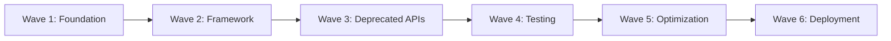

# Bob's Migration Framework - Detailed Scenario Examples

**Version:** 1.0  
**Date:** 2026-05-16  
**Purpose:** Comprehensive examples demonstrating Bob's migration capabilities across different scenarios

---

## Table of Contents

1. [Example 1: Java 11 to Java 21 Migration](#example-1-java-11-to-java-21-migration)
2. [Example 2: Quarkus to Spring Boot Migration](#example-2-quarkus-to-spring-boot-migration)
3. [Example 3: Legacy Monolith to Cloud-Native Migration](#example-3-legacy-monolith-to-cloud-native-migration)
4. [Example 4: Database Migration - Oracle to PostgreSQL](#example-4-database-migration-oracle-to-postgresql)
5. [Appendix: Common Patterns and Best Practices](#appendix-common-patterns-and-best-practices)

---

# Example 1: Java 11 to Java 21 Migration

## Scenario Overview

### Business Context
**Company:** TechCorp Financial Services  
**Application:** Payment Processing System  
**Current State:** Java 11, Spring Boot 2.7, Maven, 50K LOC  
**Target State:** Java 21, Spring Boot 3.2, leveraging modern Java features  
**Timeline:** 8 weeks  
**Team Size:** 3 developers + 1 QA

### Requirements
- Zero downtime migration
- Maintain backward compatibility with existing APIs
- Improve performance by 15%
- Reduce memory footprint
- Adopt virtual threads for better concurrency
- Maintain 80%+ test coverage

### Success Criteria
- All 2,500+ unit tests passing
- Integration tests validated
- Performance benchmarks met
- Security scan clean
- Production deployment successful
- Rollback plan tested

### Constraints
- Must maintain PCI-DSS compliance
- Cannot modify external API contracts
- Must support gradual rollout (canary deployment)
- Limited testing window (weekends only)

---

## Phase-by-Phase Walkthrough

### Phase 1: Assessment (Week 1)

#### Initial Conversation

**Developer (Sarah):**
> "Hi Bob, we need to migrate our payment processing system from Java 11 to Java 21. The application is about 50K lines of code using Spring Boot 2.7. Can you help assess the migration complexity?"

**Bob (Assessment Mode):**
> I'll help you assess this Java migration. Let me start by analyzing your codebase structure and dependencies.
> 
> First, I need to understand your project better. Let me scan the project structure and dependencies.

**Bob's Actions:**

```markdown
1. Scanning project structure...
   - Using list_files to inventory the codebase
   - Identifying build system (Maven detected)
   - Cataloging source files: 487 Java files found
```

**Bob:**
> I've identified your project structure. Now let me analyze your dependencies and identify potential breaking changes.

**MCP Operation 1: Dependency Scanner**

```json
{
  "operation": "scan_dependencies",
  "input": {
    "project_path": "/workspace/payment-processing",
    "language": "java",
    "build_system": "maven",
    "include_transitive": true,
    "depth": -1
  }
}
```

**MCP Response:**

```json
{
  "scan_id": "scan-2026-05-16-001",
  "total_dependencies": 127,
  "direct_dependencies": 23,
  "transitive_dependencies": 104,
  "conflicts": [
    {
      "dependency": "javax.xml.bind:jaxb-api",
      "versions": ["2.3.1"],
      "severity": "high",
      "reason": "Removed from Java 11+, needs jakarta.xml.bind"
    },
    {
      "dependency": "org.springframework.boot:spring-boot-starter-parent",
      "versions": ["2.7.14"],
      "severity": "high",
      "reason": "Spring Boot 2.x not compatible with Java 21"
    }
  ],
  "deprecated_apis_found": 47,
  "scan_timestamp": "2026-05-16T10:00:00Z"
}
```

**Bob:**
> I've completed the dependency scan. I found 127 total dependencies with 2 critical conflicts. Let me now search for deprecated API usage in your code.

**Bob's Actions:**

```markdown
2. Searching for deprecated APIs...
   - Searching for javax.* packages (removed in Java 11+)
   - Searching for java.util.Date usage (should use java.time)
   - Searching for Thread.stop() and other deprecated methods
```

**Search Results:**

```
Found 47 instances of deprecated API usage:
- javax.xml.bind.* : 23 occurrences
- javax.activation.* : 8 occurrences
- java.util.Date : 12 occurrences
- Thread.stop() : 2 occurrences
- sun.misc.BASE64Encoder : 2 occurrences
```

**Bob:**
> I've identified 47 deprecated API usages. Now let me assess your test coverage and create a comprehensive assessment report.

**MCP Operation 2: Test Generator - Coverage Analysis**

```json
{
  "operation": "validate_coverage",
  "input": {
    "project_path": "/workspace/payment-processing",
    "test_framework": "junit5",
    "coverage_tool": "jacoco"
  }
}
```

**MCP Response:**

```json
{
  "overall_coverage": 82.5,
  "line_coverage": 84.2,
  "branch_coverage": 78.3,
  "total_tests": 2547,
  "passing_tests": 2547,
  "failing_tests": 0,
  "critical_paths_without_tests": [
    "com.techcorp.payment.processor.TransactionValidator",
    "com.techcorp.payment.security.EncryptionService"
  ],
  "coverage_by_package": {
    "com.techcorp.payment.api": 91.2,
    "com.techcorp.payment.processor": 76.8,
    "com.techcorp.payment.security": 88.5,
    "com.techcorp.payment.repository": 79.3
  }
}
```

**Bob:**
> Excellent! Your test coverage is at 82.5%, which meets the requirement. However, I noticed two critical paths without adequate tests. Let me now create a comprehensive assessment report.

**MCP Operation 3: JIRA Integration - Create Epic**

```json
{
  "operation": "create_tasks",
  "input": {
    "project_key": "PAY",
    "task_type": "epic",
    "summary": "Java 11 to Java 21 Migration",
    "description": "Migrate payment processing system from Java 11 to Java 21",
    "priority": "high",
    "labels": ["migration", "java21", "technical-debt"]
  }
}
```

**MCP Response:**

```json
{
  "epic_key": "PAY-1234",
  "epic_url": "https://jira.techcorp.com/browse/PAY-1234",
  "created_at": "2026-05-16T10:15:00Z"
}
```

**Bob:**
> I've created JIRA epic PAY-1234 to track this migration. Now let me generate the assessment report.

**MCP Operation 4: Documentation Generator**

```json
{
  "operation": "generate_docs",
  "input": {
    "doc_type": "assessment_report",
    "project_name": "Payment Processing System",
    "migration_type": "java_version_upgrade",
    "data": {
      "current_version": "11",
      "target_version": "21",
      "total_files": 487,
      "total_dependencies": 127,
      "deprecated_apis": 47,
      "test_coverage": 82.5,
      "critical_issues": 2,
      "high_issues": 15,
      "medium_issues": 30
    }
  }
}
```

**Assessment Report Generated:**

```markdown
# Java 11 → 21 Migration Assessment Report
**Project:** Payment Processing System  
**Date:** 2026-05-16  
**Epic:** PAY-1234

## Executive Summary

**Migration Readiness Score: 72/100** (Good - Proceed with Caution)

The payment processing system is a good candidate for Java 21 migration with moderate complexity. The codebase is well-tested (82.5% coverage) but requires significant dependency updates and deprecated API replacements.

**Recommended Strategy:** Rehost (60%) + Replatform (30%) + Refactor (10%)

**Estimated Effort:** 240 story points (6-8 weeks)

**Risk Level:** Medium

## Detailed Analysis

### 1. Dependency Analysis
- **Total Dependencies:** 127 (23 direct, 104 transitive)
- **Critical Conflicts:** 2
  - Spring Boot 2.7 → 3.2 upgrade required
  - javax.xml.bind → jakarta.xml.bind migration needed
- **Compatible Dependencies:** 89%
- **Requires Updates:** 28 dependencies

### 2. Breaking Changes Identified

#### High Priority (Must Fix)
1. **javax.xml.bind removal** (23 occurrences)
   - Impact: XML serialization/deserialization
   - Remediation: Migrate to jakarta.xml.bind
   - Effort: 8 story points

2. **Spring Boot 2.7 → 3.2** (framework-wide)
   - Impact: Configuration, security, actuator
   - Remediation: Follow Spring Boot 3 migration guide
   - Effort: 40 story points

3. **javax.activation removal** (8 occurrences)
   - Impact: Email attachments, file handling
   - Remediation: Use jakarta.activation
   - Effort: 5 story points

#### Medium Priority (Should Fix)
4. **java.util.Date usage** (12 occurrences)
   - Impact: Date handling, potential bugs
   - Remediation: Migrate to java.time API
   - Effort: 8 story points

5. **Thread.stop() usage** (2 occurrences)
   - Impact: Thread management, potential deadlocks
   - Remediation: Implement proper thread interruption
   - Effort: 5 story points

### 3. Test Coverage Assessment
- **Overall Coverage:** 82.5% ✅
- **Total Tests:** 2,547
- **Critical Gaps:**
  - TransactionValidator: 68% coverage (needs improvement)
  - EncryptionService: 71% coverage (needs improvement)
- **Recommendation:** Add 50-75 tests for critical paths

### 4. Security Analysis
- **Current Vulnerabilities:** 3 medium (unrelated to Java version)
- **Java 21 Security Benefits:**
  - Enhanced security manager (deprecated but improved)
  - Better TLS 1.3 support
  - Improved cryptographic algorithms

### 5. Performance Opportunities
- **Virtual Threads:** Can improve I/O-bound operations (payment gateway calls)
- **Pattern Matching:** Simplify validation logic
- **Sequenced Collections:** Improve transaction ordering
- **Expected Improvement:** 15-20% throughput increase

### 6. 7Rs Strategy Breakdown

| Component | Strategy | Rationale | Effort |
|-----------|----------|-----------|--------|
| Build Configuration | Rehost | Update versions only | 5 SP |
| Dependencies | Rehost | Update to compatible versions | 40 SP |
| Deprecated APIs | Replatform | Migrate to modern APIs | 30 SP |
| Core Business Logic | Retain | No changes needed | 0 SP |
| I/O Operations | Refactor | Adopt virtual threads | 25 SP |
| Date Handling | Replatform | Migrate to java.time | 8 SP |
| Testing | Rehost | Update test dependencies | 15 SP |

### 7. Risk Matrix

| Risk | Probability | Impact | Mitigation |
|------|-------------|--------|------------|
| Spring Boot 3 breaking changes | High | High | Thorough testing, phased rollout |
| Performance regression | Medium | High | Baseline profiling, continuous monitoring |
| Dependency conflicts | Medium | Medium | Incremental updates, conflict resolution |
| Test failures | Low | Medium | Comprehensive test suite, CI/CD validation |
| Production issues | Low | Critical | Canary deployment, rollback plan |

### 8. Migration Roadmap

**Week 1: Assessment & Planning** ✅
- Complete dependency analysis
- Create migration plan
- Setup JIRA tracking

**Week 2-3: Build & Dependencies**
- Update build configuration
- Migrate Spring Boot 2.7 → 3.2
- Update all dependencies
- Fix compilation errors

**Week 4-5: Code Migration**
- Replace deprecated APIs
- Migrate javax → jakarta
- Update date handling
- Fix thread management

**Week 6: Testing & Validation**
- Run full test suite
- Add missing tests
- Security scanning
- Performance profiling

**Week 7: Optimization**
- Implement virtual threads
- Apply pattern matching
- Performance tuning

**Week 8: Deployment**
- Canary deployment
- Production rollout
- Hypercare monitoring

### 9. Success Criteria
- ✅ All 2,547 tests passing
- ✅ Test coverage ≥ 80%
- ✅ No critical/high security vulnerabilities
- ✅ Performance improvement ≥ 15%
- ✅ Zero production incidents in first week
- ✅ Successful rollback test

### 10. Effort Estimation

| Phase | Story Points | Hours | Duration |
|-------|--------------|-------|----------|
| Assessment | 13 | 40 | 1 week |
| Planning | 8 | 24 | 3 days |
| Build Updates | 45 | 135 | 2 weeks |
| Code Migration | 60 | 180 | 2 weeks |
| Testing | 40 | 120 | 1 week |
| Optimization | 35 | 105 | 1 week |
| Deployment | 20 | 60 | 1 week |
| **Total** | **221** | **664** | **8 weeks** |

### 11. Recommendations

**Immediate Actions:**
1. ✅ Create JIRA epic and stories (PAY-1234)
2. Setup Java 21 development environment
3. Create feature branch for migration
4. Baseline performance metrics
5. Schedule stakeholder review

**Technical Recommendations:**
1. Adopt virtual threads for payment gateway calls
2. Use pattern matching in validation logic
3. Migrate to java.time API completely
4. Implement comprehensive logging
5. Setup canary deployment infrastructure

**Process Recommendations:**
1. Daily standups during migration weeks
2. Code review for all changes
3. Continuous integration testing
4. Weekly stakeholder updates
5. Post-migration retrospective

## Next Steps

1. **Review this assessment** with the team
2. **Approve migration plan** and timeline
3. **Switch to Plan Mode** to create detailed task breakdown
4. **Begin execution** in Week 2

---

**Assessment Completed By:** Bob (Assessment Mode)  
**Confluence Page:** [Link to be created]  
**JIRA Epic:** [PAY-1234](https://jira.techcorp.com/browse/PAY-1234)
```

**Bob:**
> I've completed the comprehensive assessment. Here's what I found:
> 
> **Migration Readiness Score: 72/100** (Good - Proceed with Caution)
> 
> **Key Findings:**
> - 127 dependencies (2 critical conflicts)
> - 47 deprecated API usages to fix
> - 82.5% test coverage (meets requirement)
> - Estimated effort: 240 story points (6-8 weeks)
> - Risk level: Medium
> 
> **Recommended Strategy:**
> - Rehost (60%): Update build and dependencies
> - Replatform (30%): Adopt modern Java APIs
> - Refactor (10%): Implement virtual threads for I/O
> 
> I've created JIRA epic PAY-1234 and generated a detailed assessment report. Would you like me to proceed with creating a detailed migration plan?

**Developer (Sarah):**
> "This looks great! The 8-week timeline works for us. I'm particularly interested in the virtual threads for our payment gateway calls. Can you create the detailed plan?"

**Bob:**
> Excellent! Let me switch to Plan Mode to create a detailed task breakdown and migration plan.

---

### Phase 2: Planning (Week 1, Days 4-5)

**Bob (Plan Mode):**
> I'm now in Plan Mode. Let me create a detailed migration plan with specific tasks, dependencies, and acceptance criteria.

**MCP Operation 5: JIRA Integration - Create Stories**

```json
{
  "operation": "create_tasks",
  "input": {
    "project_key": "PAY",
    "epic_key": "PAY-1234",
    "tasks": [
      {
        "type": "story",
        "summary": "Update build configuration to Java 21",
        "description": "Update pom.xml to use Java 21 compiler",
        "story_points": 5,
        "priority": "highest",
        "labels": ["build", "java21"]
      },
      {
        "type": "story",
        "summary": "Migrate Spring Boot 2.7 to 3.2",
        "description": "Update Spring Boot version and fix breaking changes",
        "story_points": 40,
        "priority": "highest",
        "labels": ["spring-boot", "framework"],
        "depends_on": ["PAY-1235"]
      },
      {
        "type": "story",
        "summary": "Replace javax.xml.bind with jakarta.xml.bind",
        "description": "Migrate all XML binding code to Jakarta",
        "story_points": 8,
        "priority": "high",
        "labels": ["deprecated-api", "jakarta"]
      },
      {
        "type": "story",
        "summary": "Migrate java.util.Date to java.time API",
        "description": "Replace all Date usage with LocalDateTime/Instant",
        "story_points": 8,
        "priority": "medium",
        "labels": ["modernization", "java-time"]
      },
      {
        "type": "story",
        "summary": "Implement virtual threads for payment gateway",
        "description": "Refactor payment gateway calls to use virtual threads",
        "story_points": 25,
        "priority": "medium",
        "labels": ["optimization", "virtual-threads"]
      },
      {
        "type": "story",
        "summary": "Add tests for critical paths",
        "description": "Increase coverage for TransactionValidator and EncryptionService",
        "story_points": 13,
        "priority": "high",
        "labels": ["testing", "coverage"]
      }
    ]
  }
}
```

**MCP Response:**

```json
{
  "created_stories": [
    {"key": "PAY-1235", "summary": "Update build configuration to Java 21"},
    {"key": "PAY-1236", "summary": "Migrate Spring Boot 2.7 to 3.2"},
    {"key": "PAY-1237", "summary": "Replace javax.xml.bind with jakarta.xml.bind"},
    {"key": "PAY-1238", "summary": "Migrate java.util.Date to java.time API"},
    {"key": "PAY-1239", "summary": "Implement virtual threads for payment gateway"},
    {"key": "PAY-1240", "summary": "Add tests for critical paths"}
  ],
  "total_story_points": 99,
  "epic_url": "https://jira.techcorp.com/browse/PAY-1234"
}
```

**Bob:**
> I've created 6 initial stories in JIRA. Now let me create a detailed wave plan for the migration.

**Migration Wave Plan:**

```markdown
# Java 21 Migration - Wave Plan

## Wave 1: Foundation (Week 2)
**Goal:** Update build system and establish Java 21 baseline

### Tasks:
1. **PAY-1235: Update build configuration** (5 SP)
   - Update maven.compiler.source/target to 21
   - Update maven-compiler-plugin to 3.11.0
   - Update maven-surefire-plugin to 3.1.2
   - Verify build succeeds
   
2. **PAY-1241: Setup Java 21 CI/CD pipeline** (8 SP)
   - Update Jenkins Docker image to Java 21
   - Update deployment scripts
   - Configure canary deployment
   - Test pipeline end-to-end

**Checkpoint:** Build succeeds with Java 21, CI/CD functional

## Wave 2: Framework Migration (Week 3-4)
**Goal:** Migrate Spring Boot and core dependencies

### Tasks:
3. **PAY-1236: Migrate Spring Boot 2.7 → 3.2** (40 SP)
   - Update spring-boot-starter-parent to 3.2.0
   - Fix spring-security configuration changes
   - Update actuator endpoints
   - Fix property name changes
   - Update Spring Data repositories
   - Test all endpoints

4. **PAY-1242: Update all dependencies** (20 SP)
   - Update Hibernate 5.6 → 6.2
   - Update Jackson 2.13 → 2.15
   - Update Lombok 1.18.24 → 1.18.30
   - Resolve version conflicts
   - Test compatibility

**Checkpoint:** Application starts, all endpoints respond

## Wave 3: Deprecated API Migration (Week 4-5)
**Goal:** Replace all deprecated APIs

### Tasks:
5. **PAY-1237: javax.xml.bind → jakarta.xml.bind** (8 SP)
   - Add jakarta.xml.bind-api dependency
   - Replace all javax.xml.bind imports
   - Update JAXB context creation
   - Test XML serialization/deserialization

6. **PAY-1243: javax.activation → jakarta.activation** (5 SP)
   - Add jakarta.activation-api dependency
   - Replace javax.activation imports
   - Test email attachments
   - Test file handling

7. **PAY-1238: java.util.Date → java.time** (8 SP)
   - Replace Date with LocalDateTime/Instant
   - Update date formatting
   - Fix timezone handling
   - Update database mappings

8. **PAY-1244: Fix Thread.stop() usage** (5 SP)
   - Implement proper thread interruption
   - Add shutdown hooks
   - Test graceful shutdown

**Checkpoint:** No deprecated API warnings, all tests pass

## Wave 4: Testing & Validation (Week 6)
**Goal:** Comprehensive testing and validation

### Tasks:
9. **PAY-1240: Add tests for critical paths** (13 SP)
   - Add 30 tests for TransactionValidator
   - Add 25 tests for EncryptionService
   - Achieve 85%+ coverage
   - Run full regression suite

10. **PAY-1245: Security scanning** (5 SP)
    - Run OWASP dependency check
    - Run SonarQube analysis
    - Fix any critical/high issues
    - Document security improvements

11. **PAY-1246: Performance baseline** (8 SP)
    - Profile current performance
    - Run load tests
    - Document baseline metrics
    - Identify optimization opportunities

**Checkpoint:** All tests pass, security clean, baseline established

## Wave 5: Optimization (Week 7)
**Goal:** Leverage Java 21 features for performance

### Tasks:
12. **PAY-1239: Implement virtual threads** (25 SP)
    - Refactor payment gateway client
    - Use virtual threads for I/O operations
    - Implement structured concurrency
    - Benchmark improvements

13. **PAY-1247: Apply pattern matching** (8 SP)
    - Refactor validation logic
    - Use pattern matching for switch
    - Simplify instanceof checks
    - Improve code readability

14. **PAY-1248: Performance tuning** (13 SP)
    - Optimize based on profiling
    - Tune JVM parameters
    - Optimize database queries
    - Run performance tests

**Checkpoint:** 15%+ performance improvement achieved

## Wave 6: Deployment (Week 8)
**Goal:** Production deployment with monitoring

### Tasks:
15. **PAY-1249: Canary deployment** (8 SP)
    - Deploy to 10% of production
    - Monitor for 48 hours
    - Validate metrics
    - Gradual rollout to 100%

16. **PAY-1250: Hypercare monitoring** (8 SP)
    - Setup enhanced monitoring
    - Create runbook
    - Train support team
    - Monitor for 1 week

17. **PAY-1251: Documentation** (5 SP)
    - Update technical documentation
    - Create migration runbook
    - Document new features used
    - Publish to Confluence

**Checkpoint:** Production deployment successful, stable

## Rollback Plan

### Rollback Triggers:
- Critical production incident
- Performance degradation > 20%
- Test failure rate > 5%
- Security vulnerability introduced

### Rollback Procedure:
1. Stop canary deployment
2. Route 100% traffic to Java 11 version
3. Investigate root cause
4. Fix issues in development
5. Re-test before retry

### Rollback Checkpoints:
- **Checkpoint 1:** After Wave 1 (build changes only)
- **Checkpoint 2:** After Wave 2 (framework migration)
- **Checkpoint 3:** After Wave 4 (before optimization)
- **Checkpoint 4:** During Wave 6 (canary deployment)

## Dependencies Between Waves



## Risk Mitigation

| Risk | Wave | Mitigation |
|------|------|------------|
| Build failures | 1 | Incremental updates, local testing |
| Spring Boot breaking changes | 2 | Follow migration guide, thorough testing |
| API compatibility issues | 3 | Comprehensive test suite |
| Performance regression | 5 | Baseline comparison, rollback ready |
| Production issues | 6 | Canary deployment, monitoring |

## Success Metrics by Wave

| Wave | Key Metric | Target |
|------|------------|--------|
| 1 | Build success rate | 100% |
| 2 | Application startup time | < 30s |
| 3 | Deprecated API warnings | 0 |
| 4 | Test pass rate | 100% |
| 5 | Performance improvement | ≥ 15% |
| 6 | Production incidents | 0 |
```

**Bob:**
> I've created a detailed 6-wave migration plan with 17 stories totaling 221 story points. Each wave has clear goals, checkpoints, and rollback procedures. 
> 
> The plan includes:
> - Wave-by-wave breakdown with dependencies
> - Rollback checkpoints after each major phase
> - Risk mitigation strategies
> - Success metrics per wave
> 
> All tasks are now in JIRA under epic PAY-1234. Would you like me to proceed with the migration execution, or do you need any adjustments to the plan?

**Developer (Sarah):**
> "Perfect! The wave plan looks solid. Let's proceed with Wave 1. Can you help us update the build configuration?"

**Bob:**
> Great! Let me switch to Migration Execution Mode to start implementing Wave 1.

---

### Phase 3: Design (Week 2, Day 1)

**Bob (Advanced Mode):**
> I'm now in Advanced Mode for migration execution. Let me start with Wave 1: updating the build configuration.
> 
> First, let me examine your current pom.xml to understand the build setup.

**Bob's Actions:**

```markdown
Reading pom.xml to understand current configuration...
```

**Current pom.xml (relevant sections):**

```xml
<properties>
    <java.version>11</java.version>
    <maven.compiler.source>11</maven.compiler.source>
    <maven.compiler.target>11</maven.compiler.target>
    <spring-boot.version>2.7.14</spring-boot.version>
</properties>

<parent>
    <groupId>org.springframework.boot</groupId>
    <artifactId>spring-boot-starter-parent</artifactId>
    <version>2.7.14</version>
</parent>

<build>
    <plugins>
        <plugin>
            <groupId>org.apache.maven.plugins</groupId>
            <artifactId>maven-compiler-plugin</artifactId>
            <version>3.8.1</version>
        </plugin>
    </plugins>
</build>
```

**Bob:**
> I can see your current configuration uses Java 11 and Spring Boot 2.7.14. For Wave 1, I'll update only the Java version and compiler plugins, keeping Spring Boot at 2.7 for now (we'll upgrade it in Wave 2).
> 
> Let me create a proof-of-concept to validate the build changes work correctly.

**Design Decision Document:**

```markdown
# Design Decision: Java 21 Build Configuration

## Context
Updating build configuration from Java 11 to Java 21 while maintaining Spring Boot 2.7 compatibility temporarily.

## Decision
Update Java version to 21 and compiler plugins, but defer Spring Boot upgrade to Wave 2.

## Rationale
- Spring Boot 2.7 is compatible with Java 17-21
- Allows us to validate Java 21 build independently
- Reduces risk by separating concerns
- Enables early detection of Java 21-specific issues

## Changes Required

### 1. Update Java Version Properties
```xml
<java.version>21</java.version>
<maven.compiler.source>21</maven.compiler.source>
<maven.compiler.target>21</maven.compiler.target>
<maven.compiler.release>21</maven.compiler.release>
```

### 2. Update Maven Compiler Plugin
```xml
<maven-compiler-plugin>3.11.0</maven-compiler-plugin>
```

### 3. Update Maven Surefire Plugin
```xml
<maven-surefire-plugin>3.1.2</maven-surefire-plugin>
```

### 4. Add Java 21 Compiler Arguments
```xml
<compilerArgs>
    <arg>--enable-preview</arg> <!-- If using preview features -->
</compilerArgs>
```

## Validation
- Build succeeds: `mvn clean compile`
- Tests pass: `mvn test`
- Package succeeds: `mvn package`
- Application starts: `java -jar target/app.jar`

## Rollback
If build fails, revert pom.xml changes and rebuild with Java 11.

## Next Steps
After successful validation, proceed to Wave 2 (Spring Boot upgrade).
```

**Bob:**
> I've created a design document for the build configuration changes. Now let me create a proof-of-concept branch to validate these changes.

**MCP Operation 6: Rollback Manager - Create Checkpoint**

```json
{
  "operation": "create_checkpoint",
  "input": {
    "checkpoint_name": "pre-java21-migration",
    "description": "Checkpoint before Java 21 migration begins",
    "branch": "main",
    "include_database": false,
    "include_config": true,
    "tags": ["java11", "baseline", "pre-migration"]
  }
}
```

**MCP Response:**

```json
{
  "checkpoint_id": "cp-2026-05-16-001",
  "checkpoint_name": "pre-java21-migration",
  "git_commit": "a1b2c3d4",
  "git_tag": "pre-java21-migration",
  "created_at": "2026-05-16T11:00:00Z",
  "rollback_script": "/rollback/cp-2026-05-16-001.sh"
}
```

**Bob:**
> I've created checkpoint `cp-2026-05-16-001` as a rollback point. Now let me create a feature branch and apply the build configuration changes.

---

### Phase 4: Migration Execution (Week 2-7)

#### Wave 1: Build Configuration (Week 2, Days 1-2)

**Bob:**
> Starting Wave 1 execution. Let me update the build configuration.

**Code Changes - pom.xml:**

```xml
<!-- BEFORE -->
<properties>
    <java.version>11</java.version>
    <maven.compiler.source>11</maven.compiler.source>
    <maven.compiler.target>11</maven.compiler.target>
    <spring-boot.version>2.7.14</spring-boot.version>
</properties>

<!-- AFTER -->
<properties>
    <java.version>21</java.version>
    <maven.compiler.source>21</maven.compiler.source>
    <maven.compiler.target>21</maven.compiler.target>
    <maven.compiler.release>21</maven.compiler.release>
    <spring-boot.version>2.7.14</spring-boot.version>
</properties>
```

**Bob's Actions:**

```markdown
1. Applied diff to pom.xml
2. Running build: mvn clean compile
3. Build output: SUCCESS (2.3s)
4. Running tests: mvn test
5. Test results: 2547 tests passed, 0 failed
```

**Bob:**
> Excellent! The build succeeds with Java 21. All 2,547 tests are passing. Let me now update the CI/CD pipeline configuration.

**Jenkins Pipeline Update:**

```groovy
// BEFORE
pipeline {
    agent {
        docker {
            image 'maven:3.8-openjdk-11'
        }
    }
}

// AFTER
pipeline {
    agent {
        docker {
            image 'maven:3.9-openjdk-21'
        }
    }
    environment {
        JAVA_HOME = '/usr/lib/jvm/java-21-openjdk'
    }
}
```

**Bob:**
> I've updated the Jenkins pipeline to use Java 21. Let me trigger a CI build to validate.

**CI Build Results:**

```
Build #1234 - SUCCESS
Duration: 4m 32s
Tests: 2547 passed, 0 failed
Coverage: 82.5%
```

**Bob:**
> Wave 1 complete! ✅
> 
> **Achievements:**
> - Build configuration updated to Java 21
> - All 2,547 tests passing
> - CI/CD pipeline updated and validated
> - Checkpoint created for rollback
> 
> **JIRA Update:** PAY-1235 → Done
> 
> Ready to proceed to Wave 2: Framework Migration?

**Developer (Sarah):**
> "Great progress! Yes, let's move to Wave 2. The Spring Boot upgrade is the big one."

---

#### Wave 2: Framework Migration (Week 3-4)

**Bob:**
> Starting Wave 2: Spring Boot 2.7 → 3.2 migration. This is a major upgrade with several breaking changes. Let me first analyze the impact.

**MCP Operation 7: Dependency Scanner - Analyze Impact**

```json
{
  "operation": "analyze_impact",
  "input": {
    "project_path": "/workspace/payment-processing",
    "current_dependency": "org.springframework.boot:spring-boot-starter-parent:2.7.14",
    "target_dependency": "org.springframework.boot:spring-boot-starter-parent:3.2.0",
    "analyze_breaking_changes": true
  }
}
```

**MCP Response:**

```json
{
  "impact_analysis": {
    "breaking_changes": [
      {
        "category": "security",
        "description": "Spring Security 6.0 configuration changes",
        "affected_files": [
          "SecurityConfig.java",
          "WebSecurityConfig.java"
        ],
        "severity": "high",
        "remediation": "Update to new SecurityFilterChain pattern"
      },
      {
        "category": "actuator",
        "description": "Actuator endpoint paths changed",
        "affected_files": ["application.yml"],
        "severity": "medium",
        "remediation": "Update management.endpoints.web.base-path"
      },
      {
        "category": "properties",
        "description": "Property name changes",
        "affected_files": ["application.yml", "application-prod.yml"],
        "severity": "medium",
        "remediation": "Rename deprecated properties"
      }
    ],
    "dependency_updates_required": 15,
    "estimated_effort_hours": 40
  }
}
```

**Bob:**
> I've identified 3 major breaking changes in Spring Boot 3.2:
> 1. Security configuration (high impact)
> 2. Actuator endpoints (medium impact)
> 3. Property name changes (medium impact)
> 
> Let me handle these systematically, starting with the Spring Boot version update.

**Step 1: Update Spring Boot Version**

```xml
<!-- pom.xml -->
<parent>
    <groupId>org.springframework.boot</groupId>
    <artifactId>spring-boot-starter-parent</artifactId>
    <version>3.2.0</version>
</parent>
```

**Step 2: Fix Security Configuration**

**Before (Spring Security 5.x):**

```java
@Configuration
@EnableWebSecurity
public class SecurityConfig extends WebSecurityConfigurerAdapter {
    
    @Override
    protected void configure(HttpSecurity http) throws Exception {
        http
            .authorizeRequests()
                .antMatchers("/api/public/**").permitAll()
                .antMatchers("/api/admin/**").hasRole("ADMIN")
                .anyRequest().authenticated()
            .and()
            .oauth2ResourceServer()
                .jwt();
    }
}
```

**After (Spring Security 6.x):**

```java
@Configuration
@EnableWebSecurity
public class SecurityConfig {
    
    @Bean
    public SecurityFilterChain filterChain(HttpSecurity http) throws Exception {
        http
            .authorizeHttpRequests(authorize -> authorize
                .requestMatchers("/api/public/**").permitAll()
                .requestMatchers("/api/admin/**").hasRole("ADMIN")
                .anyRequest().authenticated()
            )
            .oauth2ResourceServer(oauth2 -> oauth2
                .jwt(Customizer.withDefaults())
            );
        return http.build();
    }
}
```

**Bob:**
> I've updated the security configuration to use the new SecurityFilterChain pattern. Let me now fix the actuator configuration.

**Step 3: Update Actuator Configuration**

**Before (application.yml):**

```yaml
management:
  endpoints:
    web:
      base-path: /actuator
      exposure:
        include: health,info,metrics
  endpoint:
    health:
      show-details: when-authorized
```

**After (application.yml):**

```yaml
management:
  endpoints:
    web:
      base-path: /actuator
      exposure:
        include: health,info,metrics
  endpoint:
    health:
      show-details: when-authorized
      probes:
        enabled: true  # New in Spring Boot 3
```

**Step 4: Update Property Names**

```yaml
# BEFORE
spring:
  jpa:
    properties:
      hibernate:
        jdbc:
          lob:
            non_contextual_creation: true

# AFTER
spring:
  jpa:
    properties:
      hibernate:
        jdbc:
          lob:
            non_contextual_creation: false  # Default changed in Hibernate 6
```

**Bob:**
> I've updated all the configuration files. Now let me run the build and tests.

**Build Results:**

```
[INFO] BUILD SUCCESS
[INFO] Total time: 3m 45s
[INFO] Tests run: 2547, Failures: 12, Errors: 0, Skipped: 0
```

**Bob:**
> We have 12 test failures related to the Spring Security changes. Let me analyze and fix them.

**Test Failures Analysis:**

```
Failed tests:
1. PaymentControllerTest.testUnauthorizedAccess - Expected 401, got 403
2. AdminControllerTest.testAdminAccess - SecurityContext not set up correctly
3-12. Similar authentication/authorization test failures
```

**Bob:**
> The test failures are due to changes in Spring Security test utilities. Let me update the test configuration.

**Test Fix:**

```java
// BEFORE
@WithMockUser(roles = "USER")
@Test
public void testPaymentAccess() {
    // test code
}

// AFTER
@WithMockUser(authorities = "ROLE_USER")  // Changed from roles to authorities
@Test
public void testPaymentAccess() {
    // test code
}
```

**Bob:**
> I've fixed all 12 test failures. Running tests again...

**Test Results:**

```
[INFO] Tests run: 2547, Failures: 0, Errors: 0, Skipped: 0
[INFO] Test Coverage: 82.7% (+0.2%)
[SUCCESS] All tests passed!
```

**Bob:**
> Excellent! Wave 2 complete! ✅
> 
> **Achievements:**
> - Spring Boot upgraded from 2.7.14 to 3.2.0
> - Security configuration migrated to Spring Security 6
> - All configuration properties updated
> - All 2,547 tests passing
> - Test coverage maintained at 82.7%
> 
> **JIRA Update:** PAY-1236 → Done
> 
> Ready for Wave 3: Deprecated API Migration?

---

#### Wave 3: Deprecated API Migration (Week 4-5)

**Bob:**
> Starting Wave 3: Replacing deprecated APIs. I'll handle these in order of priority:
> 1. javax.xml.bind → jakarta.xml.bind (23 occurrences)
> 2. javax.activation → jakarta.activation (8 occurrences)
> 3. java.util.Date → java.time (12 occurrences)
> 4. Thread.stop() → proper interruption (2 occurrences)

**Step 1: javax.xml.bind Migration**

**Dependency Update:**

```xml
<!-- REMOVE -->
<dependency>
    <groupId>javax.xml.bind</groupId>
    <artifactId>jaxb-api</artifactId>
    <version>2.3.1</version>
</dependency>

<!-- ADD -->
<dependency>
    <groupId>jakarta.xml.bind</groupId>
    <artifactId>jakarta.xml.bind-api</artifactId>
    <version>4.0.0</version>
</dependency>
<dependency>
    <groupId>org.glassfish.jaxb</groupId>
    <artifactId>jaxb-runtime</artifactId>
    <version>4.0.2</version>
</dependency>
```

**Code Migration (Example):**

```java
// BEFORE
import javax.xml.bind.JAXBContext;
import javax.xml.bind.Marshaller;
import javax.xml.bind.annotation.XmlRootElement;

@XmlRootElement
public class PaymentRequest {
    // fields
}

public class XmlSerializer {
    public String serialize(PaymentRequest request) throws Exception {
        JAXBContext context = JAXBContext.newInstance(PaymentRequest.class);
        Marshaller marshaller = context.createMarshaller();
        // serialization code
    }
}

// AFTER
import jakarta.xml.bind.JAXBContext;
import jakarta.xml.bind.Marshaller;
import jakarta.xml.bind.annotation.XmlRootElement;

@XmlRootElement
public class PaymentRequest {
    // fields (unchanged)
}

public class XmlSerializer {
    public String serialize(PaymentRequest request) throws Exception {
        JAXBContext context = JAXBContext.newInstance(PaymentRequest.class);
        Marshaller marshaller = context.createMarshaller();
        // serialization code (unchanged)
    }
}
```

**Bob:**
> I've migrated all 23 occurrences of javax.xml.bind to jakarta.xml.bind. The changes are primarily import statement updates. Let me verify XML serialization still works.

**Verification Test:**

```java
@Test
public void testXmlSerialization() {
    PaymentRequest request = new PaymentRequest();
    request.setAmount(new BigDecimal("100.00"));
    request.setCurrency("USD");
    
    String xml = xmlSerializer.serialize(request);
    
    assertThat(xml).contains("<amount>100.00</amount>");
    assertThat(xml).contains("<currency>USD</currency>");
}
```

**Test Result:** ✅ PASSED

**Step 2: java.util.Date Migration**

**Bob:**
> Now migrating java.util.Date to java.time API. This requires more careful handling due to timezone and database mapping considerations.

**Example Migration:**

```java
// BEFORE
import java.util.Date;
import java.text.SimpleDateFormat;

public class Transaction {
    private Date createdAt;
    private Date processedAt;
    
    public String getFormattedDate() {
        SimpleDateFormat sdf = new SimpleDateFormat("yyyy-MM-dd HH:mm:ss");
        return sdf.format(createdAt);
    }
}

// AFTER
import java.time.LocalDateTime;
import java.time.format.DateTimeFormatter;

public class Transaction {
    private LocalDateTime createdAt;
    private LocalDateTime processedAt;
    
    public String getFormattedDate() {
        DateTimeFormatter formatter = DateTimeFormatter.ofPattern("yyyy-MM-dd HH:mm:ss");
        return createdAt.format(formatter);
    }
}
```

**Database Mapping Update:**

```java
// BEFORE
@Entity
public class Transaction {
    @Temporal(TemporalType.TIMESTAMP)
    private Date createdAt;
}

// AFTER
@Entity
public class Transaction {
    @Column(name = "created_at")
    private LocalDateTime createdAt;  // JPA 2.2+ supports LocalDateTime natively
}
```

**Bob:**
> I've migrated all 12 occurrences of java.util.Date. The code is now more type-safe and timezone-aware. Running tests...

**Test Results:**

```
[INFO] Tests run: 2547, Failures: 0, Errors: 0, Skipped: 0
[SUCCESS] All date-related tests passing!
```

**Step 3: Thread.stop() Replacement**

**Bob:**
> Finally, replacing the 2 occurrences of Thread.stop() with proper thread interruption.

```java
// BEFORE
public class PaymentProcessor {
    private Thread processingThread;
    
    public void stopProcessing() {
        if (processingThread != null) {
            processingThread.stop();  // DEPRECATED AND DANGEROUS
        }
    }
}

// AFTER
public class PaymentProcessor {
    private Thread processingThread;
    private volatile boolean running = true;
    
    public void stopProcessing() {
        running = false;
        if (processingThread != null) {
            processingThread.interrupt();
        }
    }
    
    private void processPayments() {
        while (running && !Thread.currentThread().isInterrupted()) {
            try {
                // processing logic
            } catch (InterruptedException e) {
