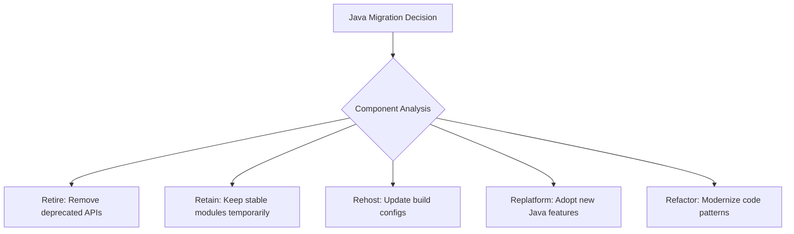
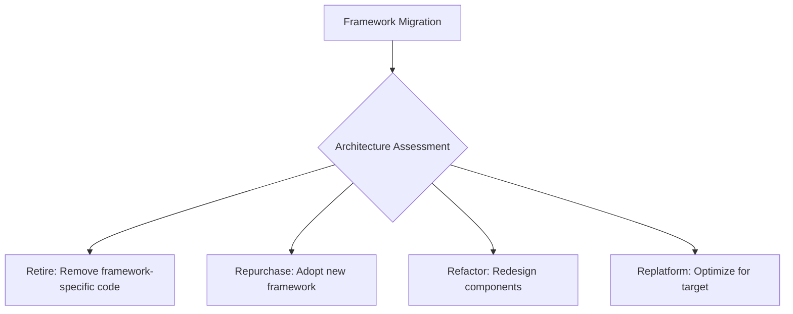
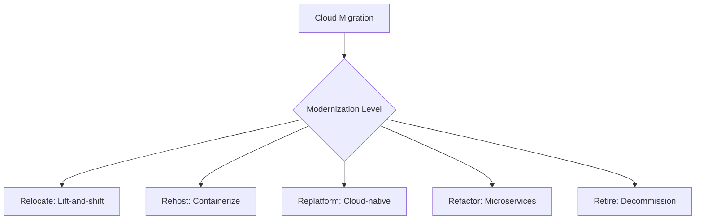
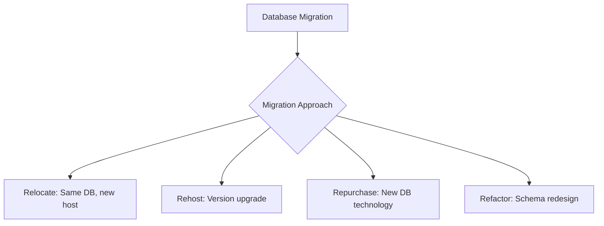
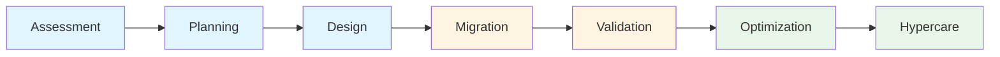
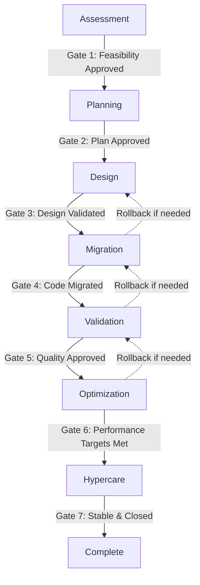
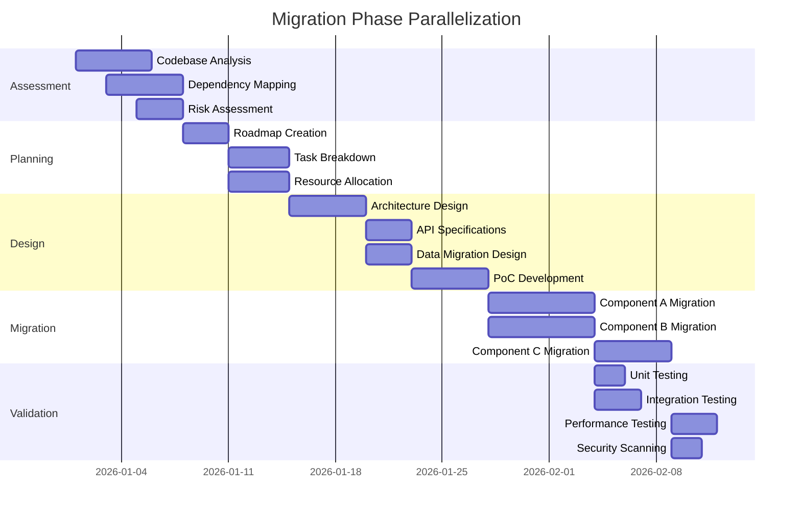

# Bob's Technical Migration Framework
## Comprehensive Plan for Migration Assistance

**Version:** 1.0  
**Date:** 2026-05-16  
**Focus:** Java/Framework migrations with balanced approach  
**Integration:** JIRA and Confluence  

---

## Executive Summary

This document defines Bob's systematic role in technical migration workflows, mapping the 7Rs migration framework to technical scenarios, defining Bob's responsibilities across 7 migration phases, and identifying priority areas for tooling development. The framework emphasizes:

- **Equal support** for all migration types (Java, framework, cloud, database)
- **Hybrid automation**: Fully automated execution/validation, semi-automated planning with human collaboration
- **JIRA/Confluence integration** for workflow management
- **Balanced rigor** in phase gates and validation

---

## 1. 7Rs Framework Applied to Technical Migrations

### 1.1 The 7Rs Migration Strategies

| Strategy | Definition | Technical Application |
|----------|------------|----------------------|
| **Retire** | Decommission and remove | Remove deprecated dependencies, eliminate unused code, sunset legacy systems |
| **Retain** | Keep as-is temporarily | Maintain stable components during phased migration, defer non-critical updates |
| **Relocate** | Move without changes | Lift-and-shift to new infrastructure, move to containers without code changes |
| **Rehost** | Minimal changes for compatibility | Update configurations, adjust deployment scripts, minor compatibility fixes |
| **Replatform** | Optimize for new platform | Adopt platform-specific features, update to newer APIs, leverage managed services |
| **Repurchase** | Replace with alternative | Switch frameworks (Quarkus→Spring Boot), adopt new libraries, change databases |
| **Refactor** | Redesign and rebuild | Modernize architecture, rewrite for new patterns, comprehensive code transformation |

### 1.2 Migration Type to 7Rs Mapping

#### Java Version Upgrades (e.g., Java 11 → 21)

**Primary Strategies:**
- **Rehost (60%)**: Update build files, dependency versions, JVM configurations
- **Replatform (25%)**: Adopt new Java features (records, pattern matching, virtual threads)
- **Retire (10%)**: Remove deprecated APIs and libraries
- **Refactor (5%)**: Modernize critical components using new language features

**Decision Criteria:**
- Code complexity and coupling
- Deprecated API usage density
- Performance requirements
- Team expertise with new Java features
- Timeline and risk tolerance

#### Framework Migrations (e.g., Quarkus → Spring Boot)

**Primary Strategies:**
- **Repurchase (50%)**: Replace framework dependencies and configurations
- **Refactor (35%)**: Redesign components for new framework patterns
- **Retire (10%)**: Remove framework-specific utilities
- **Replatform (5%)**: Optimize for target framework features

**Decision Criteria:**
- Framework compatibility matrix
- Dependency availability in target framework
- Architecture alignment (reactive vs. traditional)
- Team training requirements
- Migration tooling availability

#### Legacy to Cloud Migrations

**Primary Strategies:**
- **Relocate (30%)**: Direct VM migration, minimal changes
- **Rehost (25%)**: Containerization, basic cloud adaptation
- **Replatform (25%)**: Adopt managed services, cloud-native features
- **Refactor (15%)**: Microservices, serverless transformation
- **Retire (5%)**: Decommission redundant systems

**Decision Criteria:**
- Application architecture complexity
- Cloud provider capabilities
- Cost optimization goals
- Scalability requirements
- Compliance and security needs

#### Database Migrations

**Primary Strategies:**
- **Relocate (35%)**: Move to managed database service
- **Rehost (30%)**: Upgrade database version
- **Repurchase (20%)**: Switch database technology (Oracle→PostgreSQL)
- **Refactor (15%)**: Schema optimization and redesign

**Decision Criteria:**
- Data volume and complexity
- Query performance requirements
- Feature compatibility
- Licensing costs
- Operational overhead

### 1.3 7Rs Decision Matrix

| Migration Type | Retire | Retain | Relocate | Rehost | Replatform | Repurchase | Refactor |
|---------------|--------|--------|----------|--------|------------|------------|----------|
| **Java Upgrade** | ⭐⭐ | ⭐ | - | ⭐⭐⭐ | ⭐⭐⭐ | - | ⭐⭐ |
| **Framework** | ⭐⭐ | ⭐ | - | - | ⭐⭐ | ⭐⭐⭐ | ⭐⭐⭐ |
| **Cloud** | ⭐⭐ | ⭐ | ⭐⭐⭐ | ⭐⭐⭐ | ⭐⭐⭐ | ⭐ | ⭐⭐ |
| **Database** | ⭐ | ⭐ | ⭐⭐⭐ | ⭐⭐⭐ | ⭐⭐ | ⭐⭐⭐ | ⭐⭐ |

**Legend:** ⭐⭐⭐ Primary | ⭐⭐ Secondary | ⭐ Occasional | - Rare

---

## 2. Bob's Role Across 7 Migration Phases

### 2.1 Phase Overview

**Phase Categories:**
- 🔵 **Discovery Phases** (Assessment, Planning, Design): Semi-automated, collaborative
- 🟡 **Execution Phases** (Migration, Validation): Hybrid automation
- 🟢 **Stabilization Phases** (Optimization, Hypercare): Automated monitoring, guided improvements

### 2.2 Phase 1: Assessment

**Bob's Role:** Discovery Partner & Analysis Facilitator

#### What Bob Helps Accomplish
- Comprehensive codebase analysis
- Dependency mapping and impact assessment
- Risk identification and categorization
- Migration complexity estimation
- 7Rs strategy recommendation

#### Information Bob Gathers
- Project structure and file inventory
- Dependency tree (direct and transitive)
- Code metrics (LOC, complexity, coupling)
- Deprecated API usage patterns
- Test coverage statistics
- Build and deployment configurations
- Integration points and external dependencies
- Security vulnerabilities and technical debt

#### Bob's Outputs
- **Assessment Report** (Confluence page)
  - Executive summary with migration feasibility
  - Detailed dependency analysis
  - Risk matrix (likelihood × impact)
  - Recommended 7Rs strategy per component
  - Effort estimation (story points/hours)
  - Resource requirements
- **JIRA Epic** with assessment findings
- **Dependency Graph** (visual representation)
- **Migration Readiness Score** (0-100)

#### Validations Bob Performs
- ✅ All source code files scanned
- ✅ Build system compatibility verified
- ✅ Critical dependencies identified
- ✅ Breaking changes documented
- ✅ Test infrastructure assessed
- ✅ Rollback feasibility confirmed

#### Tools & Skills Required
- **MCP Tools:**
  - JIRA MCP: Create assessment epic, link issues
  - Confluence MCP: Generate assessment report
  - Code Analysis MCP: Static analysis, dependency scanning
- **Skills:**
  - Dependency analysis (Maven, Gradle, npm)
  - Code complexity metrics
  - Risk assessment frameworks
  - Migration pattern recognition

#### Mode: Plan Mode
**Automation Level:** Semi-automated (30% automated analysis, 70% collaborative discussion)

---

### 2.3 Phase 2: Planning

**Bob's Role:** Strategic Planning Partner & Workflow Designer

#### What Bob Helps Accomplish
- Detailed migration roadmap creation
- Task breakdown and sequencing
- Resource allocation planning
- Timeline estimation with milestones
- Risk mitigation strategy development
- Communication plan design

#### Information Bob Gathers
- Team capacity and expertise
- Existing project timelines and dependencies
- Organizational constraints (freeze periods, release windows)
- Stakeholder requirements and priorities
- Budget and resource constraints
- Compliance and security requirements

#### Bob's Outputs
- **Migration Plan** (Confluence page)
  - Phase-by-phase breakdown
  - Task dependencies (Gantt chart)
  - Resource allocation matrix
  - Risk mitigation strategies
  - Rollback procedures
  - Success criteria per phase
- **JIRA Stories** for each migration task
  - Acceptance criteria
  - Story point estimates
  - Dependencies and blockers
  - Assignee recommendations
- **Communication Plan**
  - Stakeholder notification schedule
  - Status reporting cadence
  - Escalation procedures

#### Validations Bob Performs
- ✅ All dependencies identified and sequenced
- ✅ Resource availability confirmed
- ✅ Timeline realistic and achievable
- ✅ Risk mitigation strategies defined
- ✅ Rollback plan validated
- ✅ Success metrics established

#### Tools & Skills Required
- **MCP Tools:**
  - JIRA MCP: Create stories, epics, sprints
  - Confluence MCP: Generate planning documents
  - Project Management MCP: Timeline visualization
- **Skills:**
  - Agile planning and estimation
  - Critical path analysis
  - Resource optimization
  - Risk management

#### Mode: Plan Mode
**Automation Level:** Semi-automated (40% automated task generation, 60% collaborative refinement)

---

### 2.4 Phase 3: Design

**Bob's Role:** Architecture Advisor & Design Validator

#### What Bob Helps Accomplish
- Target architecture design
- Component migration strategy per 7Rs
- API and interface design
- Data migration schema design
- Integration pattern definition
- Testing strategy design

#### Information Bob Gathers
- Current architecture documentation
- Target platform capabilities and constraints
- Performance requirements
- Security and compliance requirements
- Integration requirements
- Data volume and characteristics

#### Bob's Outputs
- **Architecture Design Document** (Confluence)
  - Target architecture diagrams
  - Component migration strategies (7Rs mapping)
  - API specifications
  - Data migration approach
  - Integration patterns
  - Security design
- **Technical Specifications** per component
  - Before/after code structure
  - Configuration changes
  - Dependency updates
  - Test requirements
- **Design Review Checklist**
- **Proof of Concept (PoC) Recommendations**

#### Validations Bob Performs
- ✅ Architecture aligns with target platform best practices
- ✅ All integration points addressed
- ✅ Performance requirements achievable
- ✅ Security requirements met
- ✅ Data migration approach validated
- ✅ Rollback strategy feasible
- ✅ Testing strategy comprehensive

#### Tools & Skills Required
- **MCP Tools:**
  - Confluence MCP: Generate design documents
  - Architecture Visualization MCP: Create diagrams
  - Code Generation MCP: Generate PoC code
- **Skills:**
  - Software architecture patterns
  - Platform-specific best practices
  - API design
  - Data modeling
  - Security architecture

#### Mode: Plan Mode → Advanced Mode (for PoC)
**Automation Level:** Semi-automated (50% automated design generation, 50% collaborative refinement)

---

### 2.5 Phase 4: Migration (Execution)

**Bob's Role:** Automated Executor & Progress Tracker

#### What Bob Helps Accomplish
- Automated code transformation
- Configuration file updates
- Dependency version updates
- Build script modifications
- Test case updates
- Documentation updates

#### Information Bob Gathers
- Design specifications from Phase 3
- Current codebase state
- Target platform requirements
- Migration task assignments from JIRA

#### Bob's Outputs
- **Migrated Code** (pull requests per component)
  - Transformed source code
  - Updated configurations
  - Modified build files
  - Updated tests
  - Migration notes
- **Migration Progress Report** (JIRA updates)
  - Completed tasks
  - In-progress tasks
  - Blocked tasks
  - Issues encountered
- **Change Log** per component
- **Pre-migration Backup** confirmation

#### Validations Bob Performs
- ✅ Code compiles successfully
- ✅ All dependencies resolved
- ✅ Configuration files valid
- ✅ Build scripts functional
- ✅ Tests updated and passing (unit tests)
- ✅ No security vulnerabilities introduced
- ✅ Code quality metrics maintained

#### Tools & Skills Required
- **MCP Tools:**
  - JIRA MCP: Update task status, log issues
  - Git MCP: Create branches, commits, PRs
  - Code Transformation MCP: Automated refactoring
  - Build System MCP: Validate builds
- **Skills:**
  - Code transformation patterns
  - Refactoring techniques
  - Build system expertise
  - Version control best practices

#### Mode: Advanced Mode
**Automation Level:** Highly automated (80% automated execution, 20% human review/approval)

---

### 2.6 Phase 5: Validation

**Bob's Role:** Automated Validator & Quality Assurance Partner

#### What Bob Helps Accomplish
- Comprehensive test execution
- Performance benchmarking
- Security scanning
- Integration testing
- Regression testing
- Compliance validation

#### Information Bob Gathers
- Test results from all test suites
- Performance metrics (before/after)
- Security scan results
- Integration test outcomes
- User acceptance test (UAT) feedback

#### Bob's Outputs
- **Validation Report** (Confluence)
  - Test execution summary
  - Performance comparison
  - Security assessment
  - Integration test results
  - Regression test results
  - Issues identified and resolved
- **Quality Gate Status** (Pass/Fail per criteria)
- **Issue Tracking** (JIRA tickets for failures)
- **Go/No-Go Recommendation**

#### Validations Bob Performs
- ✅ All unit tests passing (100%)
- ✅ Integration tests passing (>95%)
- ✅ Performance within acceptable range (±10%)
- ✅ No critical security vulnerabilities
- ✅ No regression issues
- ✅ Compliance requirements met
- ✅ UAT sign-off obtained

#### Tools & Skills Required
- **MCP Tools:**
  - Test Execution MCP: Run test suites
  - Performance Testing MCP: Benchmarking
  - Security Scanning MCP: Vulnerability detection
  - JIRA MCP: Log defects, track resolution
  - Confluence MCP: Generate validation report
- **Skills:**
  - Test automation
  - Performance analysis
  - Security testing
  - Quality assurance

#### Mode: Advanced Mode
**Automation Level:** Highly automated (90% automated testing, 10% human validation)

---

### 2.7 Phase 6: Optimization

**Bob's Role:** Performance Tuner & Best Practice Advisor

#### What Bob Helps Accomplish
- Performance optimization
- Resource utilization optimization
- Code quality improvements
- Configuration tuning
- Cost optimization (cloud migrations)
- Documentation refinement

#### Information Bob Gathers
- Production metrics (if deployed)
- Performance profiling data
- Resource utilization statistics
- User feedback
- Cost reports (cloud)
- Code quality metrics

#### Bob's Outputs
- **Optimization Report** (Confluence)
  - Performance improvements achieved
  - Resource optimization recommendations
  - Cost savings (if applicable)
  - Code quality improvements
  - Best practices applied
- **Optimized Code** (pull requests)
- **Configuration Tuning Recommendations**
- **Knowledge Base Articles** (lessons learned)

#### Validations Bob Performs
- ✅ Performance targets met or exceeded
- ✅ Resource utilization optimized
- ✅ Code quality metrics improved
- ✅ No new issues introduced
- ✅ Cost targets achieved (cloud)
- ✅ Documentation complete and accurate

#### Tools & Skills Required
- **MCP Tools:**
  - Performance Profiling MCP: Identify bottlenecks
  - Code Quality MCP: Static analysis, suggestions
  - Cloud Cost MCP: Cost analysis and optimization
  - Confluence MCP: Generate optimization report
- **Skills:**
  - Performance tuning
  - Code optimization
  - Cloud cost optimization
  - Best practices knowledge

#### Mode: Advanced Mode
**Automation Level:** Guided automation (60% automated analysis, 40% human-guided optimization)

---

### 2.8 Phase 7: Hypercare

**Bob's Role:** Monitoring Assistant & Issue Resolver

#### What Bob Helps Accomplish
- Continuous monitoring and alerting
- Rapid issue diagnosis
- Quick fix implementation
- Knowledge transfer
- Post-migration review
- Continuous improvement recommendations

#### Information Bob Gathers
- Production logs and metrics
- Error reports and stack traces
- User-reported issues
- System health indicators
- Performance trends

#### Bob's Outputs
- **Hypercare Dashboard** (real-time monitoring)
- **Issue Resolution Log** (JIRA)
- **Post-Migration Review** (Confluence)
  - What went well
  - What could be improved
  - Lessons learned
  - Recommendations for future migrations
- **Knowledge Base Updates**
- **Runbook Updates**

#### Validations Bob Performs
- ✅ System stability maintained (>99.9% uptime)
- ✅ All critical issues resolved within SLA
- ✅ Performance within acceptable range
- ✅ No data integrity issues
- ✅ User satisfaction maintained
- ✅ Team trained on new system

#### Tools & Skills Required
- **MCP Tools:**
  - Monitoring MCP: Real-time metrics, alerting
  - Log Analysis MCP: Error detection, pattern recognition
  - JIRA MCP: Issue tracking and resolution
  - Confluence MCP: Knowledge base updates
- **Skills:**
  - Troubleshooting and debugging
  - Log analysis
  - Incident management
  - Knowledge management

#### Mode: Advanced Mode
**Automation Level:** Automated monitoring (70% automated detection, 30% human intervention)

---

## 3. Phase-Based Workflow Structure

### 3.1 Phase Dependencies and Gates

### 3.2 Phase Gate Criteria

#### Gate 1: Assessment → Planning
**Prerequisites:**
- ✅ Complete codebase scan performed
- ✅ All dependencies identified and documented
- ✅ Risk assessment completed
- ✅ 7Rs strategy recommended per component
- ✅ Migration feasibility confirmed

**Deliverables:**
- Assessment Report (Confluence)
- JIRA Epic with findings
- Dependency graph
- Migration readiness score

**Approval Required:** Technical Lead, Product Owner

**Exit Criteria:**
- Migration feasibility score ≥ 70/100
- All critical risks have mitigation strategies
- Stakeholder buy-in obtained

---

#### Gate 2: Planning → Design
**Prerequisites:**
- ✅ Migration roadmap created
- ✅ All tasks identified and estimated
- ✅ Resource allocation confirmed
- ✅ Timeline approved by stakeholders
- ✅ Risk mitigation strategies defined

**Deliverables:**
- Migration Plan (Confluence)
- JIRA Stories for all tasks
- Communication plan
- Rollback procedures

**Approval Required:** Project Manager, Technical Lead, Stakeholders

**Exit Criteria:**
- All dependencies mapped and sequenced
- Resource availability confirmed
- Budget approved
- Timeline realistic (buffer ≥ 20%)

---

#### Gate 3: Design → Migration
**Prerequisites:**
- ✅ Target architecture designed and reviewed
- ✅ Component migration strategies defined (7Rs)
- ✅ API specifications complete
- ✅ Data migration approach validated
- ✅ Testing strategy approved
- ✅ PoC successful (if required)

**Deliverables:**
- Architecture Design Document (Confluence)
- Technical specifications per component
- Design review sign-off
- PoC results (if applicable)

**Approval Required:** Architect, Technical Lead, Security Team

**Exit Criteria:**
- Architecture review passed
- All integration points addressed
- Security requirements validated
- Performance requirements achievable
- Rollback strategy feasible

---

#### Gate 4: Migration → Validation
**Prerequisites:**
- ✅ All code migrated per design
- ✅ Code compiles successfully
- ✅ All dependencies resolved
- ✅ Configuration files updated
- ✅ Build scripts functional
- ✅ Unit tests updated and passing

**Deliverables:**
- Migrated code (pull requests)
- Migration progress report (JIRA)
- Change log per component
- Pre-migration backup confirmation

**Approval Required:** Technical Lead, Code Reviewers

**Exit Criteria:**
- All migration tasks completed
- Code review approved
- Build successful in all environments
- No critical issues blocking validation

---

#### Gate 5: Validation → Optimization
**Prerequisites:**
- ✅ All test suites executed
- ✅ Performance benchmarks completed
- ✅ Security scans passed
- ✅ Integration tests successful
- ✅ Regression tests passed
- ✅ UAT sign-off obtained

**Deliverables:**
- Validation Report (Confluence)
- Quality gate status (all passed)
- Issue resolution log (JIRA)
- Go/No-Go recommendation

**Approval Required:** QA Lead, Technical Lead, Product Owner

**Exit Criteria:**
- All critical and high-priority issues resolved
- Performance within acceptable range (±10%)
- No critical security vulnerabilities
- UAT approved
- Rollback tested and ready

---

#### Gate 6: Optimization → Hypercare
**Prerequisites:**
- ✅ Performance optimizations applied
- ✅ Resource utilization optimized
- ✅ Code quality improvements completed
- ✅ Configuration tuned
- ✅ Documentation updated
- ✅ Production deployment successful

**Deliverables:**
- Optimization Report (Confluence)
- Optimized code (pull requests)
- Configuration tuning recommendations
- Knowledge base articles

**Approval Required:** Technical Lead, Operations Team

**Exit Criteria:**
- Performance targets met or exceeded
- Resource utilization optimized
- Production deployment stable (24 hours)
- Monitoring and alerting configured
- Team trained on new system

---

#### Gate 7: Hypercare → Complete
**Prerequisites:**
- ✅ System stable for defined period (typically 30 days)
- ✅ All critical issues resolved
- ✅ Performance maintained
- ✅ User satisfaction confirmed
- ✅ Team fully trained
- ✅ Post-migration review completed

**Deliverables:**
- Hypercare summary report (Confluence)
- Post-migration review
- Lessons learned document
- Updated runbooks and documentation

**Approval Required:** Project Manager, Technical Lead, Product Owner

**Exit Criteria:**
- System uptime ≥ 99.9%
- No open critical or high-priority issues
- User satisfaction score ≥ 80%
- Knowledge transfer complete
- Continuous improvement recommendations documented

---

### 3.3 Parallel Execution Opportunities

While phases are primarily sequential, certain activities can run in parallel:

**Parallel Execution Guidelines:**
- **Assessment Phase:** Codebase analysis, dependency mapping, and risk assessment can overlap
- **Planning Phase:** Task breakdown and resource allocation can proceed in parallel
- **Design Phase:** API specs, data migration design, and PoC can run concurrently after architecture design
- **Migration Phase:** Independent components can be migrated in parallel
- **Validation Phase:** Different test types can run simultaneously

---

### 3.4 Rollback Procedures

Each phase must have a defined rollback procedure:

| Phase | Rollback Trigger | Rollback Action | Recovery Time |
|-------|------------------|-----------------|---------------|
| **Assessment** | Feasibility score < 70 | Abort migration, document reasons | Immediate |
| **Planning** | Timeline/budget unacceptable | Revise plan or abort | 1-2 days |
| **Design** | Architecture review fails | Redesign or abort | 3-5 days |
| **Migration** | Build failures, critical issues | Revert code changes, restore from backup | 2-4 hours |
| **Validation** | Quality gates fail | Fix issues or rollback migration | 1-3 days |
| **Optimization** | Performance degradation | Revert optimizations | 1-2 hours |
| **Hypercare** | System instability | Rollback to previous version | 1-4 hours |

---

## 4. Priority Areas for Bob's Assistance

Based on the research findings on "Where Developers Need Most Help," here are the priority areas ranked by impact and feasibility:

### 4.1 High Priority (Implement First)

#### 1. Dependency Discovery Automation ⭐⭐⭐
**Impact:** Critical - Foundation for all migration phases  
**Feasibility:** High - Existing tools and patterns available  
**Phase:** Assessment  

**Required Capabilities:**
- Parse build files (Maven, Gradle, npm, etc.)
- Resolve transitive dependencies
- Identify deprecated dependencies
- Detect version conflicts
- Map dependency relationships
- Generate dependency graphs

**Tools to Build:**
- **Dependency Scanner MCP**: Analyze build files and generate dependency tree
- **Dependency Conflict Resolver Skill**: Identify and suggest resolutions for version conflicts
- **Dependency Graph Generator**: Visual representation of dependencies

**Integration:**
- JIRA: Create issues for dependency conflicts
- Confluence: Generate dependency documentation

---

#### 2. Testing Automation ⭐⭐⭐
**Impact:** Critical - Ensures migration quality  
**Feasibility:** High - Test frameworks well-established  
**Phase:** Validation  

**Required Capabilities:**
- Generate test cases based on code changes
- Update existing tests for new APIs
- Execute test suites automatically
- Analyze test results and identify failures
- Generate test coverage reports
- Suggest additional test scenarios

**Tools to Build:**
- **Test Generator MCP**: Auto-generate unit and integration tests
- **Test Updater Skill**: Update tests for API changes
- **Test Execution MCP**: Run test suites and collect results
- **Test Coverage Analyzer**: Identify gaps in test coverage

**Integration:**
- JIRA: Log test failures as defects
- Confluence: Generate test reports

---

#### 3. Data Quality Assessment ⭐⭐⭐
**Impact:** High - Prevents data loss and corruption  
**Feasibility:** Medium - Requires domain knowledge  
**Phase:** Assessment, Validation  

**Required Capabilities:**
- Analyze data schemas and structures
- Identify data quality issues (nulls, duplicates, inconsistencies)
- Validate data migration mappings
- Generate data quality reports
- Suggest data cleansing strategies
- Monitor data integrity during migration

**Tools to Build:**
- **Data Quality Analyzer MCP**: Scan data sources for quality issues
- **Data Migration Validator**: Verify data migration accuracy
- **Data Profiling Tool**: Generate data statistics and patterns

**Integration:**
- JIRA: Create issues for data quality problems
- Confluence: Generate data quality reports

---

### 4.2 Medium Priority (Implement Second)

#### 4. Performance Optimization Guidance ⭐⭐
**Impact:** High - Ensures migration success  
**Feasibility:** Medium - Requires profiling and analysis  
**Phase:** Optimization  

**Required Capabilities:**
- Profile application performance
- Identify performance bottlenecks
- Suggest optimization strategies
- Benchmark before/after performance
- Generate performance reports
- Monitor performance trends

**Tools to Build:**
- **Performance Profiler MCP**: Identify bottlenecks and hotspots
- **Performance Optimizer Skill**: Suggest code optimizations
- **Benchmark Tool**: Compare performance before/after migration

**Integration:**
- Confluence: Generate performance reports

---

#### 5. Security Configuration ⭐⭐
**Impact:** Critical - Prevents security vulnerabilities  
**Feasibility:** Medium - Requires security expertise  
**Phase:** Design, Validation  

**Required Capabilities:**
- Scan for security vulnerabilities
- Validate security configurations
- Suggest security best practices
- Check compliance requirements
- Generate security reports
- Monitor security posture

**Tools to Build:**
- **Security Scanner MCP**: Detect vulnerabilities and misconfigurations
- **Security Best Practices Advisor**: Suggest security improvements
- **Compliance Checker**: Validate against security standards

**Integration:**
- JIRA: Create security issues
- Confluence: Generate security reports

---

#### 6. Rollback Procedures ⭐⭐
**Impact:** High - Enables safe migration  
**Feasibility:** High - Well-defined patterns  
**Phase:** All phases  

**Required Capabilities:**
- Generate rollback scripts
- Create backup procedures
- Validate rollback feasibility
- Document rollback steps
- Test rollback procedures
- Monitor rollback execution

**Tools to Build:**
- **Rollback Script Generator**: Create automated rollback scripts
- **Backup Validator**: Verify backup integrity
- **Rollback Tester**: Test rollback procedures

**Integration:**
- JIRA: Track rollback procedures
- Confluence: Document rollback steps

---

### 4.3 Lower Priority (Implement Later)

#### 7. Cost Estimation ⭐
**Impact:** Medium - Helps with planning  
**Feasibility:** Medium - Requires historical data  
**Phase:** Planning  

**Required Capabilities:**
- Estimate migration effort (story points/hours)
- Calculate resource costs
- Predict cloud costs (for cloud migrations)
- Generate cost reports
- Track actual vs. estimated costs

**Tools to Build:**
- **Effort Estimator**: Calculate migration effort based on complexity
- **Cloud Cost Calculator**: Estimate cloud infrastructure costs
- **Cost Tracker**: Monitor actual costs vs. estimates

**Integration:**
- JIRA: Update story point estimates
- Confluence: Generate cost reports

---

#### 8. Change Management ⭐
**Impact:** Medium - Facilitates adoption  
**Feasibility:** Low - Requires organizational context  
**Phase:** All phases  

**Required Capabilities:**
- Generate communication plans
- Create training materials
- Track stakeholder engagement
- Monitor adoption metrics
- Suggest change management strategies

**Tools to Build:**
- **Communication Plan Generator**: Create stakeholder communication plans
- **Training Material Generator**: Generate documentation and tutorials
- **Adoption Tracker**: Monitor team adoption and feedback

**Integration:**
- Confluence: Generate change management documentation
- JIRA: Track change management tasks

---

## 5. Implementation Roadmap

### 5.1 Phase 1: Foundation (Months 1-2)

**Goal:** Establish core capabilities for Assessment and Planning phases

**Deliverables:**
1. **Dependency Scanner MCP**
   - Parse build files (Maven, Gradle, npm)
   - Generate dependency tree
   - Identify deprecated dependencies
   - Detect version conflicts

2. **JIRA Integration MCP**
   - Create epics, stories, tasks
   - Update issue status
   - Link related issues
   - Generate reports

3. **Confluence Integration MCP**
   - Create pages and spaces
   - Update documentation
   - Generate reports
   - Attach files

4. **Assessment Mode** (Custom Mode)
   - Specialized for discovery and analysis
   - Read-only access to codebase
   - Integration with Dependency Scanner
   - Output: Assessment Report

**Success Criteria:**
- Bob can perform complete dependency analysis
- Bob can create JIRA epics and stories
- Bob can generate Confluence assessment reports
- Assessment phase can be completed with Bob's assistance

---

### 5.2 Phase 2: Execution (Months 3-4)

**Goal:** Enable automated migration and validation

**Deliverables:**
1. **Code Transformation MCP**
   - Automated refactoring
   - API migration patterns
   - Configuration updates
   - Build script modifications

2. **Test Generator MCP**
   - Auto-generate unit tests
   - Update existing tests
   - Generate integration tests

3. **Test Execution MCP**
   - Run test suites
   - Collect results
   - Analyze failures
   - Generate coverage reports

4. **Migration Mode** (Custom Mode)
   - Specialized for code transformation
   - Full write access
   - Integration with Code Transformation MCP
   - Output: Migrated code with tests

**Success Criteria:**
- Bob can automatically migrate code components
- Bob can generate and update tests
- Bob can execute test suites and report results
- Migration and Validation phases can be completed with Bob's assistance

---

### 5.3 Phase 3: Quality & Optimization (Months 5-6)

**Goal:** Ensure quality and optimize performance

**Deliverables:**
1. **Data Quality Analyzer MCP**
   - Scan data sources
   - Identify quality issues
   - Validate migration mappings
   - Generate quality reports

2. **Performance Profiler MCP**
   - Profile application performance
   - Identify bottlenecks
   - Benchmark before/after
   - Generate performance reports

3. **Security Scanner MCP**
   - Detect vulnerabilities
   - Validate configurations
   - Check compliance
   - Generate security reports

4. **Optimization Mode** (Custom Mode)
   - Specialized for performance tuning
   - Integration with profiling tools
   - Output: Optimized code and configurations

**Success Criteria:**
- Bob can assess data quality
- Bob can profile and optimize performance
- Bob can scan for security vulnerabilities
- Optimization phase can be completed with Bob's assistance

---

### 5.4 Phase 4: Stabilization (Month 7)

**Goal:** Support hypercare and continuous improvement

**Deliverables:**
1. **Monitoring MCP**
   - Real-time metrics collection
   - Alerting and notifications
   - Log analysis
   - Trend analysis

2. **Issue Resolver Skill**
   - Rapid diagnosis
   - Quick fix suggestions
   - Knowledge base search
   - Runbook execution

3. **Hypercare Mode** (Custom Mode)
   - Specialized for monitoring and support
   - Integration with monitoring tools
   - Output: Issue resolution and knowledge base updates

**Success Criteria:**
- Bob can monitor production systems
- Bob can diagnose and resolve issues
- Bob can update knowledge base
- Hypercare phase can be completed with Bob's assistance

---

## 6. Success Metrics

### 6.1 Phase-Level Metrics

| Phase | Key Metrics | Target |
|-------|-------------|--------|
| **Assessment** | Time to complete assessment | < 2 days |
| | Migration readiness score accuracy | > 90% |
| | Risk identification completeness | > 95% |
| **Planning** | Planning accuracy (actual vs. estimated) | ± 20% |
| | Task breakdown completeness | > 95% |
| | Stakeholder satisfaction | > 80% |
| **Design** | Design review pass rate | > 90% |
| | PoC success rate | > 85% |
| | Architecture quality score | > 80/100 |
| **Migration** | Code migration success rate | > 95% |
| | Build success rate | > 98% |
| | Time to migrate per component | < estimated |
| **Validation** | Test pass rate | > 95% |
| | Performance variance | ± 10% |
| | Security vulnerabilities | 0 critical |
| **Optimization** | Performance improvement | > 10% |
| | Resource utilization improvement | > 15% |
| | Code quality improvement | > 10% |
| **Hypercare** | System uptime | > 99.9% |
| | Mean time to resolution (MTTR) | < 4 hours |
| | User satisfaction | > 85% |

### 6.2 Overall Migration Metrics

| Metric | Target |
|--------|--------|
| **Migration Success Rate** | > 90% |
| **Time to Complete Migration** | Within ± 20% of estimate |
| **Cost Variance** | Within ± 15% of budget |
| **Defect Density** | < 1 defect per 1000 LOC |
| **Team Productivity** | > 30% improvement with Bob |
| **Knowledge Transfer Effectiveness** | > 85% team proficiency |

---

## 7. Risk Management

### 7.1 Common Migration Risks and Mitigation

| Risk | Likelihood | Impact | Mitigation Strategy | Bob's Role |
|------|------------|--------|---------------------|------------|
| **Data Loss** | Medium | Critical | Comprehensive backup, validation checks | Automate backup verification, data validation |
| **Security Vulnerabilities** | Medium | Critical | Security scanning, compliance checks | Automated security scanning, best practice recommendations |
| **Compatibility Issues** | High | High | Thorough testing, PoC validation | Dependency analysis, compatibility checking |
| **Performance Degradation** | Medium | High | Performance benchmarking, optimization | Automated profiling, optimization suggestions |
| **Downtime Exceeds Window** | Medium | High | Phased rollout, rollback procedures | Automated rollback scripts, progress monitoring |
| **Poor Data Quality** | High | Medium | Data quality assessment, cleansing | Automated data quality analysis, cleansing recommendations |
| **Cost Overruns** | Medium | Medium | Accurate estimation, cost tracking | Effort estimation, cost monitoring |
| **Lack of Expertise** | Medium | Medium | Training, knowledge transfer | Guided assistance, knowledge base creation |
| **Integration Failures** | Medium | High | Integration testing, API validation | Automated integration testing, API compatibility checking |

### 7.2 Bob-Specific Risks

| Risk | Mitigation |
|------|------------|
| **Over-reliance on Automation** | Maintain human oversight at critical gates, require approvals |
| **Incorrect Code Transformations** | Comprehensive testing, code review requirements |
| **Security Credential Exposure** | Use environment variables, secure credential stores |
| **Context Window Limitations** | Break down large migrations into smaller components |
| **Tool Integration Failures** | Fallback procedures, manual alternatives documented |

---

## 8. Next Steps

### 8.1 Immediate Actions

1. **Review and Approve Plan**
   - Stakeholder review of this document
   - Feedback incorporation
   - Final approval

2. **Set Up Development Environment**
   - Configure MCP development environment
   - Set up JIRA and Confluence test instances
   - Prepare sample migration projects

3. **Begin Phase 1 Implementation**
   - Develop Dependency Scanner MCP
   - Implement JIRA Integration MCP
   - Create Confluence Integration MCP
   - Build Assessment Mode

### 8.2 Long-Term Roadmap

**Q1 2026:** Foundation (Assessment & Planning)  
**Q2 2026:** Execution (Migration & Validation)  
**Q3 2026:** Quality & Optimization  
**Q4 2026:** Stabilization & Continuous Improvement

### 8.3 Success Criteria for Plan Approval

- ✅ 7Rs framework clearly mapped to technical scenarios
- ✅ Bob's role defined for each migration phase
- ✅ Phase dependencies and gates documented
- ✅ Priority areas identified with implementation roadmap
- ✅ Success metrics established
- ✅ Risk mitigation strategies defined
- ✅ Integration points with JIRA/Confluence specified

---

## Appendix A: Glossary

| Term | Definition |
|------|------------|
| **7Rs** | Seven migration strategies: Retire, Retain, Relocate, Rehost, Replatform, Repurchase, Refactor |
| **MCP** | Model Context Protocol - standardized protocol for AI tool integration |
| **PoC** | Proof of Concept - small-scale implementation to validate approach |
| **UAT** | User Acceptance Testing - validation by end users |
| **MTTR** | Mean Time To Resolution - average time to resolve issues |
| **SLA** | Service Level Agreement - committed service quality levels |

## Appendix B: References

- Migration Research Document (source of 7 phases, 7Rs, challenges)
- IBM Bob Documentation: https://bob.ibm.com/docs/ide
- JIRA API Documentation
- Confluence API Documentation
- MCP Specification

---

**Document Status:** Draft for Review  
**Next Review Date:** Upon stakeholder feedback  
**Owner:** Bob Development Team