# Migration Skills and Workflow Specifications

**Version:** 1.0  
**Date:** 2026-05-16  
**Parent Document:** migration-technical-specifications.md

---

## Table of Contents

1. [Migration-Specific Skills](#1-migration-specific-skills)
2. [Workflow Instructions](#2-workflow-instructions)
3. [Tool Integration Architecture](#3-tool-integration-architecture)

---

## 1. Migration-Specific Skills

### 1.1 Java Migration Skill

**Skill Name:** `java-version-migration`  
**Purpose:** Handle Java version upgrades (Java 11 → 17 → 21)  
**Complexity:** Medium to High

#### Trigger Conditions

Activate this skill when:
- User mentions Java version upgrade (e.g., "migrate from Java 11 to 21")
- Project uses Java and target version is specified
- Assessment identifies Java version as migration requirement
- Keywords: "Java upgrade", "Java migration", "update Java version"

#### Required Inputs and Context

**Inputs:**
```json
{
  "current_version": "11|17",
  "target_version": "17|21",
  "project_path": "string",
  "build_system": "maven|gradle",
  "frameworks": ["spring-boot", "quarkus", "micronaut"],
  "migration_strategy": "rehost|replatform|refactor"
}
```

**Context to Gather:**
- Current Java version from build files
- Dependency versions and compatibility
- Usage of deprecated APIs
- Test coverage percentage
- CI/CD pipeline configuration
- Deployment target (on-prem, cloud, containers)

#### Step-by-Step Workflow

**Phase 1: Assessment (Use Assessment Mode)**

1. **Scan Project Structure**
   - Use `list_files` to identify Java source files
   - Use `list_code_definition_names` to catalog classes and methods
   - Identify build system (Maven/Gradle)

2. **Analyze Dependencies**
   - Use Dependency Scanner MCP to scan all dependencies
   - Identify incompatible dependencies with target Java version
   - Check for deprecated APIs in dependencies

3. **Identify Breaking Changes**
   - Use `search_files` to find deprecated API usage:
     - Java 11→17: `sun.*` packages, `javax.xml.bind`, `javax.activation`
     - Java 17→21: Deprecated methods in `java.lang`, `java.util`
   - Search for removed features (e.g., Nashorn, Pack200)
   - Identify security manager usage (removed in Java 17+)

4. **Assess Test Coverage**
   - Use Test Generator MCP to validate coverage
   - Identify critical paths without tests
   - Estimate test generation effort

5. **Generate Assessment Report**
   - Impact score (0-100)
   - Breaking changes list with remediation
   - Dependency update requirements
   - Estimated effort (story points)
   - Risk matrix
   - Recommended migration strategy

**Phase 2: Planning (Use Plan Mode)**

6. **Create Migration Plan**
   - Break down into tasks:
     - Update build configuration
     - Update dependencies
     - Fix deprecated API usage
     - Adopt new Java features (optional)
     - Update tests
     - Update CI/CD pipeline
   - Sequence tasks with dependencies
   - Estimate effort per task

7. **Create JIRA Tasks**
   - Use JIRA Integration MCP to create epic and stories
   - Link dependencies between tasks
   - Assign story points

8. **Create Rollback Plan**
   - Use Rollback Manager MCP to define checkpoints
   - Document rollback procedures
   - Identify rollback triggers

**Phase 3: Execution (Use Migration Execution Mode)**

9. **Update Build Configuration**
   - Update `pom.xml` or `build.gradle`:
     ```xml
     <maven.compiler.source>21</maven.compiler.source>
     <maven.compiler.target>21</maven.compiler.target>
     ```
   - Update compiler plugin versions
   - Update JVM arguments if needed

10. **Update Dependencies**
    - Use Dependency Scanner MCP to get compatible versions
    - Update dependency versions incrementally
    - Test after each major dependency update
    - Resolve version conflicts

11. **Fix Deprecated API Usage**
    - Replace removed APIs:
      - `javax.xml.bind` → `jakarta.xml.bind`
      - `java.util.Date` → `java.time.*`
      - `Thread.stop()` → proper thread management
    - Use `apply_diff` for targeted fixes
    - Maintain backward compatibility where possible

12. **Adopt New Java Features (Optional - Replatform/Refactor)**
    - Java 17 features:
      - Sealed classes for domain modeling
      - Pattern matching for instanceof
      - Records for DTOs
    - Java 21 features:
      - Virtual threads for concurrency
      - Pattern matching for switch
      - Sequenced collections
    - Use `apply_diff` to refactor code

13. **Update Tests**
    - Use Test Generator MCP to create new tests
    - Update existing tests for API changes
    - Ensure coverage meets requirements (80%+)
    - Run test suite with `execute_command`

14. **Update CI/CD Pipeline**
    - Update Docker base images
    - Update CI Java version
    - Update deployment configurations
    - Test pipeline end-to-end

**Phase 4: Validation (Use Migration Execution Mode)**

15. **Run Comprehensive Tests**
    - Use Test Generator MCP to execute all tests
    - Validate test coverage
    - Fix any test failures

16. **Security Scan**
    - Use Security Scanner MCP to scan for vulnerabilities
    - Verify no new security issues introduced
    - Update security configurations if needed

17. **Performance Validation**
    - Use Performance Profiler MCP to profile application
    - Compare with baseline metrics
    - Ensure no performance regression

**Phase 5: Optimization (Use Optimization Mode)**

18. **Leverage New Features**
    - Identify optimization opportunities
    - Implement virtual threads for I/O-bound operations
    - Use pattern matching to simplify code
    - Optimize with new APIs

19. **Performance Tuning**
    - Use Performance Profiler MCP to identify hotspots
    - Optimize based on profiling data
    - Benchmark improvements

**Phase 6: Documentation**

20. **Generate Documentation**
    - Use Documentation Generator MCP to create:
      - Migration runbook
      - Breaking changes document
      - New features guide
      - Rollback procedures
    - Update Confluence pages

#### Integration with MCPs and Modes

**MCP Integration:**
- **Dependency Scanner MCP**: Scan dependencies, analyze impact
- **Test Generator MCP**: Generate and execute tests
- **Security Scanner MCP**: Scan for vulnerabilities
- **Performance Profiler MCP**: Profile and compare performance
- **Rollback Manager MCP**: Create checkpoints
- **Documentation Generator MCP**: Generate documentation
- **JIRA Integration MCP**: Track tasks and progress

**Mode Transitions:**
- Assessment Mode → Plan Mode (after assessment approval)
- Plan Mode → Migration Execution Mode (after plan approval)
- Migration Execution Mode → Optimization Mode (after validation)
- Any Mode → Hypercare Mode (after production deployment)

#### Success Criteria and Validation

**Success Criteria:**
- ✅ Application compiles with target Java version
- ✅ All tests pass (100% of existing tests)
- ✅ Test coverage ≥ 80%
- ✅ No critical or high security vulnerabilities
- ✅ Performance within 5% of baseline
- ✅ No deprecated API usage (or documented exceptions)
- ✅ CI/CD pipeline updated and working
- ✅ Documentation complete and reviewed
- ✅ Rollback plan tested

**Validation Checklist:**
```markdown
- [ ] Build succeeds with target Java version
- [ ] All unit tests pass
- [ ] All integration tests pass
- [ ] Security scan shows no new vulnerabilities
- [ ] Performance benchmarks meet requirements
- [ ] Deprecated APIs replaced or documented
- [ ] Dependencies updated and compatible
- [ ] CI/CD pipeline validated
- [ ] Documentation generated and published
- [ ] Rollback procedure tested
- [ ] Stakeholders notified
```

---

### 1.2 Framework Migration Skill

**Skill Name:** `framework-migration`  
**Purpose:** Handle framework transitions (Quarkus → Spring Boot, etc.)  
**Complexity:** High

#### Trigger Conditions

Activate this skill when:
- User mentions framework migration (e.g., "migrate from Quarkus to Spring Boot")
- Assessment identifies framework change requirement
- Keywords: "framework migration", "switch framework", "Quarkus to Spring Boot"

#### Required Inputs and Context

**Inputs:**
```json
{
  "source_framework": "quarkus|spring-boot|micronaut|jakarta-ee",
  "source_version": "string",
  "target_framework": "spring-boot|quarkus|micronaut",
  "target_version": "string",
  "project_path": "string",
  "architecture_type": "monolith|microservices|serverless",
  "migration_strategy": "repurchase|refactor|replatform"
}
```

**Context to Gather:**
- Current framework version and configuration
- Application architecture (REST, reactive, messaging)
- Dependency injection patterns used
- Data access patterns (JPA, reactive, JDBC)
- Security configuration (OAuth, JWT, etc.)
- Testing approach (unit, integration, e2e)
- Deployment model (containers, serverless, traditional)

#### Step-by-Step Workflow

**Phase 1: Assessment (Use Assessment Mode)**

1. **Analyze Current Framework Usage**
   - Identify framework-specific annotations
   - Map dependency injection patterns
   - Catalog REST endpoints and configurations
   - Identify data access patterns
   - Document security configurations

2. **Create Framework Compatibility Matrix**
   ```markdown
   | Feature | Source (Quarkus) | Target (Spring Boot) | Migration Effort |
   |---------|------------------|----------------------|------------------|
   | REST API | @Path | @RestController | Medium |
   | DI | @Inject | @Autowired | Low |
   | Config | @ConfigProperty | @Value | Low |
   | Data Access | Panache | Spring Data JPA | High |
   | Security | Quarkus Security | Spring Security | High |
   ```

3. **Identify Breaking Changes**
   - Annotation differences
   - Configuration format changes
   - Dependency changes
   - Behavioral differences

4. **Estimate Migration Effort**
   - Count framework-specific code locations
   - Assess complexity of each component
   - Calculate story points per component

**Phase 2: Planning (Use Plan Mode)**

5. **Create Phased Migration Plan**
   - **Phase 1**: Setup target framework skeleton
   - **Phase 2**: Migrate configuration
   - **Phase 3**: Migrate REST endpoints
   - **Phase 4**: Migrate business logic
   - **Phase 5**: Migrate data access layer
   - **Phase 6**: Migrate security
   - **Phase 7**: Migrate tests
   - **Phase 8**: Update deployment

6. **Define Migration Patterns**
   - REST endpoint migration pattern
   - Service layer migration pattern
   - Repository migration pattern
   - Configuration migration pattern
   - Test migration pattern

**Phase 3: Execution (Use Migration Execution Mode)**

7. **Setup Target Framework**
   - Create new project structure
   - Add target framework dependencies
   - Configure build system
   - Setup basic application configuration

8. **Migrate Configuration**
   - Convert `application.properties` to target format
   - Migrate environment-specific configs
   - Update external configuration sources

9. **Migrate REST Layer**
   - Convert REST annotations:
     ```java
     // Quarkus
     @Path("/api/users")
     @GET
     public List<User> getUsers() { }
     
     // Spring Boot
     @RestController
     @RequestMapping("/api/users")
     @GetMapping
     public List<User> getUsers() { }
     ```
   - Update request/response handling
   - Migrate exception handling

10. **Migrate Business Logic**
    - Convert dependency injection
    - Update service annotations
    - Migrate transaction management
    - Update event handling

11. **Migrate Data Access Layer**
    - Convert repository patterns
    - Update entity annotations
    - Migrate query methods
    - Update transaction configuration

12. **Migrate Security**
    - Convert security configuration
    - Update authentication/authorization
    - Migrate JWT/OAuth configuration
    - Update security filters

13. **Migrate Tests**
    - Convert test annotations
    - Update test configuration
    - Migrate mocking framework
    - Update integration tests

**Phase 4: Validation**

14. **Functional Testing**
    - Execute all test suites
    - Validate API contracts
    - Test integration points
    - Verify business logic

15. **Performance Testing**
    - Profile application performance
    - Compare with baseline
    - Optimize if needed

16. **Security Testing**
    - Run security scans
    - Validate authentication/authorization
    - Test security configurations

#### Integration with MCPs and Modes

**MCP Integration:**
- **Dependency Scanner MCP**: Analyze framework dependencies
- **Test Generator MCP**: Generate framework-specific tests
- **Security Scanner MCP**: Validate security configurations
- **Performance Profiler MCP**: Compare framework performance
- **Documentation Generator MCP**: Generate migration guide

**Mode Transitions:**
- Assessment Mode → Plan Mode → Migration Execution Mode → Validation → Optimization

#### Success Criteria

- ✅ All endpoints migrated and functional
- ✅ All tests pass with target framework
- ✅ Performance within 10% of baseline
- ✅ Security configurations validated
- ✅ No framework-specific code from source framework
- ✅ Documentation complete

---

### 1.3 Cloud Migration Skill

**Skill Name:** `cloud-migration`  
**Purpose:** Handle legacy to cloud migrations  
**Complexity:** High

#### Trigger Conditions

Activate this skill when:
- User mentions cloud migration (e.g., "migrate to AWS", "move to cloud")
- Assessment identifies cloud migration requirement
- Keywords: "cloud migration", "AWS", "Azure", "GCP", "containerize"

#### Required Inputs and Context

**Inputs:**
```json
{
  "source_environment": "on-premise|legacy-cloud",
  "target_cloud": "aws|azure|gcp",
  "target_architecture": "vm|containers|serverless|kubernetes",
  "migration_strategy": "relocate|rehost|replatform|refactor",
  "project_path": "string",
  "compliance_requirements": ["HIPAA", "PCI-DSS", "SOC2"]
}
```

#### Step-by-Step Workflow

**Phase 1: Assessment (Use Assessment Mode)**

1. **Analyze Current Infrastructure**
   - Document current architecture
   - Identify dependencies (databases, services, APIs)
   - Assess network topology
   - Identify data volumes and types
   - Document compliance requirements

2. **Cloud Readiness Assessment**
   - Evaluate application for cloud compatibility
   - Identify cloud-native opportunities
   - Assess security requirements
   - Estimate costs

3. **Select Migration Strategy**
   - **Relocate (30%)**: Lift-and-shift to VMs
   - **Rehost (25%)**: Containerize application
   - **Replatform (25%)**: Adopt managed services
   - **Refactor (15%)**: Microservices transformation
   - **Retire (5%)**: Decommission redundant systems

**Phase 2: Planning (Use Plan Mode)**

4. **Create Cloud Architecture**
   - Design target architecture
   - Select cloud services
   - Plan network topology
   - Design security architecture
   - Plan data migration strategy

5. **Create Migration Plan**
   - Phase migration by component
   - Define cutover strategy
   - Plan rollback procedures
   - Schedule migration windows

**Phase 3: Execution (Use Migration Execution Mode)**

6. **Setup Cloud Infrastructure**
   - Provision cloud resources
   - Configure networking (VPC, subnets, security groups)
   - Setup IAM roles and policies
   - Configure monitoring and logging

7. **Containerize Application (if Rehost/Replatform)**
   - Create Dockerfile
   - Build container images
   - Setup container registry
   - Configure orchestration (ECS, AKS, GKE)

8. **Migrate Application**
   - Deploy application to cloud
   - Configure auto-scaling
   - Setup load balancing
   - Configure health checks

9. **Migrate Data**
   - Use Data Quality Analyzer MCP to profile data
   - Execute data migration
   - Validate data integrity
   - Setup data replication if needed

10. **Configure Security**
    - Implement encryption (at rest and in transit)
    - Configure secrets management
    - Setup WAF and DDoS protection
    - Implement compliance controls

**Phase 4: Validation**

11. **Test Cloud Deployment**
    - Functional testing
    - Performance testing
    - Security testing
    - Disaster recovery testing

12. **Cost Optimization**
    - Use Cost Estimator MCP to analyze costs
    - Right-size resources
    - Implement cost controls
    - Setup cost monitoring

#### Success Criteria

- ✅ Application running in cloud
- ✅ All functionality validated
- ✅ Performance meets requirements
- ✅ Security controls implemented
- ✅ Compliance requirements met
- ✅ Costs within budget
- ✅ Monitoring and alerting configured
- ✅ Disaster recovery tested

---

### 1.4 Database Migration Skill

**Skill Name:** `database-migration`  
**Purpose:** Handle database platform changes (Oracle → PostgreSQL, etc.)  
**Complexity:** Very High

#### Trigger Conditions

Activate this skill when:
- User mentions database migration
- Assessment identifies database change requirement
- Keywords: "database migration", "Oracle to PostgreSQL", "database upgrade"

#### Required Inputs and Context

**Inputs:**
```json
{
  "source_database": "oracle|mysql|sqlserver|mongodb",
  "source_version": "string",
  "target_database": "postgresql|mysql|mongodb|dynamodb",
  "target_version": "string",
  "data_volume_gb": "number",
  "migration_strategy": "relocate|rehost|repurchase|refactor"
}
```

#### Step-by-Step Workflow

**Phase 1: Assessment (Use Assessment Mode)**

1. **Analyze Database Schema**
   - Document tables, views, procedures
   - Identify data types and constraints
   - Catalog indexes and triggers
   - Document stored procedures and functions

2. **Assess Data Quality**
   - Use Data Quality Analyzer MCP to profile data
   - Identify data quality issues
   - Assess data volumes
   - Identify referential integrity issues

3. **Identify Compatibility Issues**
   - Map data types (Oracle → PostgreSQL)
   - Identify proprietary features
   - Assess SQL dialect differences
   - Document migration complexity

**Phase 2: Planning (Use Plan Mode)**

4. **Create Migration Strategy**
   - Schema migration approach
   - Data migration approach (bulk, incremental, CDC)
   - Downtime requirements
   - Rollback strategy

5. **Create Data Migration Plan**
   - Phase migration by table/module
   - Define data validation strategy
   - Plan cutover approach
   - Schedule migration windows

**Phase 3: Execution (Use Migration Execution Mode)**

6. **Migrate Schema**
   - Convert DDL statements
   - Create tables in target database
   - Migrate indexes and constraints
   - Convert stored procedures

7. **Migrate Data**
   - Execute data migration
   - Validate data integrity
   - Verify row counts
   - Check data quality

8. **Update Application Code**
   - Update database drivers
   - Convert SQL queries
   - Update ORM configurations
   - Fix database-specific code

9. **Migrate Stored Procedures**
   - Convert to target database syntax
   - Or refactor into application code
   - Test thoroughly

**Phase 4: Validation**

10. **Validate Migration**
    - Compare row counts
    - Validate data integrity
    - Test application functionality
    - Performance testing

11. **Optimize Database**
    - Analyze query performance
    - Optimize indexes
    - Tune database parameters
    - Setup monitoring

#### Success Criteria

- ✅ Schema migrated completely
- ✅ All data migrated with integrity
- ✅ Application works with new database
- ✅ Performance meets requirements
- ✅ Data quality validated
- ✅ Backup and recovery tested

---

## 2. Workflow Instructions

### 2.1 Phase Transition Instructions

**Purpose:** Define how to move between migration phases with proper validation

#### Gate 1: Assessment → Planning

**Prerequisites:**
- Assessment report completed and reviewed
- Migration readiness score calculated (≥60 to proceed)
- All critical dependencies identified
- Risk matrix created and reviewed
- Stakeholder approval obtained

**Validation Steps:**
1. Verify assessment report completeness
2. Confirm all breaking changes documented
3. Validate effort estimation reviewed
4. Check stakeholder sign-off obtained
5. Verify JIRA epic created

**Transition Actions:**
1. Archive assessment artifacts
2. Create planning workspace
3. Initialize JIRA stories
4. Schedule planning sessions
5. Notify stakeholders of phase transition

**Approval Required:** Yes (Technical Lead + Product Owner)

---

#### Gate 2: Planning → Design

**Prerequisites:**
- Migration plan approved
- All tasks created in JIRA
- Resource allocation confirmed
- Timeline validated
- Risk mitigation strategies defined

**Validation Steps:**
1. Verify all dependencies sequenced
2. Confirm resource availability
3. Validate timeline realistic
4. Check rollback plan complete
5. Verify success metrics defined

**Transition Actions:**
1. Finalize migration plan
2. Create design workspace
3. Schedule design sessions
4. Assign design tasks
5. Setup PoC environment

**Approval Required:** Yes (Technical Lead + Architecture Review Board)

---

#### Gate 3: Design → Migration

**Prerequisites:**
- Target architecture approved
- PoC validated successfully
- Technical specifications complete
- Migration patterns defined
- Rollback procedures tested

**Validation Steps:**
1. Verify architecture review complete
2. Confirm PoC meets requirements
3. Validate technical specs approved
4. Check migration patterns documented
5. Verify rollback tested

**Transition Actions:**
1. Create migration checkpoints
2. Setup migration environment
3. Initialize migration tracking
4. Assign migration tasks
5. Conduct kickoff meeting

**Approval Required:** Yes (Architecture Review Board + Security Team)

---

#### Gate 4: Migration → Validation

**Prerequisites:**
- All migration tasks completed
- Code changes committed
- Build successful
- Unit tests passing
- Integration tests passing

**Validation Steps:**
1. Verify all JIRA tasks closed
2. Confirm code review complete
3. Validate build pipeline green
4. Check test coverage ≥80%
5. Verify no critical issues

**Transition Actions:**
1. Deploy to test environment
2. Execute validation test suite
3. Perform security scan
4. Run performance tests
5. Generate validation report

**Approval Required:** Yes (Technical Lead + QA Lead)

---

#### Gate 5: Validation → Optimization

**Prerequisites:**
- All validation tests passed
- Performance baseline established
- Security scan clean
- No critical defects
- Stakeholder acceptance

**Validation Steps:**
1. Verify functional tests 100% pass
2. Confirm performance within 5% of baseline
3. Validate security scan clean
4. Check no P1/P2 defects
5. Verify stakeholder sign-off

**Transition Actions:**
1. Establish optimization baseline
2. Identify optimization opportunities
3. Prioritize optimizations
4. Create optimization tasks
5. Schedule optimization work

**Approval Required:** Yes (Technical Lead + Product Owner)

---

#### Gate 6: Optimization → Hypercare

**Prerequisites:**
- Optimization goals achieved
- Performance improved
- Costs optimized
- Documentation complete
- Production deployment approved

**Validation Steps:**
1. Verify optimization targets met
2. Confirm performance improved
3. Validate cost reductions achieved
4. Check documentation complete
5. Verify production readiness

**Transition Actions:**
1. Deploy to production
2. Activate monitoring
3. Setup hypercare team
4. Create incident response plan
5. Schedule hypercare reviews

**Approval Required:** Yes (Change Advisory Board)

---

#### Gate 7: Hypercare → Complete

**Prerequisites:**
- Hypercare period complete (30-90 days)
- System stable
- No critical incidents
- Lessons learned documented
- Handoff to operations complete

**Validation Steps:**
1. Verify stability metrics met
2. Confirm incident rate acceptable
3. Validate lessons learned captured
4. Check operations team trained
5. Verify documentation complete

**Transition Actions:**
1. Generate final migration report
2. Archive migration artifacts
3. Conduct retrospective
4. Celebrate success
5. Close migration project

**Approval Required:** Yes (Project Sponsor + Operations Lead)

---

### 2.2 Dependency Management Instructions

**Purpose:** How to handle and track dependencies throughout migration

#### Dependency Discovery

1. **Initial Scan**
   - Use Dependency Scanner MCP at project start
   - Catalog all direct and transitive dependencies
   - Identify version conflicts
   - Document dependency tree

2. **Continuous Monitoring**
   - Re-scan after each major change
   - Track dependency updates
   - Monitor for new vulnerabilities
   - Update dependency documentation

#### Dependency Update Strategy

1. **Prioritization**
   - Critical security vulnerabilities: Immediate
   - High-impact breaking changes: Early in migration
   - Low-risk updates: Incremental throughout
   - Nice-to-have updates: Post-migration

2. **Update Process**
   ```markdown
   For each dependency update:
   1. Check compatibility with target version
   2. Review changelog for breaking changes
   3. Update dependency version
   4. Run tests
   5. Fix any issues
   6. Commit changes
   7. Update documentation
   ```

3. **Conflict Resolution**
   - Identify conflicting versions
   - Analyze impact of each version
   - Choose version that satisfies all requirements
   - Document resolution decision
   - Test thoroughly

#### Dependency Tracking

**Track in JIRA:**
- Create dependency update tasks
- Link to parent migration epic
- Track status and blockers
- Document resolution

**Track in Documentation:**
- Maintain dependency matrix
- Document version decisions
- Record compatibility notes
- Update migration guide

---

### 2.3 Validation Instructions

**Purpose:** What to validate at each phase gate

#### Code Validation

**Build Validation:**
```bash
# Verify clean build
./mvnw clean install
# or
./gradlew clean build

# Check for warnings
# Verify no compilation errors
# Confirm all modules build successfully
```

**Code Quality Validation:**
- Run static analysis tools
- Check code coverage ≥80%
- Verify no critical SonarQube issues
- Validate code style compliance

#### Test Validation

**Unit Tests:**
- All unit tests must pass (100%)
- Coverage ≥80% for new/modified code
- No flaky tests
- Execution time reasonable (<5 minutes)

**Integration Tests:**
- All integration tests pass
- External dependencies mocked appropriately
- Test data properly managed
- Cleanup after tests

**Regression Tests:**
- All existing functionality works
- No unintended side effects
- Performance not degraded
- User workflows validated

#### Security Validation

**Security Scan:**
- Use Security Scanner MCP
- No critical vulnerabilities
- High vulnerabilities documented and planned
- Compliance requirements met

**Security Testing:**
- Authentication works correctly
- Authorization properly enforced
- Sensitive data encrypted
- Security headers configured

#### Performance Validation

**Performance Testing:**
- Use Performance Profiler MCP
- Response times within SLA
- Throughput meets requirements
- Resource usage acceptable
- No memory leaks

**Load Testing:**
- System handles expected load
- Graceful degradation under stress
- Auto-scaling works correctly
- Recovery after load spike

#### Data Validation

**Data Integrity:**
- Row counts match
- Data types correct
- Constraints enforced
- Referential integrity maintained

**Data Quality:**
- Use Data Quality Analyzer MCP
- No data corruption
- Business rules validated
- Data transformations correct

---

### 2.4 Rollback Instructions

**Purpose:** When and how to trigger rollbacks

#### Rollback Triggers

**Automatic Rollback Triggers:**
- Critical production incident (P1)
- Data corruption detected
- Security breach identified
- System unavailable >30 minutes
- Error rate >5%

**Manual Rollback Triggers:**
- Stakeholder decision
- Unforeseen technical issues
- Business requirement changes
- Resource constraints

#### Rollback Procedure

**Pre-Rollback:**
1. Assess situation severity
2. Notify stakeholders
3. Document rollback reason
4. Identify rollback checkpoint
5. Validate rollback feasibility

**Execute Rollback:**
1. Use Rollback Manager MCP
2. Stop current deployment
3. Restore from checkpoint
4. Verify system functionality
5. Monitor for issues

**Post-Rollback:**
1. Conduct incident review
2. Document lessons learned
3. Update rollback procedures
4. Plan remediation
5. Communicate to stakeholders

#### Rollback Validation

**Validation Steps:**
```markdown
- [ ] System restored to previous state
- [ ] All services operational
- [ ] Data integrity verified
- [ ] No data loss
- [ ] Users can access system
- [ ] Performance acceptable
- [ ] Monitoring shows healthy state
```

---

### 2.5 Documentation Instructions

**Purpose:** What to document and when

#### Assessment Phase Documentation

**Required Documents:**
- Assessment Report (Confluence)
- Dependency Analysis Report
- Risk Matrix
- Migration Readiness Score
- Effort Estimation

**Documentation Process:**
1. Use Documentation Generator MCP
2. Generate from assessment artifacts
3. Review with stakeholders
4. Publish to Confluence
5. Link to JIRA epic

#### Planning Phase Documentation

**Required Documents:**
- Migration Plan (Confluence)
- Task Breakdown (JIRA)
- Timeline and Milestones
- Resource Allocation Matrix
- Risk Mitigation Strategies
- Rollback Procedures

#### Execution Phase Documentation

**Required Documents:**
- Migration Runbook
- Code Change Log
- Configuration Changes
- Deployment Procedures
- Test Results

**Documentation Process:**
1. Document as you go
2. Update runbook with each change
3. Capture decisions and rationale
4. Record issues and resolutions
5. Update regularly

#### Post-Migration Documentation

**Required Documents:**
- Final Migration Report
- Lessons Learned
- Updated Architecture Diagrams
- Operations Runbook
- Training Materials

**Documentation Process:**
1. Consolidate all artifacts
2. Generate final report
3. Conduct retrospective
4. Document lessons learned
5. Archive project documentation

---

## 3. Tool Integration Architecture

### 3.1 Version Control Integration (Git)

**Purpose:** Track all migration changes with proper version control

#### Git Workflow

**Branch Strategy:**
```
main (production)
  ├── develop (integration)
  │   ├── feature/migration-java-21
  │   ├── feature/migration-spring-boot-3
  │   └── feature/migration-database
  └── hotfix/migration-issue-123
```

**Commit Message Format:**
```
[MIGRATION-123] Brief description

Detailed description of changes
- What was changed
- Why it was changed
- Impact of change

Related: JIRA-123
```

**Integration Points:**
- Use `obtain_git_diff` to review changes before committing
- Create feature branches for each migration task
- Require code review before merging
- Tag releases with migration milestones
- Link commits to JIRA tasks

---

### 3.2 CI/CD Pipeline Integration

**Purpose:** Automate build, test, and deployment

#### Pipeline Stages

**Stage 1: Build**
```yaml
build:
  - Checkout code
  - Build application
  - Run static analysis
  - Archive artifacts
```

**Stage 2: Test**
```yaml
test:
  - Run unit tests
  - Run integration tests
  - Generate coverage report
  - Publish test results
```

**Stage 3: Security**
```yaml
security:
  - Run dependency scan
  - Run security scan
  - Check compliance
  - Generate security report
```

**Stage 4: Deploy**
```yaml
deploy:
  - Deploy to test environment
  - Run smoke tests
  - Deploy to staging
  - Run validation tests
```

#### Integration with Bob

**Automated Triggers:**
- Bob creates checkpoint before deployment
- Bob monitors pipeline execution
- Bob analyzes failures and suggests fixes
- Bob updates JIRA with pipeline status
- Bob generates deployment report

---

### 3.3 Testing Framework Integration

**Purpose:** Integrate with testing tools for comprehensive validation

#### Supported Frameworks

**Java:**
- JUnit 5
- TestNG
- Mockito
- RestAssured
- Testcontainers

**JavaScript/TypeScript:**
- Jest
- Mocha
- Chai
- Supertest

**Python:**
- pytest
- unittest
- mock

#### Integration Points

**Test Generation:**
- Use Test Generator MCP to create tests
- Generate tests for migrated code
- Create regression test suite
- Generate performance tests

**Test Execution:**
- Execute tests via `execute_command`
- Parse test results
- Generate coverage reports
- Identify test failures

**Test Reporting:**
- Aggregate test results
- Generate test reports
- Update JIRA with test status
- Publish to Confluence

---

### 3.4 Monitoring Tools Integration

**Purpose:** Monitor application health during and after migration

#### Monitoring Stack

**Application Monitoring:**
- Application Performance Monitoring (APM)
- Log aggregation (ELK, Splunk)
- Metrics collection (Prometheus, Grafana)
- Distributed tracing (Jaeger, Zipkin)

**Infrastructure Monitoring:**
- Resource utilization
- Network performance
- Database performance
- Cloud service health

#### Integration with Bob

**Monitoring Integration:**
- Bob configures monitoring for migrated application
- Bob sets up alerts for anomalies
- Bob analyzes monitoring data
- Bob correlates issues with migration changes
- Bob suggests optimizations based on metrics

**Hypercare Monitoring:**
- Bob monitors application 24/7 during hypercare
- Bob detects anomalies automatically
- Bob alerts team of issues
- Bob provides diagnostic information
- Bob tracks incident resolution

---

### 3.5 Project Management Integration (JIRA, Confluence)

**Purpose:** Track migration progress and documentation

#### JIRA Integration

**Epic Structure:**
```
Migration Epic
├── Assessment Phase
│   ├── Dependency Analysis
│   ├── Risk Assessment
│   └── Effort Estimation
├── Planning Phase
│   ├── Create Migration Plan
│   ├── Define Tasks
│   └── Resource Allocation
├── Execution Phase
│   ├── Update Dependencies
│   ├── Migrate Code
│   └── Update Tests
└── Validation Phase
    ├── Run Tests
    ├── Security Scan
    └── Performance Test
```

**JIRA Operations:**
- Create epics and stories
- Update task status
- Track progress
- Generate reports
- Link related issues

#### Confluence Integration

**Documentation Structure:**
```
Migration Project Space
├── Assessment
│   ├── Assessment Report
│   ├── Dependency Analysis
│   └── Risk Matrix
├── Planning
│   ├── Migration Plan
│   ├── Timeline
│   └── Resource Allocation
├── Execution
│   ├── Runbooks
│   ├── Change Log
│   └── Issues and Resolutions
└── Post-Migration
    ├── Final Report
    ├── Lessons Learned
    └── Operations Guide
```

**Confluence Operations:**
- Create and update pages
- Generate documentation
- Publish reports
- Create diagrams
- Link to JIRA

---

### 3.6 Integration Architecture Diagram

```mermaid
graph TB
    Bob[Bob Migration Assistant]
    
    subgraph "Development Tools"
        Git[Git/GitHub]
        IDE[VS Code]
        Build[Maven/Gradle]
    end
    
    subgraph "MCP Servers"
        DepScan[Dependency Scanner]
        TestGen[Test Generator]
        PerfProf[Performance Profiler]
        SecScan[Security Scanner]
        DataQual[Data Quality Analyzer]
        CostEst[Cost Estimator]
        Rollback[Rollback Manager]
        DocGen[Documentation Generator]
        JiraInt[JIRA Integration]
        ChangeMgmt[Change Management]
    end
    
    subgraph "CI/CD"
        Pipeline[CI/CD Pipeline]
        Artifacts[Artifact Repository]
    end
    
    subgraph "Testing"
        UnitTest[Unit Tests]
        IntTest[Integration Tests]
        PerfTest[Performance Tests]
        SecTest[Security Tests]
    end
    
    subgraph "Monitoring"
        APM[APM Tools]
        Logs[Log Aggregation]
        Metrics[Metrics Collection]
        Alerts[Alerting]
    end
    
    subgraph "Project Management"
        JIRA[JIRA]
        Confluence[Confluence]
    end
    
    Bob --> Git
    Bob --> IDE
    Bob --> Build
    
    Bob --> DepScan
    Bob --> TestGen
    Bob --> PerfProf
    Bob --> SecScan
    Bob --> DataQual
    Bob --> CostEst
    Bob --> Rollback
    Bob --> DocGen
    Bob --> JiraInt
    Bob --> ChangeMgmt
    
    Bob --> Pipeline
    Pipeline --> Artifacts
    
    Bob --> UnitTest
    Bob --> IntTest
    Bob --> PerfTest
    Bob --> SecTest
    
    Bob --> APM
    Bob --> Logs
    Bob --> Metrics
    Bob --> Alerts
    
    JiraInt --> JIRA
    DocGen --> Confluence
```



---

## Implementation Priority

### Phase 1: Core Skills (Months 1-2)
1. Java Migration Skill
2. Framework Migration Skill
3. Phase Transition Workflows
4. Dependency Management Workflows

### Phase 2: Advanced Skills (Months 3-4)
5. Cloud Migration Skill
6. Database Migration Skill
7. Validation Workflows
8. Rollback Workflows

### Phase 3: Integration (Months 5-6)
9. CI/CD Integration
10. Monitoring Integration
11. Testing Framework Integration
12. Documentation Workflows

### Phase 4: Optimization (Month 7)
13. Tool Integration Refinement
14. Workflow Optimization
15. Performance Tuning
16. User Experience Enhancement
