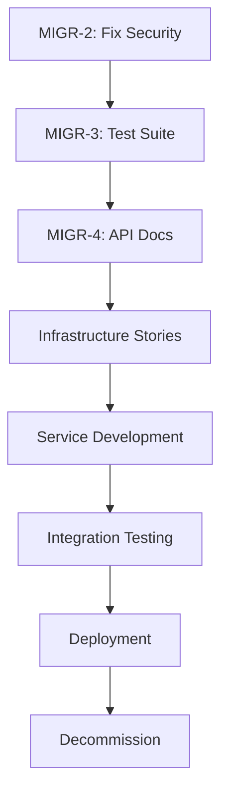

# JIRA Epic Stub — Migration Assessment

**Epic Title:** Migrate Student Library Management System from Monolith to Microservices  
**Project Key:** MIGR  
**Epic Key:** MIGR-1  
**Labels:** migration, assessment, monolith-to-microservices, spring-boot, java  
**Priority:** High  
**Reporter:** Bob (Migration Assessment Agent)  
**Created:** 2026-05-17

---

## Epic Description

Migrate the Student Library Management System from a monolithic Java Spring Boot application to a microservices architecture. The current system is a 3-tier monolith (~1,060 LOC) managing library operations including student registration, book catalog, and transaction management.

**Migration Readiness Score:** 62/100 (PASSED - Threshold: 60)

**Key Objectives:**
- Decompose monolith into 3 core microservices (Student, Book, Transaction)
- Implement distributed transaction management using Saga pattern
- Establish microservices infrastructure (Config Server, Service Discovery, API Gateway)
- Achieve zero-downtime migration using Strangler Fig pattern
- Improve security posture (remove hardcoded credentials, implement OAuth2)
- Establish comprehensive test coverage (currently 0%)

**Business Value:**
- Independent service scaling (handle peak book issue/return periods)
- Faster feature delivery (parallel team development)
- Technology flexibility (polyglot persistence, language choice per service)
- Improved fault isolation (service failures don't cascade)
- Better resource utilization (right-size each service)

**Timeline:** 26 weeks (~6 months)  
**Team Size:** 2 developers + 1 QA + 1 DevOps  
**Budget:** TBD based on resource allocation

---

## Child Stories (Generated from 7Rs Matrix)

### Pre-Migration Phase (Foundation)

| Story Key | Title | 7R Strategy | Effort | Priority | Acceptance Criteria |
|-----------|-------|-------------|--------|----------|---------------------|
| MIGR-2 | Fix Critical Security Issue: Remove Hardcoded Database Password | Rehost | S | Critical | Password moved to environment variable; application.properties contains placeholder only; deployment guide updated |
| MIGR-3 | Develop Comprehensive Test Suite for Monolith | N/A | XL | Critical | 60+ tests written (unit, integration, E2E); >70% code coverage; all critical flows tested |
| MIGR-4 | Document Current Monolith API Contracts | N/A | S | High | OpenAPI/Swagger spec generated; all 12+ endpoints documented; request/response examples provided |
| MIGR-5 | Establish Baseline Performance Metrics | N/A | S | High | Load test results captured; response time percentiles documented; throughput benchmarks established |

### Infrastructure Services (Repurchase)

| Story Key | Title | 7R Strategy | Effort | Priority | Acceptance Criteria |
|-----------|-------|-------------|--------|----------|---------------------|
| MIGR-6 | Set Up Spring Cloud Config Server | Repurchase | S | High | Config server deployed; Git backend configured; encryption enabled; health check passing |
| MIGR-7 | Implement Service Discovery with Netflix Eureka | Repurchase | M | High | Eureka server deployed; dashboard accessible; service registration tested; failover configured |
| MIGR-8 | Deploy API Gateway with Spring Cloud Gateway | Repurchase | M | High | Gateway routing configured; rate limiting enabled; CORS policies set; authentication integrated |
| MIGR-9 | Implement Distributed Tracing with Sleuth + Zipkin | Repurchase | S | Medium | Zipkin server deployed; trace IDs propagated; UI accessible; retention policy configured |
| MIGR-10 | Add Circuit Breaker with Resilience4j | Repurchase | S | Medium | Circuit breaker configured per service; fallback methods implemented; metrics exposed; dashboard integrated |
| MIGR-11 | Implement OAuth2/JWT Authentication with Keycloak | Repurchase | L | Critical | Keycloak deployed; realms configured; JWT validation working; role-based access control enabled |

### Configuration Migration (Rehost)

| Story Key | Title | 7R Strategy | Effort | Priority | Acceptance Criteria |
|-----------|-------|-------------|--------|----------|---------------------|
| MIGR-12 | Externalize Configuration to Config Server | Rehost | S | High | application.properties migrated to Git repo; environment-specific configs separated; secrets externalized |

### Student Service (Replatform)

| Story Key | Title | 7R Strategy | Effort | Priority | Acceptance Criteria |
|-----------|-------|-------------|--------|----------|---------------------|
| MIGR-13 | Design Student Service Bounded Context | Replatform | S | High | Domain model defined (Student + Card aggregate); API contract specified; database schema designed |
| MIGR-14 | Implement Student Microservice | Replatform | M | High | Service created; CRUD endpoints working; database isolated; Eureka registration successful |
| MIGR-15 | Migrate Card Management to Student Service | Replatform | S | High | Card lifecycle managed within Student aggregate; cascade operations replaced with service logic |
| MIGR-16 | Write Tests for Student Service | Replatform | M | High | Unit tests (>80% coverage); integration tests; contract tests; performance tests |

### Book Service (Replatform)

| Story Key | Title | 7R Strategy | Effort | Priority | Acceptance Criteria |
|-----------|-------|-------------|--------|----------|---------------------|
| MIGR-17 | Design Book Service Bounded Context | Replatform | S | High | Domain model defined (Book + Author aggregate); API contract specified; database schema designed |
| MIGR-18 | Implement Book Microservice | Replatform | M | High | Service created; catalog endpoints working; search functionality implemented; database isolated |
| MIGR-19 | Migrate Author Management to Book Service | Replatform | S | High | Author lifecycle managed within Book aggregate; bidirectional JPA replaced with service calls |
| MIGR-20 | Write Tests for Book Service | Replatform | M | High | Unit tests (>80% coverage); integration tests; contract tests; performance tests |

### Transaction Service (Refactor)

| Story Key | Title | 7R Strategy | Effort | Priority | Acceptance Criteria |
|-----------|-------|-------------|--------|----------|---------------------|
| MIGR-21 | Design Transaction Service with Saga Pattern | Refactor | M | Critical | Saga orchestration designed; compensating transactions defined; state machine documented |
| MIGR-22 | Implement Transaction Microservice | Refactor | XL | Critical | Service created; issue/return endpoints working; saga orchestrator implemented; rollback tested |
| MIGR-23 | Implement Compensating Transactions | Refactor | L | Critical | Rollback logic for failed transactions; idempotency guaranteed; retry mechanisms implemented |
| MIGR-24 | Write Tests for Transaction Service | Refactor | L | Critical | Unit tests (>80% coverage); saga flow tests; failure scenario tests; performance tests |

### Database Decomposition (Refactor)

| Story Key | Title | 7R Strategy | Effort | Priority | Acceptance Criteria |
|-----------|-------|-------------|--------|----------|---------------------|
| MIGR-25 | Decompose Database Schema | Refactor | L | Critical | 3 separate databases created; foreign keys removed; referential integrity in code; migration scripts ready |
| MIGR-26 | Implement Data Synchronization Strategy | Refactor | M | High | CDC or event-driven sync implemented; data consistency validated; conflict resolution defined |
| MIGR-27 | Execute Database Migration | Refactor | M | Critical | Data migrated to per-service DBs; validation queries passed; rollback plan tested; zero data loss |

### Build System (Replatform)

| Story Key | Title | 7R Strategy | Effort | Priority | Acceptance Criteria |
|-----------|-------|-------------|--------|----------|---------------------|
| MIGR-28 | Restructure Build System for Microservices | Replatform | M | High | Multi-module Maven or separate repos; per-service builds; CI/CD pipelines configured; Docker images built |

### Integration & Testing

| Story Key | Title | 7R Strategy | Effort | Priority | Acceptance Criteria |
|-----------|-------|-------------|--------|----------|---------------------|
| MIGR-29 | Implement Consumer-Driven Contract Tests | N/A | M | High | Pact or Spring Cloud Contract tests; contracts published; consumer/provider validation automated |
| MIGR-30 | Execute End-to-End Integration Testing | N/A | L | Critical | All critical flows tested; inter-service communication validated; performance benchmarks met |
| MIGR-31 | Perform Security Audit and Penetration Testing | N/A | M | Critical | OWASP Top 10 tested; vulnerabilities remediated; security report generated; compliance verified |
| MIGR-32 | Conduct Performance and Load Testing | N/A | M | High | Load tests executed; performance regression <10%; bottlenecks identified and resolved |

### Deployment & Cutover

| Story Key | Title | 7R Strategy | Effort | Priority | Acceptance Criteria |
|-----------|-------|-------------|--------|----------|---------------------|
| MIGR-33 | Implement Strangler Fig Pattern | N/A | M | Critical | Routing logic in gateway; gradual traffic shift configured; rollback mechanism ready |
| MIGR-34 | Deploy to Staging Environment | N/A | S | High | All services deployed; smoke tests passed; monitoring dashboards configured |
| MIGR-35 | Execute Production Cutover | N/A | M | Critical | Traffic shifted to microservices; monolith on standby; monitoring active; incident response ready |
| MIGR-36 | Decommission Monolith | Retire | S | Medium | 30-day stability period passed; monolith shut down; resources reclaimed; documentation updated |

### Monitoring & Observability

| Story Key | Title | 7R Strategy | Effort | Priority | Acceptance Criteria |
|-----------|-------|-------------|--------|----------|---------------------|
| MIGR-37 | Set Up Centralized Logging (ELK Stack) | Repurchase | M | High | Elasticsearch, Logstash, Kibana deployed; logs aggregated; dashboards created; alerts configured |
| MIGR-38 | Implement Metrics and Monitoring (Prometheus + Grafana) | Repurchase | M | High | Prometheus scraping metrics; Grafana dashboards; SLI/SLO defined; alerting rules configured |
| MIGR-39 | Establish Incident Response Procedures | N/A | S | High | Runbooks created; on-call rotation defined; escalation paths documented; post-mortem template ready |

---

## Story Summary by 7R Strategy

| 7R Strategy | Story Count | Total Effort |
|-------------|-------------|--------------|
| **Replatform** | 10 stories | 7M + 3S = ~10 weeks |
| **Refactor** | 5 stories | 1XL + 2L + 2M = ~12 weeks |
| **Repurchase** | 6 stories | 1L + 4M + 2S = ~8 weeks |
| **Rehost** | 2 stories | 2S = ~2 weeks |
| **Retire** | 1 story | 1S = ~1 week |
| **N/A (Supporting)** | 14 stories | 1XL + 4L + 7M + 2S = ~20 weeks |
| **Total** | **38 stories** | **~53 person-weeks** |

---

## Epic Dependencies

---

## Risk Register

| Risk ID | Description | Probability | Impact | Mitigation Story |
|---------|-------------|-------------|--------|------------------|
| R-1 | Distributed transaction failures | High | Critical | MIGR-21, MIGR-23 |
| R-2 | Data consistency issues during migration | High | High | MIGR-26, MIGR-27 |
| R-3 | Performance degradation | Medium | High | MIGR-32 |
| R-4 | Security vulnerabilities | Medium | Critical | MIGR-11, MIGR-31 |
| R-5 | Insufficient test coverage | High | Medium | MIGR-3, MIGR-16, MIGR-20, MIGR-24 |

---

## Success Metrics

| Metric | Baseline (Monolith) | Target (Microservices) | Measurement |
|--------|---------------------|------------------------|-------------|
| **Deployment Frequency** | Monthly | Weekly | CI/CD pipeline metrics |
| **Lead Time for Changes** | 2-4 weeks | 3-5 days | JIRA cycle time |
| **Mean Time to Recovery (MTTR)** | TBD | <30 minutes | Incident tracking |
| **Change Failure Rate** | TBD | <5% | Deployment success rate |
| **Service Availability** | TBD | 99.9% | Uptime monitoring |
| **API Response Time (P95)** | TBD | <200ms | APM tools |
| **Test Coverage** | 0% | >80% | SonarQube |

---

## Attachments

1. **Assessment Report:** `reports/assessment/assessment-report.md`
2. **Architecture Diagrams:** TBD (to be created in Design phase)
3. **API Contracts:** TBD (to be created in Design phase)
4. **Test Strategy:** TBD (to be created in Planning phase)
5. **Deployment Plan:** TBD (to be created in Planning phase)

---

## Epic Status

**Current Phase:** Assessment Complete  
**Next Phase:** Planning  
**Overall Progress:** 0/38 stories completed (0%)  
**Estimated Completion:** 26 weeks from start date  
**Blockers:** None (gate passed)

---

## Notes

- This epic represents the complete migration lifecycle from assessment through hypercare
- Stories are sequenced to minimize risk (Strangler Fig pattern)
- Critical path: Security fix → Infrastructure → Transaction Service → Cutover
- All stories include acceptance criteria and effort estimates
- Regular sprint reviews recommended (bi-weekly)
- Stakeholder demos after each major milestone

**Created by:** Bob Migration Assessment Agent  
**Last Updated:** 2026-05-17  
**Version:** 1.0