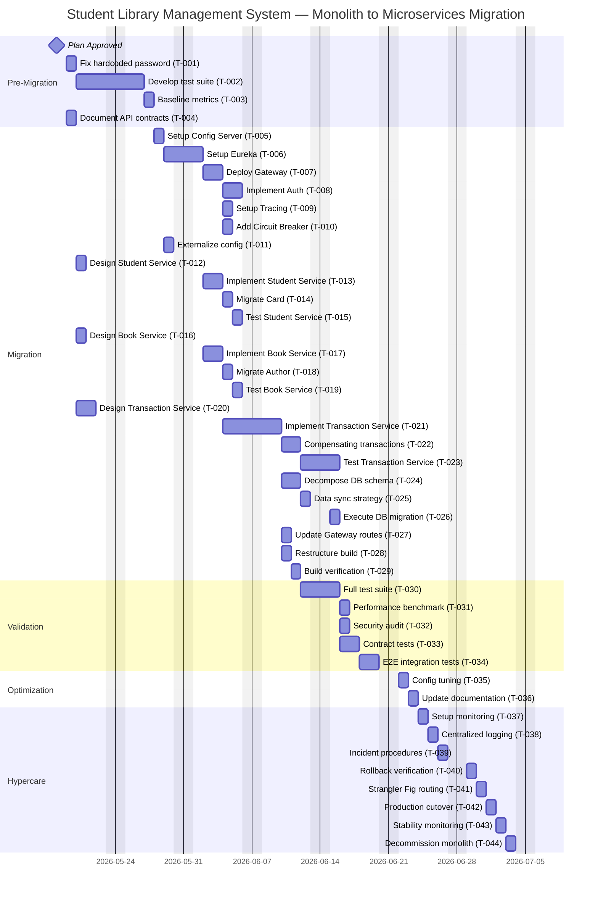

# Migration Plan

**Project:** Student Library Management System  
**Migration:** Monolithic Java Spring Boot → Microservices Architecture  
**Migration Type:** `platform-migration` (Monolith → Microservices)  
**Date:** 2026-05-17  
**Effort Classification:** Medium-Large  
**Planning Status:** Draft — Pending Approval

---

## 1. Executive Summary

The Student Library Management System will be migrated from a monolithic Java Spring Boot application to a microservices architecture using the Strangler Fig pattern. The migration decomposes the monolith into 3 core microservices (Student, Book, Transaction) plus 5 infrastructure services (Config Server, Service Discovery, API Gateway, Distributed Tracing, Circuit Breaker). The total effort is estimated at 57 person-days (47 days raw + 20% buffer) over approximately 12 weeks with a team of 2 full-time developers and 1 part-time QA engineer. The approach prioritizes risk mitigation through phased decomposition, comprehensive testing, and maintaining the monolith as a fallback throughout the migration.

---

## 2. Scope & Component Strategy

| Component | Current Implementation | 7R Strategy | Target Implementation | Rationale | Effort |
|-----------|------------------------|-------------|----------------------|-----------|--------|
| **Student Management** | Monolithic service with Student + Card entities | **Replatform** | Student Microservice (Student + Card as aggregate) | Clean bounded context, moderate coupling | M |
| **Book Catalog** | Book + Author entities with bidirectional JPA | **Replatform** | Book Microservice (Book + Author as aggregate) | Read-heavy, good candidate for early migration | M |
| **Transaction Management** | Complex service with distributed state | **Refactor** | Transaction Microservice with Saga orchestration | Requires saga pattern for distributed transactions | XL |
| **Card Service** | Embedded in Student service | **Replatform** | Part of Student Microservice (aggregate root) | Card is lifecycle-bound to Student | S |
| **Author Management** | Separate controller but coupled to Book | **Replatform** | Part of Book Microservice (aggregate root) | Author is lifecycle-bound to Book | S |
| **Database Schema** | Single MySQL database with FKs | **Refactor** | Per-service databases (Student-DB, Book-DB, Transaction-DB) | Data ownership per bounded context | L |
| **REST API** | Monolithic endpoints | **Replatform** | API Gateway + per-service endpoints | Add gateway for routing, auth, rate limiting | M |
| **Configuration** | application.properties | **Rehost** | Spring Cloud Config Server | Externalize config, no logic change | S |
| **Build System** | Single Maven project | **Replatform** | Multi-module Maven or separate repos | Per-service build and deployment | M |
| **Security (not implemented)** | Mentioned in README only | **Repurchase** | Spring Security + OAuth2/Keycloak | Adopt industry-standard auth solution | L |
| **Service Discovery** | Not present | **Repurchase** | Netflix Eureka or Consul | Required for microservices | M |
| **API Gateway** | Not present | **Repurchase** | Spring Cloud Gateway | Required for routing and cross-cutting concerns | M |
| **Distributed Tracing** | Not present | **Repurchase** | Spring Cloud Sleuth + Zipkin | Required for observability | S |
| **Circuit Breaker** | Not present | **Repurchase** | Resilience4j | Required for fault tolerance | S |

**7Rs Distribution:** Rehost (1) | Replatform (7) | Repurchase (5) | Refactor (2) | Total: 15 components

---

## 3. Task Breakdown

| ID | Task | Phase | 7R | Effort (days) | Depends On | Assignee Role |
|---|---|---|---|---|---|---|
| T-001 | Fix hardcoded database password in application.properties | Pre-Migration | Rehost | 0.5 | None | Developer |
| T-002 | Develop comprehensive test suite for monolith | Pre-Migration | N/A | 5.0 | T-001 | Developer + QA |
| T-003 | Establish baseline performance metrics | Pre-Migration | N/A | 0.5 | T-002 | QA |
| T-004 | Document current API contracts (OpenAPI/Swagger) | Pre-Migration | N/A | 1.0 | None | Developer |
| T-005 | Set up Spring Cloud Config Server | Migration | Repurchase | 1.0 | T-003 | Developer |
| T-006 | Implement Netflix Eureka Service Discovery | Migration | Repurchase | 1.5 | T-005 | Developer |
| T-007 | Deploy Spring Cloud Gateway (API Gateway) | Migration | Repurchase | 1.5 | T-006 | Developer |
| T-008 | Implement OAuth2/JWT with Keycloak | Migration | Repurchase | 2.0 | T-007 | Developer |
| T-009 | Set up Distributed Tracing (Sleuth + Zipkin) | Migration | Repurchase | 0.5 | T-007 | Developer |
| T-010 | Add Circuit Breaker (Resilience4j) | Migration | Repurchase | 0.5 | T-007 | Developer |
| T-011 | Externalize configuration to Config Server | Migration | Rehost | 0.5 | T-005 | Developer |
| T-012 | Design Student Service bounded context | Migration | Replatform | 0.5 | T-004 | Developer |
| T-013 | Implement Student Microservice | Migration | Replatform | 2.0 | T-012, T-006 | Developer |
| T-014 | Migrate Card management to Student Service | Migration | Replatform | 0.5 | T-013 | Developer |
| T-015 | Write tests for Student Service | Migration | Replatform | 1.0 | T-014 | QA |
| T-016 | Design Book Service bounded context | Migration | Replatform | 0.5 | T-004 | Developer |
| T-017 | Implement Book Microservice | Migration | Replatform | 2.0 | T-016, T-006 | Developer |
| T-018 | Migrate Author management to Book Service | Migration | Replatform | 0.5 | T-017 | Developer |
| T-019 | Write tests for Book Service | Migration | Replatform | 1.0 | T-018 | QA |
| T-020 | Design Transaction Service with Saga pattern | Migration | Refactor | 1.5 | T-004 | Developer |
| T-021 | Implement Transaction Microservice | Migration | Refactor | 4.0 | T-020, T-013, T-017 | Developer |
| T-022 | Implement compensating transactions | Migration | Refactor | 2.0 | T-021 | Developer |
| T-023 | Write tests for Transaction Service | Migration | Refactor | 1.5 | T-022 | QA |
| T-024 | Decompose database schema | Migration | Refactor | 2.0 | T-013, T-017, T-021 | Developer |
| T-025 | Implement data synchronization strategy | Migration | Refactor | 1.0 | T-024 | Developer |
| T-026 | Execute database migration | Migration | Refactor | 1.0 | T-025 | Developer |
| T-027 | Update REST API endpoints in Gateway | Migration | Replatform | 1.0 | T-007, T-013, T-017, T-021 | Developer |
| T-028 | Restructure build system (multi-module Maven) | Migration | Replatform | 1.0 | T-013, T-017, T-021 | Developer |
| T-029 | Build verification after service migration | Migration | N/A | 0.5 | T-028 | QA |
| T-030 | Execute full test suite | Validation | N/A | 2.0 | T-029 | QA |
| T-031 | Performance benchmark testing | Validation | N/A | 1.0 | T-030 | QA |
| T-032 | Security audit and penetration testing | Validation | N/A | 1.0 | T-030 | QA |
| T-033 | Consumer-driven contract tests | Validation | N/A | 1.5 | T-030 | Developer + QA |
| T-034 | End-to-end integration testing | Validation | N/A | 2.0 | T-033 | QA |
| T-035 | Configuration tuning and optimization | Optimization | N/A | 1.0 | T-034 | Developer |
| T-036 | Update documentation (architecture, API, runbooks) | Optimization | N/A | 1.0 | T-035 | Developer |
| T-037 | Set up monitoring dashboards (Prometheus + Grafana) | Hypercare | N/A | 1.0 | T-036 | Developer |
| T-038 | Implement centralized logging (ELK stack) | Hypercare | N/A | 1.0 | T-037 | Developer |
| T-039 | Establish incident response procedures | Hypercare | N/A | 0.5 | T-038 | Developer |
| T-040 | Rollback readiness verification | Hypercare | N/A | 0.5 | T-039 | QA |
| T-041 | Implement Strangler Fig routing in Gateway | Hypercare | N/A | 1.0 | T-040 | Developer |
| T-042 | Execute production cutover | Hypercare | N/A | 0.5 | T-041 | Developer |
| T-043 | Monitor stability period (30 days) | Hypercare | N/A | 1.0 | T-042 | Developer + QA |
| T-044 | Decommission monolith | Hypercare | Retire | 0.5 | T-043 | Developer |

**Total effort (raw):** 47.0 days  
**Buffer (20%):** 9.4 days  
**Total effort (with buffer):** 56.4 days (~57 days)

---

## 4. Timeline



**Timeline Summary:**
- **Start Date:** 2026-05-19 (after plan approval)
- **Estimated End Date:** ~2026-08-08 (12 weeks)
- **Critical Path:** T-001 → T-002 → T-003 → T-005 → T-006 → T-007 → T-013 → T-017 → T-021 → T-024 → T-026 → T-029 → T-030 → T-034 → T-036 → T-042 → T-044

---

## 5. Resource Matrix

| Role | Count | Availability | Capacity (days) | Assigned Phases | Assigned Tasks |
|---|---|---|---|---|---|
| Developer | 2 | 100% | 220 | All phases | T-001, T-002, T-004, T-005, T-006, T-007, T-008, T-009, T-010, T-011, T-012, T-013, T-014, T-016, T-017, T-018, T-020, T-021, T-022, T-024, T-025, T-026, T-027, T-028, T-033, T-035, T-036, T-037, T-038, T-039, T-041, T-042, T-043, T-044 |
| QA Engineer | 1 | 50% | 55 | Pre-Migration, Migration, Validation, Hypercare | T-002, T-003, T-015, T-019, T-023, T-029, T-030, T-031, T-032, T-033, T-034, T-040, T-043 |
| **Total** | **3** | **—** | **275 days** | **—** | **44 tasks** |

**Capacity Check:**  
- Total capacity: 275 days
- Total effort with buffer: 57 days
- **Status:** ✅ **FEASIBLE** (Capacity exceeds effort by 218 days / 383%)

**Resource Allocation Notes:**
- Developers can work in parallel on independent services (Student, Book) during Migration phase
- QA engineer focuses on test development in Pre-Migration, then validation activities
- Significant capacity margin allows for:
  - Handling unexpected issues or scope expansion
  - Knowledge transfer and training
  - Parallel work streams to accelerate timeline
  - Buffer for production support during Hypercare

---

## 6. Risk Mitigation Plan

| Risk | Probability | Impact | Assessment Mitigation | Planning Action | Owner Role |
|------|-------------|--------|----------------------|-----------------|------------|
| **Distributed Transaction Failures** | High | Critical | Implement saga with compensating transactions; extensive testing | T-020, T-021, T-022, T-023 explicitly address saga implementation and testing | Developer |
| **Data Consistency Issues** | High | High | Use event sourcing or CDC; monitoring | T-024, T-025, T-026 include data sync strategy and validation | Developer |
| **Performance Degradation** | Medium | High | Load testing; caching strategy; database optimization | T-031 performance benchmark; T-035 config tuning | QA + Developer |
| **Service Discovery Failures** | Medium | High | Health checks; circuit breakers; fallback mechanisms | T-006 Eureka setup; T-010 circuit breaker; T-037 monitoring | Developer |
| **Insufficient Test Coverage** | High | Medium | Allocate 8 weeks for test development; enforce coverage gates | T-002 comprehensive test suite (5 days); T-015, T-019, T-023 per-service tests | QA + Developer |
| **Security Vulnerabilities** | Medium | Critical | Security audit; penetration testing; secrets management | T-001 fix hardcoded password; T-008 OAuth2/JWT; T-032 security audit | Developer + QA |
| **Team Knowledge Gap** | Medium | Medium | Training on microservices patterns; pair programming | Pair programming implied in parallel tasks; documentation in T-036 | Developer |
| **Scope Creep** | Medium | Medium | Strict scope control; phased approach; regular reviews | Fixed task list; gate reviews at phase boundaries | Developer |
| **Database Migration Errors** | Low | Critical | Dry runs; rollback plan; data validation scripts | T-024, T-025, T-026 phased DB migration; rollback procedures in §8 | Developer |
| **Third-Party Dependency Issues** | Low | Medium | Vendor evaluation; fallback options; SLA agreements | All dependencies (Eureka, Gateway, Keycloak) are open-source with community support | Developer |
| **Timeline Slip** | Medium | Medium | 20% buffer applied; capacity margin available | 9.4 days buffer; 218 days excess capacity | Developer |
| **Production Cutover Issues** | Medium | High | Strangler Fig pattern; gradual traffic shift; rollback ready | T-041 Strangler Fig routing; T-040 rollback verification; T-042 controlled cutover | Developer |

---

## 7. Per-Phase Success Criteria

### Pre-Migration
- ✅ Hardcoded database password removed and externalized
- ✅ Test suite achieves >70% code coverage for monolith
- ✅ All critical flows (student registration, book issue/return) have E2E tests
- ✅ Baseline performance metrics captured (response time P95, throughput)
- ✅ API contracts documented in OpenAPI/Swagger format
- ✅ All Critical security findings from assessment resolved

### Migration
- ✅ All 5 infrastructure services deployed and healthy (Config, Eureka, Gateway, Tracing, Circuit Breaker)
- ✅ OAuth2/JWT authentication working end-to-end
- ✅ All 3 microservices (Student, Book, Transaction) deployed and registered with Eureka
- ✅ Database decomposed into 3 separate schemas with data migrated
- ✅ Saga pattern implemented for distributed transactions with compensating logic
- ✅ API Gateway routing all requests correctly
- ✅ Per-service test suites passing (unit + integration)
- ✅ Build system supports independent service deployment

### Validation
- ✅ Full test suite pass rate ≥ 95%
- ✅ Performance variance within ±10% of baseline (no regression)
- ✅ Security scan shows zero Critical/High findings
- ✅ Consumer-driven contract tests passing for all inter-service calls
- ✅ End-to-end integration tests passing for all critical flows
- ✅ Load testing confirms system handles expected peak traffic
- ✅ Distributed tracing shows complete request paths across services

### Optimization
- ✅ Configuration tuned for production workload
- ✅ All documentation updated (architecture diagrams, API docs, runbooks)
- ✅ Performance optimizations applied where needed
- ✅ Resource allocation right-sized per service
- ✅ Caching strategy implemented and validated

### Hypercare
- ✅ Monitoring dashboards operational (Prometheus + Grafana)
- ✅ Centralized logging functional (ELK stack)
- ✅ Incident response procedures documented and tested
- ✅ Rollback procedures verified and ready
- ✅ Strangler Fig pattern routing traffic to microservices
- ✅ Production cutover completed with zero downtime
- ✅ System stable for 30 consecutive days (99.9% uptime target)
- ✅ Mean Time to Recovery (MTTR) < 30 minutes for incidents
- ✅ Monolith decommissioned after stability period

---

## 8. Rollback Procedures

### Pre-Migration Rollback
**Trigger:** Test suite development blocked or security fix causes instability

**Steps:**
1. Revert code changes to last stable commit using `git reset --hard <commit-hash>`
2. Restore original `application.properties` from backup
3. Rebuild monolith: `mvn clean package`
4. Redeploy monolith JAR: `java -jar target/Student-library-0.0.1-SNAPSHOT.jar`
5. Verify monolith health: `curl http://localhost:8080/actuator/health`
6. Run smoke tests to confirm functionality

**Recovery time estimate:** 30 minutes  
**Owner:** Developer

### Migration Rollback
**Trigger:** Microservice deployment failure, data migration error, or critical bug in new services

**Steps:**
1. Stop all microservices: `kubectl delete deployment student-service book-service transaction-service` (or equivalent)
2. Stop infrastructure services: `kubectl delete deployment config-server eureka-server gateway-service`
3. Restore database from pre-migration backup:
   ```bash
   mysql -u root -p library < backup/library_pre_migration_YYYYMMDD.sql
   ```
4. Revert API Gateway routing to point to monolith
5. Restart monolith application
6. Verify all endpoints functional using Postman collection or automated tests
7. Notify stakeholders of rollback via incident channel

**Recovery time estimate:** 2 hours  
**Owner:** Developer + DevOps

### Validation Rollback
**Trigger:** Test failures >5%, performance regression >10%, or Critical security findings

**Steps:**
1. Halt production cutover planning
2. Document all failing tests and performance issues
3. Keep microservices running in staging environment for debugging
4. Maintain monolith as primary production system
5. Create JIRA tickets for each validation failure
6. Schedule remediation sprint before re-attempting validation
7. Do not proceed to Optimization phase until all validation criteria pass

**Recovery time estimate:** N/A (pause, not rollback)  
**Owner:** QA + Developer

### Optimization Rollback
**Trigger:** Configuration changes cause instability or performance degradation

**Steps:**
1. Revert configuration changes in Spring Cloud Config Server Git repository
2. Trigger config refresh: `curl -X POST http://config-server:8888/actuator/refresh`
3. Restart affected services if needed: `kubectl rollout restart deployment/<service-name>`
4. Monitor metrics for 15 minutes to confirm stability
5. If issue persists, rollback to previous Docker image tag:
   ```bash
   kubectl set image deployment/<service-name> <container>=<image>:<previous-tag>
   ```
6. Document issue and root cause for post-mortem

**Recovery time estimate:** 30 minutes  
**Owner:** Developer

### Hypercare Rollback
**Trigger:** Production incident with severity Critical/High, or uptime drops below 99%

**Steps:**
1. **Immediate:** Activate Strangler Fig rollback routing in API Gateway to send 100% traffic to monolith
2. Execute Gateway config update:
   ```yaml
   spring:
     cloud:
       gateway:
         routes:
           - id: fallback-to-monolith
             uri: http://monolith:8080
             predicates:
               - Path=/**
   ```
3. Verify monolith handling all traffic: check logs and metrics
4. Keep microservices running for investigation
5. Trigger incident response procedure (see T-039)
6. Conduct root cause analysis within 24 hours
7. Create remediation plan before re-attempting cutover
8. Communicate status to all stakeholders every 2 hours until resolved

**Recovery time estimate:** 15 minutes (traffic shift) + investigation time  
**Owner:** Developer + DevOps

**Post-Rollback Actions (All Phases):**
- Document rollback trigger and steps taken
- Conduct blameless post-mortem within 48 hours
- Update rollback procedures based on lessons learned
- Create preventive measures to avoid recurrence
- Communicate timeline impact to stakeholders

---

## Gate Decision

### Planning Outcome
✅ **PROCEED TO DESIGN MODE**

**Gate Criteria Status:**
- ✅ Assessment report parsed and gate confirmed (Score: 62/100)
- ✅ Team capacity gathered and confirmed (2 devs + 1 QA, 275 days available)
- ✅ All 15 components from 7Rs matrix have tasks assigned
- ✅ Total effort calculated with 20% buffer (57 days)
- ✅ Capacity ≥ effort (275 days >> 57 days, 383% margin)
- ✅ Mermaid timeline covers all 44 tasks across 5 phases
- ✅ Per-phase success criteria defined (5-6 criteria per phase)
- ✅ Rollback runbook per phase written (5 procedures)
- ✅ Migration plan written (this document)
- ✅ JIRA stories stub ready (see `reports/planning/jira-stories-stub.md`)
- ✅ Communications plan ready (see `reports/planning/comms-plan.md`)

**Blocking Issues:** None

**Recommended Next Steps:**
1. **Review and approve this plan** with technical lead and product owner
2. **Confirm team availability** and task assignments with developers and QA
3. **Schedule kickoff meeting** for 2026-05-18 to present plan and answer questions
4. **Proceed to Migration Design Mode** to create detailed service designs, API contracts, and data models
5. **Set up project tracking** in JIRA using stories from `jira-stories-stub.md`

---

**Plan Prepared By:** Bob Migration Planning Agent  
**Last Updated:** 2026-05-17  
**Version:** 1.0  
**Status:** Draft — Awaiting Approval